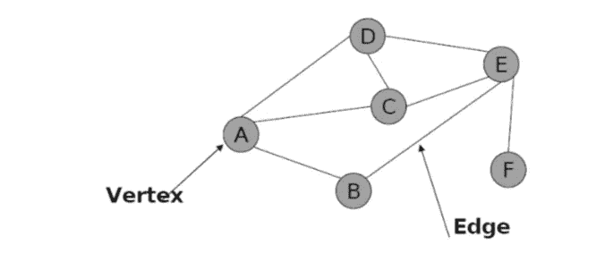
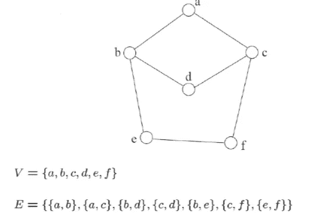
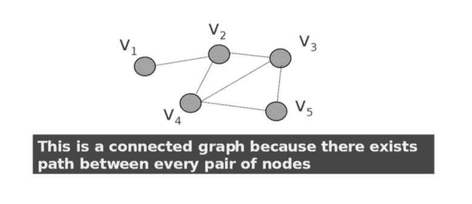
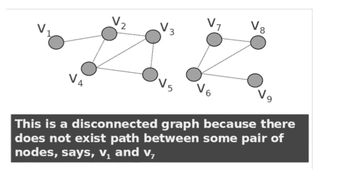
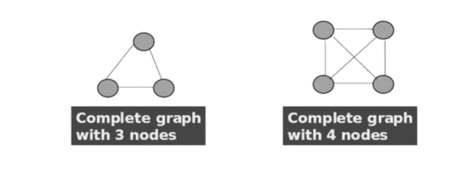
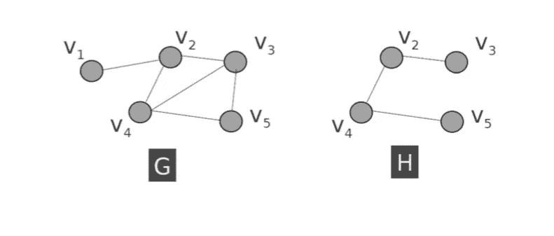
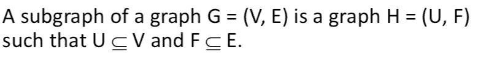
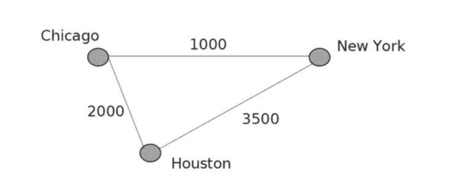
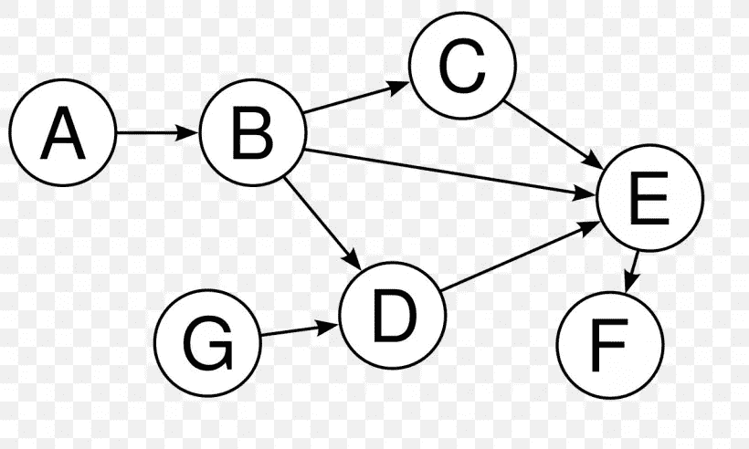
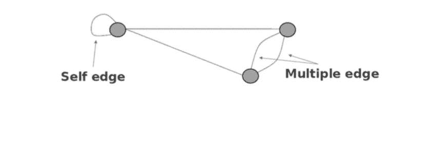

# 数据结构-图形

> 原文：<https://blog.devgenius.io/data-structures-graphs-f3d1c2d78afa?source=collection_archive---------43----------------------->

*什么是图？*

*图形表示数据项之间的关系*

> *一个图 G 由:
> 一组 V 个节点(顶点)
> 一组 E 条边:每条边连接两个节点*

*每个节点代表一个项目*

*每条边代表两个项目之间的关系*

***图表中的一些术语***

*如果顶点 1 和顶点 2 相连，则称它们为* ***相邻的*** *顶点*

*如果一条边 e 与 v 相连，那么称 v 入射到 e 上。同样，称边 e 入射到 v 上。*

*一条* ***路径*** *是一个顶点序列(v0，v1，v2，… vk)*

*路径的长度是路径上的边数*

> *一条路径是一个* ***循环*** *当且仅当 v0 = vk
> 起点和终点是同一个顶点！*

***图形种类***

***1-)无向图***

无向图

*由有序对(V，E)指定的无向图，V 是顶点，E 是边。*

*一个无向符号图的边不是有序对(u，v)和(v，u)是同一条边。*

***2-)连通图***

*连通图*

*一个图 G 是* ***连通的*** *如果每对不同的节点之间存在路；否则就是* ***断开。***

***3-)不连通图***

不连通图

***4-)完成图***

*完成图形*

*一个图是* ***完备的*** *如果每对不同的节点都有一条边*

***5-)子图***

子图

***6-)加权图***

加权图

如果 G 中的每条边都被赋予一个权重，则称之为**加权图。**

***【7-)有向图***

有向图

*前面所有的图都是无向图
如果 E 中的每条边都有方向，则称为有向边。有向图是指每条边都是有向边的图*

***8-)多图***

多重图

*图形不能有重复的边。*

*多图允许* ***多条边*******自边*** *(或* ***循环*** *)。**

*感谢你的阅读，如果你想看看我用 java 写的图表，你可以从这里进入我的 github 账户:[https://github.com/bllhlskr/Graph-With-Java](https://github.com/bllhlskr/Graph-With-Java)*