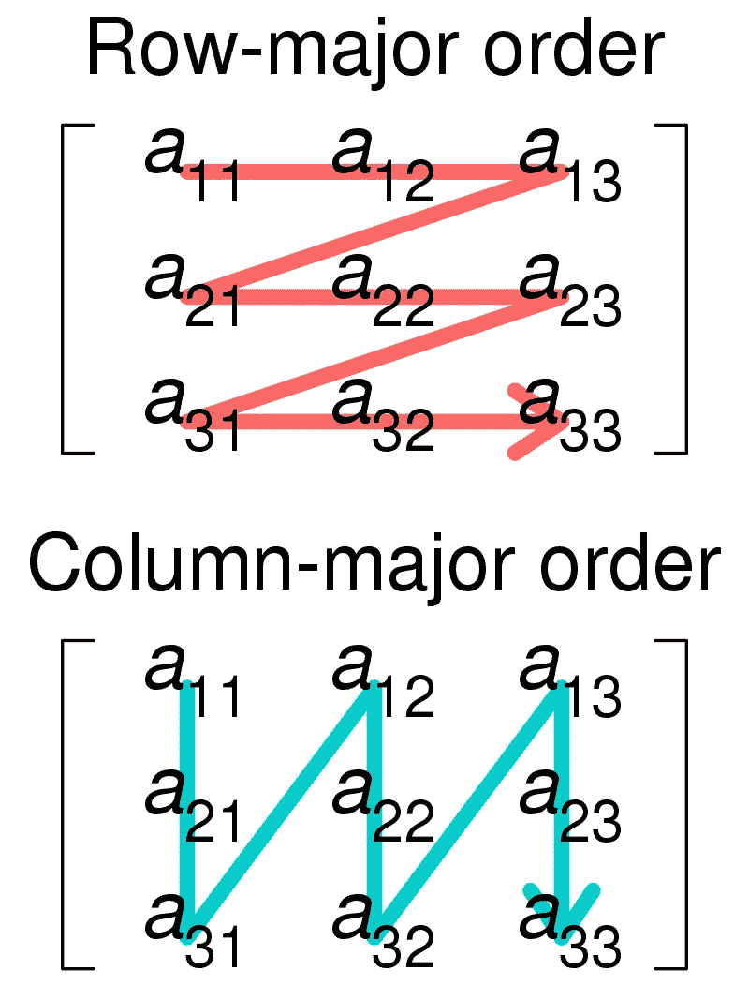

# 简而言之，数据结构

> 原文：<https://blog.devgenius.io/data-structures-in-a-nutshell-594195615752?source=collection_archive---------17----------------------->

## 简短但“扎实”地深入非原始数据结构


我们可以写很长很长的关于数据结构的文章，但是这会让任何人感到厌烦，相反，这篇文章是读者将要进入数据结构底层世界的一小步。

所以开始读吧。

# 数据结构？

各种各样的人都需要数据结构，包括设计和开发任何系统或应用软件的计算机程序的人。

数据值是程序占用的每个数据的表示。

每个程序的功能都依赖于数据值的结构和组织良好的格式。因此，我们可以说，

> 有组织的有意安排或收集数据被称为**数据结构**。

通常描述的是

## 数据结构=有组织的数据+允许的操作。

# 两种类型的数据结构

1.  同构:在这里，所有的元素都是相同的类型。数组是其常见的例子，而
2.  非同质:示例包括记录。

## 数据结构分类的另一种方式

1.  静态:这里，在编译时，与内存位置相关的大小和结构是固定的，并且
2.  动态:在这里，程序执行的需求需要结构的扩展或收缩以及相关存储位置的改变。

# 数组

数组实际上解决了涉及监控各种数据位的问题。

> 数组是一个有限的有序集合，其中的元素(本质上是同质的)存储在内存中的相邻单元中。

*阵列对回收元素很重要。*

所有数组中最简单的是一个一维数组，也称为**向量**。

`int anArrayName[n];`:这个 C 声明显示或者声明一个 n 个整数的一维数组。

> 注意，需要一个**声明**来正确分配适当的内存空间，并且 C 需要数组从零索引开始。

同样的，`int anArrayName[n][m];`是一个**二维数组**，有“*n”*行和“*m”*列。

现在，1-D 数组在映射上非常简单，可以线性地分配给存储单元。存储单元是地址和**存储阵列的**区域。大小和空间地址是分配数组所必需的。起始地址或基址是定位数组的一个重要部分。但由于数据是多维存储的，数据可以通过**逐行**或**逐列**存储在数组的单元中。



行和列主要顺序的图示，来源:[https://upload . wikimedia . org/Wikipedia/commons/thumb/4/4d/Row _ and _ column _ major _ order . SVG/170 px-Row _ and _ column _ major _ order . SVG . png](https://upload.wikimedia.org/wikipedia/commons/thumb/4/4d/Row_and_column_major_order.svg/170px-Row_and_column_major_order.svg.png)

我们通常给数组中的元素分配不同的非零值，但是当我们给大部分元素分配零元素时，会出现特殊类型的数组，称为**稀疏数组**。

# 列表

像数组一样，列表是用来存储数据的。日常生活中常见的场景和现象可以使用列表结构轻松实现。

> 然而，列表是同一类别的线性数据对象。

## 可以在列表上执行的操作

1.  创建、排序、打印、删除列表。
2.  进行空列表检查。
3.  对于列表中的元素-搜索(包括搜索列表元素的前序和后继)、删除、在指定位置添加、检索、更新、确定其大小。

> 请注意，您可以统计地(最简单的实现)或动态地(使用数组索引或指针)放入一个列表。

内存存储空间的浪费，经常比声明的数组大小更短的列表以及数组大小对其大小的限制是*数组列表*实现的一些**缺点**。


链表数据结构，来源:[https://visualgo.net/](https://visualgo.net/)

*链表*是**有利的**，因为当它们的列表可以增长和收缩时，它们使用相同的空间，并且是灵活的，允许容易地快速访问列表中的任何不同项目，从而确保效率。

为了克服**单拉伸或链表**、 ***双或循环*** 链表结构的缺点，它们交替地使用链表的双向遍历(前者)和最后一个元素指向(后者先指向)。


单向、双向和循环链表。

**存储分配**通过使用最佳拟合或第一 fir 算法，空闲空间管理重新定位碎片空闲空间，并使用垃圾收集压缩它以获得连续的空闲空间块。

# 堆栈和队列

> 堆栈(**list**的特例)是一种线性数据结构，遵循后进先出(LIFO)的顺序存储和检索数据。

数据的存储和检索也称为**数据移动**。

Stacks 显示了一个与其他计算机程序类似的重要特征，那就是，它们在做其他任务的同时推迟一些任务。

由于栈只是列表的特例，这意味着它们也可以实现为数组和链表数据结构。

> 队列是另一种基本上限制访问的数据结构，在这种结构中，操作是按照接收的顺序进行的。

队列在许多情况下被使用，例如在板球场排队，等待更新的选秀，保龄球堆积在队列中等等。

堆栈和队列的实现是相似的，因为它们涉及相似的基本操作:

1.  创建堆栈(或队列)
2.  检查堆栈(或队列)是否为空
3.  检查堆栈(或队列)是否已满
4.  初始化堆栈
5.  将一个元素压入堆栈(如果未满)(或者在后面的队列中添加一个项目(入队))
6.  从堆栈中弹出一个元素(如果不为空)(或者从队列前面移除一个项目(出列))
7.  读取栈顶(或队列的前面)，以及
8.  打印整个堆栈(或整个队列)

# 图表

我们知道，图是一种数学模型，在人类文明的各个领域的各种平台上都有应用。

> 图由有限的顶点集(节点)和边集组成。

## 图形的类型

1.  未受指导的
2.  径直的
3.  连接(弱连接或强连接)
4.  未连接，以及
5.  树:连接但没有循环

## 图表示

1.  邻接矩阵:一种简单的图形表示方法，但是需要足够多的空间和时间来表示图和稀疏图
2.  邻接表表示:解决了邻接矩阵表示的缺点。

```
 A B C D
A 0 1 1 1
B 1 0 0 0
C 1 0 0 1
D 1 0 1 0# A is adjacent to B, C, D
# C is adjacent to A, D---------------------------------------------------------------follow = {
 “andromeda” : [“mars”, “ceres”],
 “magnum1BX” : [“ursa”, “polaris”],
 “earth” : [“horseheadnebula”]
}
```

**图遍历**，深度优先，广度优先，意思是访问图的所有节点。

**寻找一个**的最短路径问题**最小成本生成树问题**是由于圈的存在使得图的遍历具有挑战性而出现的一类问题。

> 注意，没有已知的有效算法来寻找旅行推销员问题，即访问加权图中每个顶点的最小成本旅行。

# 结论

结构化和组织数据是开发计算机应用程序的一个基本方面。线性数据结构:数组、列表、堆栈和队列，以及数学结构:图形是学习和开始编程、设计和开发过程所必需的。我们充分意识到，图形和列表、数组一样，在我们的许多日常应用中有其用途。建议通过数据结构(包括原始数据结构)的每一节详细课程来引导自己，以获得这个领域的完整概念。

希望这在某种程度上对你有益，再见！