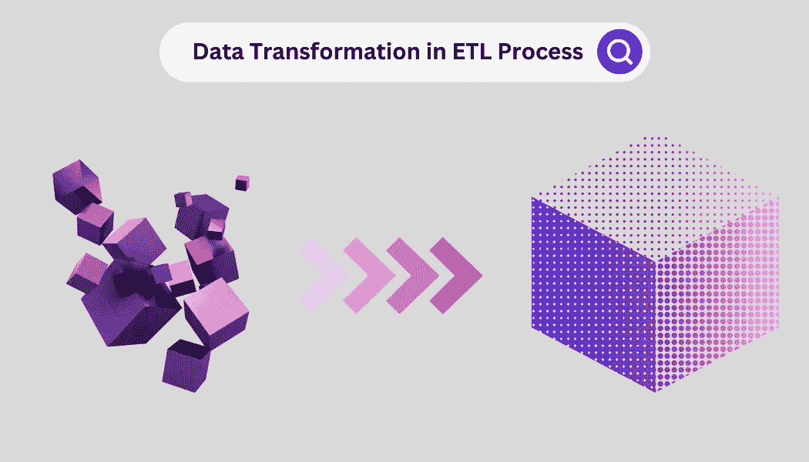
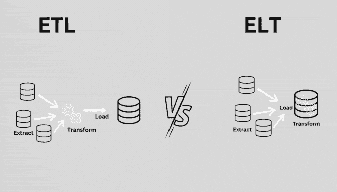

# ETL 过程中的数据转换

> 原文：<https://blog.devgenius.io/data-transformation-in-etl-process-d8efc8cf5338?source=collection_archive---------11----------------------->



当我们转换数据时，我们正在以某种方式修改它，以使它更适合特定的目的，或者从中提取更有意义的信息。转换数据的一些常见原因包括:

1.  **数据清理和预处理**:转换数据有助于识别和修复错误或不一致，并为进一步分析准备数据。
2.  **数据可视化**:转换数据可以更容易地可视化数据中的模式或趋势，这有助于确定可能不会立即显现的关系和见解。
3.  **特征工程**:转换数据可用于创建新的特征或变量，这些特征或变量对特定任务或分析更有用或更相关。
4.  **数据标准化**:转换数据有助于标准化数据的规模或范围，这对于某些类型的分析或机器学习算法非常重要。
5.  **数据聚合**:转换数据可用于组合或汇总来自多个来源或不同粒度级别的数据，以便更容易分析或解释。

*在本文中，您将了解以下与 ETL(提取、转换、加载)过程中的数据转换相关的主题:*

1.  ***数据转换的定义及其在 ETL 过程中的作用***
2.  ***ETL 和 ELT 的区别***
3.  ***可以进行的各种类型的数据转换***
4.  ***如何为特定用例选择合适的数据转换***

> 数据转换是修改数据以使其对特定用途更有用或更有意义的过程。这通常作为 ETL(提取、转换、加载)或 ELT(提取、加载、转换)过程的一部分来完成，该过程涉及从多个源提取数据，根据需要转换数据，并将其加载到目标系统中。不同类型的数据转换包括数据清理、数据可视化、特征工程、数据规范化和数据聚合。要应用的适当的数据转换取决于手头的分析或任务的目标。

# 数据转换及其在 ETL 过程中的作用

数据转换是 ETL(提取、转换、加载)过程中的一个重要步骤，ETL 是将来自多个源的数据移动和集成到目标系统中的一种常用方法。数据转换的目标是以某种方式修改数据，使其更适合特定的目的，或者从中提取更有意义的信息。

在 ETL 过程的转换步骤中，数据以满足目标系统需求的方式被清理、转换和结构化。这可能涉及以下任务:

*   *消除数据中的错误或不一致*
*   *数据格式标准化*
*   *对数据进行过滤或子集化，仅包含相关信息*
*   *合并或汇总来自多个来源的数据*
*   *基于现有数据创建新变量或特征*
*   *归一化数据的比例或范围*

数据转换是 ETL 过程的一个重要部分，因为它确保加载到目标系统中的数据是准确的、一致的，并为进一步的分析或处理做好准备。通过仔细规划和执行数据转换步骤，组织可以提高其数据的质量和有用性，并使其更适合各种业务目的。

# ***ETL 与 ELT 的区别***



ETL(提取、转换、加载)和 ELT(提取、加载、转换)是将来自多个来源的数据移动和集成到目标系统中的两种方法。虽然它们有相似的目标，但是它们在过程的各个步骤的执行顺序上有所不同。

***在一个 ETL 过程*** 中，提取、转换、加载步骤是按顺序执行的。首先，从各种来源提取数据，如数据库、文件或 web APIs。接下来，数据被转换以满足目标系统的需求，这可能涉及诸如清理、格式化、过滤或创建新变量之类的任务。最后，转换后的数据被加载到目标系统中，在那里可以存储、分析或用于各种业务目的。

***在 ELT 流程*** 中，提取、加载和转换步骤按顺序执行。首先，从各种来源提取数据并加载到目标系统中。然后，使用目标系统中的工具和流程，根据需要转换数据。这种方法允许组织利用目标系统的可伸缩性和处理能力，而不是依赖外部 ETL 工具或过程。

# *可以执行的数据转换类型*

有许多不同类型的数据转换可以执行，以使数据对特定目的更有用或更有意义。一些常见的数据转换类型包括:

## ***数据清理:***

这包括识别和纠正数据中的错误或不一致，如缺少或不正确的值、重复或格式问题。数据清理是数据转换过程中的一个重要步骤，因为它有助于确保数据的准确性和可靠性。

假设我们有一个名为`customers`的表，其中包含以下数据:

```
 +-------------+-------+-------------------+--------------+
| customer_id | name  |       email       |    phone     |
+-------------+-------+-------------------+--------------+
|           1 | Alice | alice@example.com | 555-555-1212 |
|           2 | Bob   | bob@example.com   | 555-555-1212 |
|           3 | Carol | carol@example.com | 555-555-1213 |
|           4 | Dave  | dave@example.com  | 555-555-121  |
+-------------+-------+-------------------+--------------+

-- The table contains some errors or inconsistencies, such as:
-- 1\. Alice and Bob have the same phone number
-- 2\. Dave's phone number is missing a digit

-- We can use the following SQL query to clean the data:

UPDATE customers
SET phone = '555-555-1211'
WHERE customer_id = 1;

UPDATE customers
SET phone = '555-555-1214'
WHERE customer_id = 4;

-- This query updates the phone numbers for Alice and Dave, correcting the
-- errors in the data. After running the query,
-- the table would look like this:

+-------------+-------+-------------------+--------------+
| customer_id | name  |       email       |    phone     |
+-------------+-------+-------------------+--------------+
|           1 | Alice | alice@example.com | 555-555-1211 |
|           2 | Bob   | bob@example.com   | 555-555-1212 |
|           3 | Carol | carol@example.com | 555-555-1213 |
|           4 | Dave  | dave@example.com  | 555-555-1214 |
+-------------+-------+-------------------+--------------+
```

## 数据格式:

这包括更改数据的外观或结构，以使其更一致或更适合特定的任务。例如，数据可能被格式化为符合特定的日期或时间格式，或者使用一致的分隔符或分隔符。

假设我们有一个名为`customers`的表，包含以下数据:

```
 +-------------+-------+-------------------+----------------+
| customer_id | name  |       email       |     phone      |
+-------------+-------+-------------------+----------------+
|           1 | Alice | alice@example.com | (555) 555-1211 |
|           2 | Bob   | bob@example.com   | (555) 555-1212 |
|           3 | Carol | carol@example.com | (555) 555-1213 |
|           4 | Dave  | dave@example.com  | (555) 555-1214 |
+-------------+-------+-------------------+----------------+

-- The table contains phone numbers that are formatted with parentheses and
-- hyphens, which may not be suitable for certain types of analysis or 
-- processing. We can use the following SQL query to reformat the data:

UPDATE customers
SET phone = REPLACE(phone, '(', '')
SET phone = REPLACE(phone, ')', '')
SET phone = REPLACE(phone, '-', '');

+-------------+-------+-------------------+------------+
| customer_id | name  |       email       |   phone    |
+-------------+-------+-------------------+------------+
|           1 | Alice | alice@example.com | 5555551211 |
|           2 | Bob   | bob@example.com   | 5555551212 |
|           3 | Carol | carol@example.com | 5555551213 |
|           4 | Dave  | dave@example.com  | 5555551214 |
+-------------+-------+-------------------+------------+
```

## **数据丰富:**

这包括向数据中添加额外的信息或上下文，以使其更有价值或更有用。这可能涉及将数据链接到外部信息源，如参考数据或元数据，或者基于数据添加派生变量或功能。

下面是一个使用 SQL 丰富数据的简单示例:

```
-- Suppose we have a table of customer data, with the following structure:

+-------------+-------+-------------------+--------------+
| customer_id | name  |       email       |    phone     |
+-------------+-------+-------------------+--------------+
|           1 | Alice | alice@example.com | 555-555-1211 |
|           2 | Bob   | bob@example.com   | 555-555-1212 |
|           3 | Carol | carol@example.com | 556-555-1213 |
|           4 | Dave  | dave@example.com  | 557-555-1214 |
+-------------+-------+-------------------+--------------+

-- We have another table that contains information about the geographic 
-- location of each phone number prefix:

+--------+-------------+-------+
| prefix |    city     | state |
+--------+-------------+-------+
|    555 | New York    | NY    |
|    556 | Los Angeles | CA    |
|    557 | Chicago     | IL    |
+--------+-------------+-------+

-- We can use the following SQL query to enrich the customer data with 
-- the location information:

UPDATE customers c
SET city = (SELECT city FROM phone_prefixes p WHERE 
            p.prefix = SUBSTRING(c.phone, 1, 3));
SET state = (SELECT state FROM phone_prefixes p WHERE
            p.prefix = SUBSTRING(c.phone, 1, 3));

-- After running the query, the customer table would look like this:

+-------------+-------+-------------------+--------------+-------------+-------+
| customer_id | name  |       email       |    phone     |    city     | state |
+-------------+-------+-------------------+--------------+-------------+-------+
|           1 | Alice | alice@example.com | 555-555-1211 | New York    | NY    |
|           2 | Bob   | bob@example.com   | 555-555-1212 | New York    | NY    |
|           3 | Carol | carol@example.com | 556-555-1213 | Los Angeles | CA    |
|           4 | Dave  | dave@example.com  | 557-555-1214 | Chicago     | IL    |
+-------------+-------+-------------------+--------------+-------------+-------+
```

## 数据标准化:

数据规范化是以最小化冗余和依赖性并最大化数据完整性的方式组织数据库的过程。这是数据转换过程中的一个重要步骤，因为它有助于确保数据以一致和有效的方式存储，并且不容易出现错误或不一致。

下面是一个使用 SQL 进行数据规范化的简单示例:

```
-- Suppose we have a table that stores customer data, along with the products
-- that each customer has purchased. The table has the following structure:

+-------------+-------+-------------------+--------------+------------+--------------+
| customer_id | name  |       email       |    phone     | product_id | product_name |
+-------------+-------+-------------------+--------------+------------+--------------+
|           1 | Alice | alice@example.com | 555-555-1211 |          1 | Tablet       |
|           1 | Alice | alice@example.com | 555-555-1211 |          2 | Laptop       |
|           2 | Bob   | bob@example.com   | 555-555-1212 |          2 | Laptop       |
|           3 | Carol | carol@example.com | 555-555-1213 |          3 | Smartphone   |
+-------------+-------+-------------------+--------------+------------+--------------+
```

***此表未规格化，因为它包含冗余和依赖。例如，对于客户已经购买的每个产品，客户数据是重复的，这是低效的，并且增加了数据错误的风险。***

我们可以使用以下 SQL 查询来规范化数据:

```
CREATE TABLE customers (
  customer_id INT PRIMARY KEY,
  name VARCHAR(255),
  email VARCHAR(255),
  phone VARCHAR(255)
);

CREATE TABLE products (
  product_id INT PRIMARY KEY,
  product_name VARCHAR(255)
);

CREATE TABLE purchases (
  purchase_id INT PRIMARY KEY,
  customer_id INT,
  product_id INT,
  FOREIGN KEY (customer_id) REFERENCES customers (customer_id),
  FOREIGN KEY (product_id) REFERENCES products (product_id)
);

These queries create three separate tables: 
-- one for customers, 
-- one for products, 
-- one for purchases. 

The purchases table contains a foreign key to the customers and products
tables, which allows us to track which customers have purchased which products.

-- After running these queries, we can insert the data into the new tables
-- like this:

INSERT INTO customers (customer_id, name, email, phone)
VALUES (1, 'Alice', 'alice@example.com', '555-555-1211'),
       (2, 'Bob', 'bob@example.com', '555-555-1212'),
       (3, 'Carol', 'carol@example.com', '555-555-1213');

INSERT INTO products (product_id, product_name)
VALUES (1, 'Tablet'),
       (2, 'Laptop'),
       (3, 'Smartphone');

INSERT INTO purchases (purchase_id, customer_id, product_id)
VALUES (1, 1, 1),
       (2, 1, 2),
       (3, 2, 2),
       (4, 3, 3);
```

***下面是运行数据规范化示例后客户、产品和采购表的外观:***

```
Customers table:
+-------------+-------+-------------------+--------------+
| customer_id | name  |       email       |    phone     |
+-------------+-------+-------------------+--------------+
|           1 | Alice | alice@example.com | 555-555-1211 |
|           2 | Bob   | bob@example.com   | 555-555-1212 |
|           3 | Carol | carol@example.com | 555-555-1213 |
+-------------+-------+-------------------+--------------+

Products table:
+------------+--------------+
| product_id | product_name |
+------------+--------------+
|          1 | Tablet       |
|          2 | Laptop       |
|          3 | Smartphone   |
+------------+--------------+

Purchases table:
+-------------+-------------+------------+
| purchase_id | customer_id | product_id |
+-------------+-------------+------------+
|           1 |           1 |          1 |
|           2 |           1 |          2 |
|           3 |           2 |          2 |
|           4 |           3 |          3 |
+-------------+-------------+------------+
```

*在这些表中，每个客户和产品都由一个单独的行表示，并且 purchases 表包含一个每次购买的记录，以及一个购买中涉及的客户和产品的外键。这使我们能够跟踪哪些客户购买了哪些产品，而无需重复客户或产品数据。*

## 数据集成:

这包括将来自多个来源的数据合并成一个单一的、有凝聚力的数据集，以便于分析或与其他系统集成。这可能涉及合并数据集、协调不同来源的数据或创建新的变量或要素来合并不同来源的数据等任务。

下面是一个使用 SQL 进行数据集成的简单示例:

```
-- Suppose we have two tables that contain customer data, with the 
-- following structure:

Customers table 1:
+-------------+-------+-------------------+--------------+
| customer_id | name  |       email       |    phone     |
+-------------+-------+-------------------+--------------+
|           1 | Alice | alice@example.com | 555-555-1211 |
|           2 | Bob   | bob@example.com   | 555-555-1212 |
|           3 | Carol | carol@example.com | 555-555-1213 |
+-------------+-------+-------------------+--------------+

Customers table 2:
+-------------+-------+---------------+---------------+
| customer_id | name  |    address    |     city      |
+-------------+-------+---------------+---------------+
|           1 | Alice | 123 Main St   | New York      |
|           2 | Bob   | 456 Park Ave  | Los Angeles   |
|           4 | Dave  | 789 Market St | San Francisco |
+-------------+-------+---------------+---------------+

-- We can use the following SQL query to integrate the data from these 
-- two tables into a single table:

SELECT c1.customer_id, c1.name, c1.email, c1.phone, c2.address, c2.city
FROM customers_1 c1
LEFT JOIN customers_2 c2 ON c1.customer_id = c2.customer_id

-- Query uses a LEFT JOIN to combine the data from the two tables, based on 
-- the customer_id column. The LEFT JOIN includes all rows from the left 
-- (customers_1) table, and matching rows from the right (customers_2) table. 
-- If there is no match, NULL values are returned for the right table's columns.

-- The query would return the following result:
+-------------+-------+-------------------+--------------+---------------+---------------+
| customer_id | name  |       email       |    phone     |    address    |     city      |
+-------------+-------+-------------------+--------------+---------------+---------------+
|           1 | Alice | alice@example.com | 555-555-1211 | 123 Main St   | New York      |
|           2 | Bob   | bob@example.com   | 555-555-1212 | 456 Park Ave  | Los Angeles   |
|           3 | Carol | carol@example.com | 555-555-1213 | NULL          | NULL          |
|           4 | Dave  | NULL              | NULL         | 789 Market St | San Francisco |
+-------------+-------+-------------------+--------------+---------------+---------------+
```

## 数据聚合:

这包括组合或汇总来自多个来源或不同粒度级别的数据，以便更容易分析或解释。数据聚合可用于创建数据的汇总或聚合，如总计、平均值或计数。

***数据聚合有许多不同的方法，而合适的方法将取决于具体的需求和手头分析或任务的目标。一些常见的技巧包括:***

*   ***数据透视表*** :这涉及到将数据组织成表格格式，用行和列表示不同维度或类别的数据。数据透视表通常用于通过将数据分成不同的类别来汇总和分析数据，或者创建交叉表格。
*   *分组:将数据按一列或多列分组，并对分组后的数据应用函数或聚合运算符。Group by 通常用于通过计算统计数据(如平均值、总和或计数)来汇总数据。*
*   ****Rollup*** :将数据按一列或多列分组，并为每组创建小计或总计。汇总通常用于创建汇总报告或分析不同粒度级别的数据。*

*下面是一个使用 SQL 进行数据聚合的简单示例:*

```
*-- Suppose we have a table that contains sales data, with 
-- the following structure:

-- Sales table:
+------------+------------+--------+-------+
|    date    |  product   | region | sales |
+------------+------------+--------+-------+
| 2021-01-01 | Tablet     | North  |   100 |
| 2021-01-01 | Laptop     | North  |   200 |
| 2021-01-01 | Smartphone | North  |    50 |
| 2021-01-01 | Tablet     | South  |    50 |
| 2021-01-02 | Laptop     | South  |   100 |
| 2021-01-02 | Smartphone | South  |   150 |
| 2021-01-02 | Tablet     | North  |   100 |
| 2021-01-02 | Laptop     | North  |   200 |
| 2021-01-02 | Smartphone | North  |    50 |
+------------+------------+--------+-------+

-- We can use the following SQL query to aggregate the data by product and region:
SELECT product, region, SUM(sales) as total_sales
FROM sales
GROUP BY product, region

-- This query groups the data by the product and region columns, and applies 
-- the SUM function to the sales column. The query would return the following
-- result:

+------------+--------+-------------+
|  product   | region | total_sales |
+------------+--------+-------------+
| Tablet     | North  |         200 |
| Laptop     | North  |         400 |
| Smartphone | North  |         100 |
| Tablet     | South  |          50 |
| Laptop     | South  |         100 |
| Smartphone | South  |         150 |
+------------+--------+-------------+

-- This result shows the total sales for each product and region combination. 
-- We can use additional functions or operators to calculate other statistics, 
-- such as averages, counts, or minimum and maximum values.*
```

## *数据映射:*

*这包括在两个不同数据集中的元素之间建立对应关系，以便于集成或分析。这可能涉及一些任务，例如基于公共标识符字段匹配记录，或者创建一个查找表，将一个数据集中的值映射到另一个数据集中的相应值。*

*下面是一个使用 SQL 进行数据映射的简单示例:*

```
*-- Suppose we have two tables that contain customer data, with the following 
-- structure:

-- Customers table 1:
+-------------+-------+-------------------+--------------+
| customer_id | name  |       email       |    phone     |
+-------------+-------+-------------------+--------------+
|           1 | Alice | alice@example.com | 555-555-1211 |
|           2 | Bob   | bob@example.com   | 555-555-1212 |
|           3 | Carol | carol@example.com | 555-555-1213 |
+-------------+-------+-------------------+--------------+

-- Customers table 2:
+-------------+-------+---------------+---------------+
| customer_id | name  |    address    |     city      |
+-------------+-------+---------------+---------------+
|           1 | Alice | 123 Main St   | New York      |
|           2 | Bob   | 456 Park Ave  | Los Angeles   |
|           4 | Dave  | 789 Market St | San Francisco |
+-------------+-------+---------------+---------------+

-- We can use the following SQL query to map the data from these two tables 
-- based on the customer_id column:

SELECT c1.customer_id, c1.name, c1.email, c1.phone, c2.address, c2.city
FROM customers_1 c1
JOIN customers_2 c2 ON c1.customer_id = c2.customer_id

-- This query uses an INNER JOIN to map the data from the two tables, based on 
-- the customer_id column. The INNER JOIN only includes rows that have a match
-- in both tables.

-- The query would return the following result:

+-------------+-------+-------------------+--------------+--------------+-------------+
| customer_id | name  |       email       |    phone     |   address    |    city     |
+-------------+-------+-------------------+--------------+--------------+-------------+
|           1 | Alice | alice@example.com | 555-555-1211 | 123 Main St  | New York    |
|           2 | Bob   | bob@example.com   | 555-555-1212 | 456 Park Ave | Los Angeles |
+-------------+-------+-------------------+--------------+--------------+-------------+*
```

## *重复数据消除:*

*这包括识别和删除数据集中的重复记录，以确保数据的准确性和一致性。这可能涉及一些任务，例如基于公共标识符字段或其他标准来比较记录，并选择一个有代表性的记录来保留，同时丢弃其他记录。*

*下面是一个使用 SQL 进行重复数据消除的简单示例:*

```
*-- Suppose we have a table that contains customer data, with the following 
-- structure:

-- Customers table:
+-------------+-------+-------------------+--------------+
| customer_id | name  |       email       |    phone     |
+-------------+-------+-------------------+--------------+
|           1 | Alice | alice@example.com | 555-555-1211 |
|           2 | Bob   | bob@example.com   | 555-555-1212 |
|           3 | Carol | carol@example.com | 555-555-1213 |
|           4 | Alice | alice@example.com | 555-555-1211 |
|           5 | Bob   | bob@example.com   | 555-555-1212 |
|           6 | Carol | carol@example.com | 555-555-1213 |
+-------------+-------+-------------------+--------------+

-- We can use the following SQL query to de-duplicate the data based on the 
-- name and email columns:

SELECT DISTINCT name, email, phone
FROM customers

-- This query uses the DISTINCT keyword to remove duplicate rows from the result 
-- set. The DISTINCT keyword compares the values in the selected columns and 
-- removes rows that have duplicate values.

-- The query would return the following result:

+-------+-------------------+--------------+
| name  |       email       |    phone     |
+-------+-------------------+--------------+
| Alice | alice@example.com | 555-555-1211 |
| Bob   | bob@example.com   | 555-555-1212 |
| Carol | carol@example.com | 555-555-1213 |
+-------+-------------------+--------------+*
```

## *数据清理:*

*这包括识别和纠正数据质量问题，如错误、不一致或缺失值，以提高数据的整体质量。这可能涉及一些任务，例如对照外部来源验证数据值、输入缺失值或应用规则或算法来纠正错误。*

*下面是一个使用 SQL 清理数据的示例:*

```
*-- Suppose we have a table that contains customer data, with the following 
-- structure:

-- Customers table:
+-------------+-------+------------------+--------------+
| customer_id | name  |      email       |    phone     |
+-------------+-------+------------------+--------------+
|           1 | Alice | aliceexample.com | 555-555-1211 |
|           2 | Bob   | example.com      | 555-555-1212 |
|           3 | Carol | Bob@example.com  | 555-555-1213 |
|           4 | Dave  | dave@example.com | 555-555-1214 |
|           5 | Eve   | EVEE@example.com | 555-555-1215 |
|           6 | Frank | fk@example.com   | 555-555-1216 |
+-------------+-------+------------------+--------------+

-- We notice that the email addresses of several customers are incorrect or 
-- missing. We can use the following SQL query to scrub the data and correct 
-- the email addresses:

UPDATE customers
SET email = CASE
  WHEN name = 'Alice' THEN 'alice@example.com'
  WHEN name = 'Bob' THEN 'bob@example.com'
  WHEN name = 'Carol' THEN 'carol@example.com'
  WHEN name = 'Dave' THEN 'dave@example.com'
  WHEN name = 'Eve' THEN 'eve@example.com'
  WHEN name = 'Frank' THEN 'frank@example.com'
END

-- This query uses the UPDATE statement to update the email column in the 
-- customers table. The SET clause uses a CASE expression to assign the 
-- correct email address to each customer based on their name. The CASE 
-- expression evaluates each WHEN clause in order, and returns the value of 
-- the first matching THEN clause.

-- After running this query, the customers table would be updated as follows:
+-------------+-------+-------------------+--------------+
| customer_id | name  |       email       |    phone     |
+-------------+-------+-------------------+--------------+
|           1 | Alice | alice@example.com | 555-555-1211 |
|           2 | Bob   | bob@example.com   | 555-555-1212 |
|           3 | Carol | carol@example.com | 555-555-1213 |
|           4 | Dave  | dave@example.com  | 555-555-1214 |
|           5 | Eve   | eve@example.com   | 555-555-1215 |
|           6 | Frank | frank@example.com | 555-555-1216 |
+-------------+-------+-------------------+--------------+*
```

> ***注意:这只是一个使用 SQL 进行数据转换的简单例子，但是在实践中，这些可能涉及更复杂的任务。数据转换可以包含各种各样的活动和技术，用于修改数据，以使其对于特定的目的更有用或更有意义。通过仔细选择和应用正确的数据转换技术，组织可以提高其数据的质量和有用性，并使其更适合各种业务目的。***

# *特定用例的数据转换:*

*在为特定用例选择适当的数据转换时，有几个因素需要考虑:*

1.  *数据质量:在选择数据转换时，数据质量是一个关键的考虑因素，因为它决定了转换数据的准确性和可靠性。重要的是要评估源数据的质量，并确定在转换过程之前或期间需要解决的任何问题。*
2.  *数据需求:目标系统或分析的特定需求也会影响数据转换的选择。例如，如果目标系统需要特定格式或结构的数据，您可能需要应用转换来使数据符合这些要求。*
3.  *数据量和复杂性:数据量和复杂性也会影响数据转换的选择。对于大型或复杂的数据集，您可能需要应用更高级的转换，如数据聚合或要素工程，以提取有意义的见解或使数据更具可操作性。*
4.  *数据目标和目的:手头的分析或任务的总体目标和目的也会影响数据转换的选择。例如，如果目标是识别数据中的趋势或模式，您可能需要应用数据聚合或数据可视化等转换，以使数据更易于分析。*

*通过考虑这些因素，您可以为您的特定用例选择适当的数据转换，并确保转换后的数据满足目标系统或分析的需要和要求。*

**

> *感谢你阅读这篇文章。如果你觉得它有帮助，请关注我的更多内容，并随时更新我的新文章。我将继续分享关于数据工程和管理的宝贵见解和技巧。再次感谢您的支持，我期待着将来再次与您联系。*