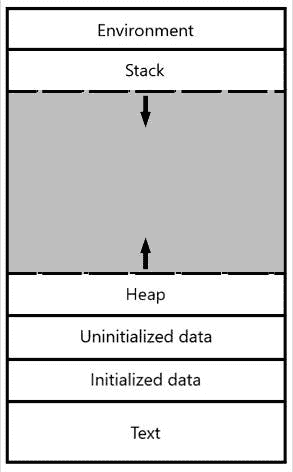
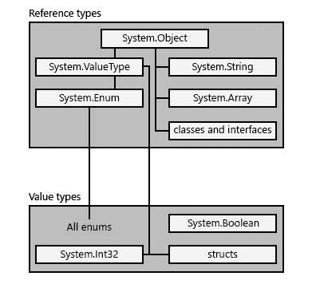
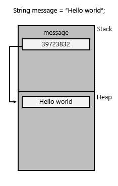

# C#中的数据类型和内存管理

> 原文：<https://blog.devgenius.io/data-types-and-memory-management-in-c-db95f728153?source=collection_archive---------1----------------------->


在解释 C#中可用的不同数据类型之前，有必要提一下 C#是一种强类型语言。这意味着每个变量、常量、输入参数、返回类型以及通常每个计算结果为值的表达式都有一个类型。

每种类型都包含一些信息，这些信息将由编译器作为元数据嵌入到可执行文件中，公共语言运行时(CLR)将使用这些元数据来保证分配和回收内存时的类型安全。

如果你想知道一个特定类型分配了多少内存，你可以使用如下的 **sizeof** 操作符:

```
static void Main()
{
    var size = sizeof(int);
    Console.WriteLine($"int size:{size}");
    size = sizeof(bool);
    Console.WriteLine($"bool size:{size}");
    size = sizeof(double);
    Console.WriteLine($"double size:{size}");
    size = sizeof(char);
    Console.WriteLine($"char size:{size}");
}
```

输出将显示每个变量分配的字节数。

```
int size:4
bool size:1
double size:8
char size:2
```

与每种类型相关的信息有:

*   所需的存储空间。
*   最大值和最小值。例如，Int32 类型接受-2147483648 和 2147483647 之间的值。
*   成员(方法、字段、事件等。)包含在该类型中。例如，如果我们检查 int 类型的定义，我们会发现下面的结构和成员:

```
...
namespace System
{
    [ComVisible(true)]
    public struct Int32 : IComparable, IFormattable, IConvertible, IComparable<Int32>, IEquatable<Int32>
    {      
        public const Int32 MaxValue = 2147483647;     
        public const Int32 MinValue = -2147483648;
        public static Int32 Parse(string s, NumberStyles style, IFormatProvider provider);    
        ... 
    }  
}
```

*   它继承的基类型。
*   运行时为变量分配内存的位置。
*   允许的操作种类。

# 内存管理

当一个操作系统上运行多个进程，而 RAM 的容量不足以容纳所有进程时，操作系统会将硬盘的一部分与 RAM 进行映射，并开始在硬盘中存储数据。操作系统将使用特定的表来执行请求，其中虚拟地址被映射到它们对应的物理地址。这种管理内存的能力被称为**虚拟内存**。

在每个进程中，可用的虚拟内存分为以下 6 个部分，但是为了与本主题相关，我们将只关注**堆栈**和**堆**。



# 堆

堆栈是 LIFO(后进先出)数据结构，大小取决于操作系统(默认情况下，对于 ARM、x86 和 x64 机器，Windows 保留 1MB，而 Linux 保留 2MB 到 8MB，具体取决于版本)。

这段内存由 CPU 自动管理**。每当一个函数声明一个新变量时，编译器就在堆栈上分配一个与其大小一样大的新内存块，当函数结束时，该变量的内存块就会被释放。**

# 许多

这个内存区域不是由 CPU 自动管理的，它的大小比堆栈大。当 ***new*** 关键字被调用时，编译器开始寻找符合请求大小的第一个空闲内存块。当它找到它时，通过使用内置的 C 函数 **malloc()** 将它标记为保留，并返回指向该位置的指针。还可以通过使用内置的 C 函数 **free()** 来释放一块内存。这种机制会导致内存碎片，并且必须使用指针来访问正确的内存块，**它比堆栈**执行读/写操作要慢。

# 自定义和内置类型

虽然 C#提供了一组标准的内置类型来表示整数、布尔值、文本字符等，但您可以使用 struct、class、interface 和 enum 等构造来创建自己的类型。

使用 struct 构造的自定义类型的一个示例是:

```
struct Point
{
    public int X;
    public int Y;};
```

# 值类型和引用类型

我们可以将 C#类型分为以下几类:

*   值类型
*   参考类型

下面的方案显示了两种引用类型(字符串、数组等)的层次结构。)和值类型。正如您所看到的，这两种数据类型都来自于类**系统。对象**。



# 值类型

值类型源自**系统。ValueType** 这种类型的类和变量在堆栈中的内存分配中包含它们的值。值类型的两个类别是**结构**和**枚举**。

以下示例显示了 boolean 类型的成员。如您所见，没有明确引用 System。ValueType 类，发生这种情况是因为该类由结构继承。

```
...
namespace System
{
    [ComVisible(true)]
    public struct Boolean : IComparable, IConvertible, IComparable<Boolean>, IEquatable<Boolean>
    {
        public static readonly string TrueString;
        public static readonly string FalseString;
        public static Boolean Parse(string value);
        ...
    }
}
```

# 参考类型

另一方面，引用类型不包含存储在变量中的实际数据，而是包含存储值的堆的**内存地址。引用类型的类别有**类**、**委托**、**数组**和**接口**。**



在运行时，当引用类型变量被声明时，**它包含空值**，直到一个使用关键字 ***new*** 创建的对象被分配给它。

以下示例显示了泛型类型列表<t>的成员。</t>

```
...
namespace System.Collections.Generic
{
    [DebuggerDisplay("Count = {Count}")]
    [DebuggerTypeProxy(typeof(Generic.Mscorlib_CollectionDebugView<>))]
    [DefaultMember("Item")]
    public class List<T> : IList<T>, ICollection<T>, IEnumerable<T>, IEnumerable, IList, ICollection, IReadOnlyList<T>, IReadOnlyCollection<T>
    {
        ...
        public T this[int index] { get; set; }
        public int Count { get; }
        public int Capacity { get; set; }
        public void Add(T item);
        public void AddRange(IEnumerable<T> collection);
        ...
    }
}
```

如果你想找出一个特定对象的内存地址，类 **System。InteropServices** 提供了一种从非托管内存访问托管对象的方法。在下面的例子中，我们将使用静态方法 **GCHandle。Alloc()** 分配一个句柄给一个字符串，然后方法 **AddrOfPinnedObject** 检索它的地址。

```
string s1 = "Hello World";
GCHandle gch = GCHandle.Alloc(s1, GCHandleType.Pinned);
IntPtr pObj = gch.AddrOfPinnedObject();
Console.WriteLine($"Memory address:{pObj.ToString()}");
```

输出将是

```
Memory address:39723832
```

# 录像

[https://www.youtube.com/watch?v=_7AL8wDl5Tc](https://www.youtube.com/watch?v=_7AL8wDl5Tc)