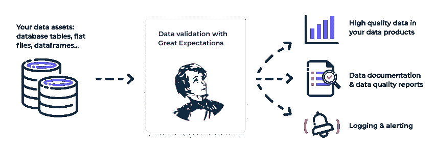

# 大期望和云功能的数据单元测试

> 原文：<https://blog.devgenius.io/data-unit-testing-with-great-expectations-and-cloud-functions-f739cee0bc95?source=collection_archive---------16----------------------->


在 AirQo，我们每天从部署在非洲大陆各地的低成本监视器中收集大量数据，其中大部分位于乌干达，此外还有来自我们的合作伙伴(如坎帕拉首都城市管理局)的数据，这些数据每小时都在流动，这导致我们收集的信息呈指数级增长。

理想情况下，在将数据存储到数据仓库之前，应该对其进行质量检查，这可以通过数据单元测试来完成。

在数据工程领域，数据单元测试是一个相对较新的概念，它对组织存储的数据进行质量检查。测试可以在数据管道的任何阶段进行，也可以在数据存储之后进行。这些测试有助于检测错误，如超出范围的值、丢失的数据和不正确的数据类型。

本教程的目标是解释如何在数据管道的任何阶段建立数据单元测试。我们将使用一个名为[远大前程](https://greatexpectations.io/)的 Python 开源库。



《远大前程》提供了名为**期望**的预先编写的测试，我们需要做的就是指定他们需要的测试，并为他们提供参数，我们将在本教程中看到

它还生成人们可读的文档，称为数据文档，总结可能在数据中发现的任何问题。

我们还将利用 Google Cloud 函数作为数据测试的触发器，并使用从数据管道中捕获的数据

# 本教程的先决条件:

*   谷歌云项目平台中的 2 个数据桶
*   本地运行的机器
*   本地安装的 gcloud SDK。

我们还将使用来自 [AirQo](https://www.sciencedirect.com/science/article/pii/S2352340922007065) 数据的样本数据集，但是您可以自由使用您选择的任何样本数据集，因为概念保持不变。

**下面是我们将要使用的数据集的屏幕截图。**


这项任务可以分为 3 个主要步骤:

*   设置 Great_expectations 并在本地进行配置。
*   将配置上传到 GCP
*   创建并上传云功能到 GCP

当使用`great_expectations`时，我们将使用三个主要概念:

*   **期望** —这些是关于数据的可验证的断言，即我们将测试什么。这些可以一起保存在一个称为期望套件的文件中
*   **一个数据环境** —一个远大前程部署的主要入口点，包含所有支持组件的配置和方法。
*   **检查点** —这是在高期望值的生产部署中验证数据的主要方法。

更多概念在[远大前程](https://greatexpectations.io/)网站上有详细介绍。他们还提供了一个很棒的[入门教程](https://docs.greatexpectations.io/docs/tutorials/getting_started/tutorial_overview)，我建议你在继续之前查看一下，快速了解一下这个库。本教程是一个用例，其中一个文件存储在谷歌云平台上，我们将从本地配置我们的数据上下文开始，然后上传到 GCP。

好吧。我们继续吗？


# 第一步

在您的计算机上创建一个新目录，并运行以下命令:

```
$ python3 -m venv venv $ source venv/bin/activate
$ source venv/bin/activate
```

这创造了我们将要工作的虚拟环境。根据您机器的 python 安装，第一条指令也可以写成如下形式:

```
$ python -m venv venv
$ source venv/bin/activate
```

# 第二步

安装 great expectations 并创建一个数据环境和一个期望套件。

```
$ python3 -m pip install great_expectations
$ great_expectations –-version
```

第一行在我们的环境中安装 great_expectations，第二行验证它是否已经安装。您应该会收到来自终端的如下输出:

```
> great_expectations, version 0.15.34
```

# 第三步

首先在你的本地机器上初始化和配置数据上下文，然后我们将它上传到 GCP。

```
$ great_expectations init
$ great_expectations suite new
```

第一行创建我们将在其中工作的数据上下文，而第二行返回创建期望时可用选项的提示。**选项包括:**

1.  在没有样本数据的情况下手动创建期望值
2.  根据一批样本数据创建预期，以快速验证您的预期
3.  自动使用数据助理。在这里，框架自动分析您的数据，并创建一些期望，您可以在以后轻松地进行配置。

对于本教程，我们将使用选项 1，因为我们的数据不是存储在本地，而是存储在 GCP。

选择选项 1 后，将创建一个 Jupyter 笔记本，您将使用它来创建套件，并请求为套件命名，我们将使用 airqo_data_tests。

# 第四步

删除第一个单元格的内容，并替换为以下内容:

```
import great_expectations as ge
import great_expectations.jupyter_ux
from great_expectations.core.expectation_configuration import ExpectationConfiguration

context = ge.data_context.DataContext()
suite = context.create_expectation_suite(
expectation_suite_name="airqo_data_tests", overwrite_existing=True
)

print(f'Created ExpectationSuite "{suite.expectation_suite_name}".')
```

这就创建了您的期望套件。你可以把这个期望套件命名为你认为合适的名称。

# 第五步

创建表和列期望。这些本质上是对数据的测试或验证。我将使用两个示例来让您对它们的结构有一个总体的了解。你在 Jupyter 笔记本的单元格中写下下面的语句并保存它:

```
python
expectation_configuration = ExpectationConfiguration(
expectation_type="expect_table_column_count_to_equal",
kwargs={"value": 10},
suite.add_expectation(expectation_configuration=expectation_configuration
)
```

这样做的目的是创建一个期望，声明表应该具有在`kwargs`参数中提供的列数。对于这个例子，我们首先在`expectation_type`参数中指定期望，因为我们期望该表有 10 列，所以我们将值 10 传递给`kwargs`参数。

所有你可以利用的期望都列在[远大前程网站](https://greatexpectations.io/expectations)上，所以你可以在网站上搜索你想利用的期望。

让我们创建另一个期望，这个期望针对特定的列，而不是整个表。在笔记本中创建一个新单元格，并添加以下内容:

```
expectation_configuration = ExpectationConfiguration(
expectation_type="expect_column_min_to_be_between",
kwargs={
    "column": "latitude",
    "min_value": -90,
    "max_value":90,
},
)
suite.add_expectation(expectation_configuration=expectation_configuration)
```

就像前一个一样，结构是相似的，先传递`expectation_type`，然后传递`kwargs`，后者设置纬度列中的值。该值应大于或等于-90 且小于或等于 90

# 第六步

创建期望后，添加最后一个单元格，内容如下:

```
with open("../expectations/airqo_data_tests.json", "w") as expectation_store:
import json
json.dump(suite.to_json_dict(), expectation_store)
```

最后一步将您的配置保存到一个 JSON 文件中，并构建数据文档

# 第七步

接下来，我们将在`great_expectations`目录中创建一个名为`loading_args`的目录。我们将在那里保存一个名为`airqo_data_tests.yaml.` **(它应该与期望套件文件同名)**。

这里我们将添加一些我们想传递给熊猫`pd.read_csv()`的论点。这是必要的，因为 Great Expectations 使用 pandas 作为这些测试的执行引擎。你可以在官方文件中找到更多相关信息。

在同一文件中，添加以下内容:

```
reader_options:
 index_col: False
```

# 第八步

我们继续配置 great_expectations 文件夹中的`great_expectations.yaml`文件。该文件用于设置目标数据的位置以及存储其他信息的位置，如期望值、验证结果和数据文档。

```
yaml
config_version: 3

datasources:
  my_gcs_datasource:
    class_name: Datasource
    module_name: "great_expectations.datasource"
    execution_engine:
        class_name: PandasExecutionEngine
    data_connectors:
        default_runtime_data_connector_name:
            class_name: RuntimeDataConnector
            batch_identifiers:
                - default_identifier_name

expectations_store_name: expectations_GCS_store
validations_store_name: validations_GCS_store
evaluation_parameter_store_name: "evaluation_parameter_store"

stores:
    expectations_GCS_store:
        class_name: ExpectationsStore
        store_backend:
            class_name: TupleGCSStoreBackend
            project: ${PROJECT}
            bucket: ${VALIDATION_BUCKET}
            prefix: 'expectations'

    validations_GCS_store:
        class_name: ValidationsStore
        store_backend:
            class_name: TupleGCSStoreBackend
            project: ${PROJECT}
            bucket: ${VALIDATION_BUCKET}
            prefix: 'validations'

    evaluation_parameter_store:
      class_name: EvaluationParameterStore

data_docs_sites:
  gs_site:
    class_name: SiteBuilder
    store_backend:
      class_name: TupleGCSStoreBackend
      project: ${PROJECT}
      bucket: ${VALIDATION_BUCKET}
      prefix:
    site_index_builder:
      class_name: DefaultSiteIndexBuilder

validation_operators:
  action_list_operator:
    class_name: ActionListValidationOperator
    action_list:
    - name: store_validation_result
      action:
        class_name: StoreValidationResultAction
    - name: store_evaluation_params
      action:
        class_name: StoreEvaluationParametersAction
    - name: update_data_docs
      action:
        class_name: UpdateDataDocsAction

anonymous_usage_statistics:
  enabled: False
```

上面代码含义的快速总结:

```
datasources:
  my_gcs_datasource:
    class_name: Datasource
    module_name: "great_expectations.datasource"
    execution_engine:
        class_name: PandasExecutionEngine
    data_connectors:
        default_runtime_data_connector_name:
            class_name: RuntimeDataConnector
            batch_identifiers:
                - default_identifier_name
```

这定义了 Great Expectations 可以在哪里找到数据，以及使用什么执行引擎。它提供熊猫和 PySpark。

```
stores:
    expectations_GCS_store:
        class_name: ExpectationsStore
        store_backend:
            class_name: TupleGCSStoreBackend
            project: ${PROJECT}
            bucket: ${VALIDATION_BUCKET}
            prefix: 'expectations'

    validations_GCS_store:
        class_name: ValidationsStore
        store_backend:
            class_name: TupleGCSStoreBackend
            project: ${PROJECT}
            bucket: ${VALIDATION_BUCKET}
            prefix: 'validations'
```

这定义了`VALIDATION BUCKET`将保存我们定义的期望以及在一个名为`validations`的目录中完成的检查的结果

```
data_docs_sites:
  gs_site:
    class_name: SiteBuilder
    store_backend:
      class_name: TupleGCSStoreBackend
      project: ${PROJECT}
      bucket: ${VALIDATION_BUCKET}
      prefix:
    site_index_builder:
      class_name: DefaultSiteIndexBuilder
```

这定义了关于已经验证的数据的文档存储在哪里。

```
validation_operators:
  action_list_operator:
    class_name: ActionListValidationOperator
    action_list:
    - name: store_validation_result
      action:
        class_name: StoreValidationResultAction
    - name: store_evaluation_params
      action:
        class_name: StoreEvaluationParametersAction
    - name: update_data_docs
      action:
        class_name: UpdateDataDocsAction
```

然后，这告诉大期望存储结果，并更新数据文件。

`$PROJECT`和`$VALIDATION_BUCKET`的值可以在终端中配置为环境变量。例如`$VALIDATION_BUCKET= "gs://validation_bucket"`其中**项目**是 GCP 项目名称， **VALIDATION_BUCKET** 是一个存储验证、数据文档以及期望的存储桶。

**注意:确保在值前包含 gs://。**

最后，当我们安装了 gcloud 之后，我们将这些配置上传到 GCP，在那里进行测试。

这可以使用以下命令来完成:

```
gsutil -m rsync -r -x 'uncommitted/*|.gitignore|plugins/*' great_expectations $VALIDATION_BUCKET
```

接下来，我们将编写云函数的代码。每次创建或修改 bucket 中的文件时，都会触发该函数。
首先，我们将创建一个带有子目录`data_validation.`的`cloud_functions`文件夹，导航到`data_validation`文件夹
，在这里，我们将创建 3 个文件和 1 个目录，如下所示:

1.  `requirements.txt` -包含云功能所需的库，如下所示:

```
google-cloud-storage
great-expectations==0.15.28
fsspec
gcsfs
```

2.env . YAML——它保存了关于项目的私有细节的文件，存储桶和填充如下所示:

```
PROJECT: <PROJECT_NAME>
BUCKET: <BUCKET_NAME>
VALIDATION_BUCKET: <VALIDATION_BUCKET_NAME>
```

3.接下来，我们将用一个空的`__init__.py`文件创建一个`src`目录，以及一个`gcs.py`文件。用以下内容填充`gcs.py`文件:

```
import logging
from typing import Any

import ruamel.yaml as yaml
from google.cloud import storage

logger = logging.getLogger(__name__)
logger.setLevel(logging.DEBUG)
ch = logging.StreamHandler()
ch.setLevel(logging.DEBUG)
formatter = logging.Formatter("%(asctime)s - %(name)s - %(levelname)s - %(message)s")
ch.setFormatter(formatter)
logger.addHandler(ch)

def read_yml_from_gcs(
    bucket_name: str,
    blob_name: str,
    template: dict[str, Any],
    client: storage.Client = storage.Client(),
) -> dict[str, Any]:
    bucket: storage.Bucket = client.bucket(bucket_name)
    content: bytes = bucket.blob(blob_name).download_as_string()
    decoded: str = content.decode("utf-8")

    for k, v in template.items():
        decoded = decoded.replace(k, v)

    return yaml.safe_load(decoded)

def move_blob(
    bucket_name: str,
    blob_name: str,
    prefix: str,
    client: storage.Client = storage.Client(),
) -> None:

    bucket = client.bucket(bucket_name)
    blob = bucket.blob(blob_name)

    new_name = "/".join([prefix] + blob_name.split("/")[1:])
    new_blob = bucket.rename_blob(blob, new_name)

    logger.info(f"Blob {blob.name} has been renamed to {new_blob.name}")

def check_trigger_file_path(blob_name: str, trigger_prefix: str) -> bool:
    return blob_name.startswith(trigger_prefix)

def extract_dataset_name(blob_name) -> str:
    return blob_name.split("/")[1]
```

4.最后，导航回父目录`data_validation`创建一个 [main.py](http://main.py) 文件，该文件将用于触发云函数，如下所示:

```
import logging
import os
from typing import Any, Dict

from great_expectations.checkpoint import SimpleCheckpoint
from great_expectations.checkpoint.types.checkpoint_result import CheckpointResult
from great_expectations.core.batch import RuntimeBatchRequest
from great_expectations.data_context import BaseDataContext
from great_expectations.data_context.types.base import DataContextConfig
from src.gcs import (
    check_trigger_file_path,
    extract_dataset_name,
    move_blob,
    read_yml_from_gcs,
)

logger = logging.getLogger(__name__)
logger.setLevel(logging.DEBUG)
ch = logging.StreamHandler()
ch.setLevel(logging.DEBUG)
formatter = logging.Formatter("%(asctime)s - %(name)s - %(levelname)s - %(message)s")
ch.setFormatter(formatter)
logger.addHandler(ch)

PROJECT = os.environ["PROJECT"]
VALIDATION_BUCKET = os.environ["VALIDATION_BUCKET"]
YAML_TEMPLATE = {"$PROJECT": PROJECT, "$VALIDATION_BUCKET": VALIDATION_BUCKET}

class ValidationError(Exception):
    """Validation Unsuccessful Exception"""

def build_data_context_config(config: dict[str, Any]) -> DataContextConfig:
    return DataContextConfig(**config)

def build_data_context(config: DataContextConfig) -> BaseDataContext:
    return BaseDataContext(config)

def build_batch_request(
    gcs_uri: str, batch_spec_passthrough: dict[str, Any]
) -> RuntimeBatchRequest:

    return RuntimeBatchRequest(
        datasource_name="my_gcs_datasource",
        data_connector_name="default_runtime_data_connector_name",
        data_asset_name=gcs_uri,
        runtime_parameters={"path": gcs_uri},
        batch_identifiers={"default_identifier_name": "default_identifier"},
        batch_spec_passthrough=batch_spec_passthrough,
    )

def build_checkpoint(
    checkpoint_name: str,
    expectation_suite_name: str,
    context: BaseDataContext,
    batch_request: RuntimeBatchRequest,
) -> SimpleCheckpoint:

    file_name = "-".join(batch_request.data_asset_name.split("/")[3:])

    checkpoint_config = {
        "config_version": 1.0,
        "class_name": "Checkpoint",
        "run_name_template": f"%Y%m%d-%H%M%S-{file_name}",
        "validations": [
            {
                "batch_request": batch_request.to_json_dict(),
                "expectation_suite_name": expectation_suite_name,
            },
        ],
    }

    return SimpleCheckpoint(
        name=checkpoint_name, data_context=context, **checkpoint_config
    )

def run_validation(
    dataset_name: str,
    gcs_uri: str,
    project_config: Dict[str, Any],
    batch_spec_passthrough: Dict[str, Any],
) -> CheckpointResult:

    logger.info("Building great expectations configs")

    context_config = build_data_context_config(project_config)
    context = build_data_context(context_config)
    batch_request = build_batch_request(gcs_uri, batch_spec_passthrough)
    checkpoint = build_checkpoint(
        checkpoint_name=dataset_name,
        expectation_suite_name=dataset_name,
        context=context,
        batch_request=batch_request,
    )

    logger.info(f"Starting Validation for {gcs_uri}")
    return checkpoint.run()

def main(data, context): 

    if not check_trigger_file_path(data["name"], "landing_zone"):
        return

    dataset_name = extract_dataset_name(data["name"])
    data_uri = f"gs://{data['bucket']}/{data['name']}"
    project_config = read_yml_from_gcs(
        bucket_name=VALIDATION_BUCKET,
        blob_name="great_expectations.yml",
        template=YAML_TEMPLATE,
    )
    batch_spec_passthrough = read_yml_from_gcs(
        bucket_name=VALIDATION_BUCKET,
        blob_name=f"loading_args/{dataset_name}.yml",
        template=YAML_TEMPLATE,
    )

    checkpoint_result = run_validation(
        dataset_name, data_uri, project_config, batch_spec_passthrough
    )

    if checkpoint_result["success"]:
        logger.info("Validation successful")
        move_blob(
            bucket_name=data["bucket"], blob_name=data["name"], prefix="validated"
        )
    else:
        logger.error("Validation unsuccessful")
        raise ValidationError
```

5.我们快到了！所以我们会把云功能上传到 Google Cloud。**需要云功能管理员权限才能做到这一点。**我们可以创建一个名为 [upload.sh](http://upload.sh) 的 bash 脚本来实现它，如下所示。我将添加注释来解释每个参数的含义:

```
##This tutorial uses v1 cloud functions. 
gcloud functions deploy  data_unit_test \
    --source cloud_functions/data_validation \ #local path to the cloud function
    --entry-point main \ #main.py file. Runs on function trigger
    --project $PROJECT \ #The GCP project name
    --region europe-west \ #Region where to deploy the function
    --env-vars-file cloud_functions/data_validation/env.yaml \ 
    --runtime python310 \ #python version
    --memory 512MB \ #how much memory the function is allocated
    --trigger-resource $BUCKET \ # bucket that triggers the function
    --trigger-event google.storage.object.finalize #event that causes func to run
```


记住将您要验证的文件添加到一个标有`landing_zone`的目录和一个与您的期望套件同名的子目录中。每次创建文件或修改现有文件时，都会触发该功能。您可以将数据添加到未测试的数据桶中，作为触发该功能的测试。要查看功能的运行状态，请查看云功能的日志。

validated data 文件夹还包含一个名为`validations`的子目录，其中包含给定触发器结果的详细信息，这些信息由 great_expectations 汇总在一个 html 文件或 JSON 文件中，如下所示:


作者:[穆塔巴兹贵族](https://ug.linkedin.com/in/mutabazi-noble-062994236)

> ***如果您是需要项目数据的开发人员或学生，我们是您空气质量数据的一站式来源。只需点击这里*** [***即可注册***](https://airqo.net) ***。***

*最初发布于*[*https://airqoengineering . hashnode . dev*](https://airqoengineering.hashnode.dev/data-unit-testing-with-great-expectations-and-cloud-functions)*。*