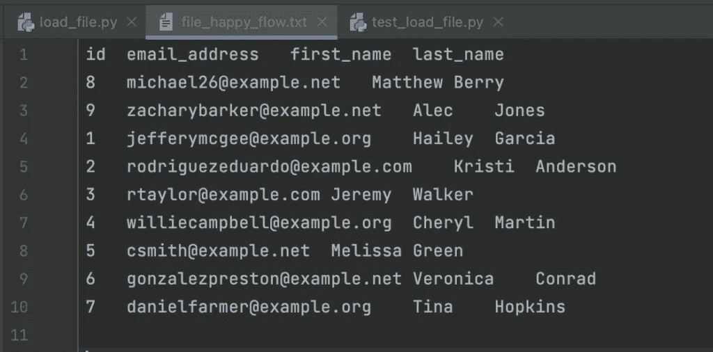

# 数据验证不同于(单元)测试

> 原文：<https://blog.devgenius.io/data-validation-is-not-the-same-as-unit-testing-b4f0ed59fdf?source=collection_archive---------7----------------------->

文章首发 [@ownyourdata.ai](https://ownyourdata.ai/wp/data-validation-is-not-the-same-as-unit-testing/) 。

当我们称之为测试时，我认为我们对数据验证非常不公平。随着越来越多的(大/海量)数据处理被添加到软件应用程序中，我们应该区分什么是测试，什么是数据验证。在本文中，我们将从编写单元测试开始，实现输入和输出验证，最后实现数据验证。

# 测试

是检查应用程序的行为是否如需求所定义，是后端、前端还是数据应用程序。测试可以有多种类型，可以发生在开发的不同阶段:

*   单元测试通常由开发人员创建的测试组成，是自动化的，并作为 CI/CD 管道的一部分执行；
*   集成测试由测试人员创建的测试组成，可以是手动的，也可以是自动的，并且作为功能或用户接受测试阶段的一部分来执行。我将极大地简化集成测试:它也包含回归测试，并且通常在大项目中进行。最好是由开发人员以外的其他同事来执行。

让我们更详细地看看单元测试。我们将从一个简单的方法开始练习，该方法将文件位置作为输入，并返回按字段排序的前 X 条记录，也作为输入提供:

```
import json

import pandas as pd

def get_json_from_file(file_path, separator, order_by_column, number_of_records):
    df = pd.read_csv(
        file_path,
        sep=separator
    ).sort_values(by=order_by_column)[0:number_of_records]
    return json.loads(df.to_json(orient="records"))
```

在上面的方法中，我们用 pandas 读取位于`file_path`的 csv，由`separator`分隔，我们按`order_by_column`排序数据，并返回第一个`number_of_records`。

当我们对上面的方法进行单元测试时，我们寻找令人满意的和错误的测试场景。对于快乐流，文件首先需要存在，当我们测试时，我们提供正确的分隔符和一个存在的列:



测试将会是:

```
def test_load_file_happy_flow():
    file_to_test = f"{pathlib.Path(__file__).parent.resolve()}/file_happy_flow.txt"
    separator = "\t"
    order_by_column = "id"
    number_of_records = 5
    records = get_json_from_file(
        file_path=file_to_test,
        separator=separator,
        order_by_column=order_by_column,
        number_of_records=number_of_records
    )
    assert len(records) == number_of_records, "Length is not as expected"
    records_before_sorting = records
    records_before_sorting.sort(key=itemgetter(order_by_column))
    assert records == records_before_sorting, "The response is not sorted"
```

在 happy 流中，我们测试得到的记录数与输入的记录数相同，并且结果按输入提供的列排序。

对于错误流可以有许多测试场景，但是让我们从文件不存在开始:

```
def test_load_file_error_404():
    file_to_test = "unknown_location"
    separator = "\t"
    order_by_column = "id"
    number_of_records = 5

    with pytest.raises(FileNotFoundError):
        get_json_from_file(
            file_path=file_to_test,
            separator=separator,
            order_by_column=order_by_column,
            number_of_records=number_of_records
        )
```

上述测试将测试该方法是否会引发文件未找到错误。在这种情况下，很好地观察到，当我们编写单元测试时，我们不希望它们失败，我们希望它们成功地测试出我们的代码将在某个场景中失败。这是与数据验证相比的第一个区别:当数据没有通过验证检查时，数据验证应该发出一个错误信号。

# 确认

在错误流中，我们可以随心所欲地测试任何出现在我们脑海中的场景，但是我们需要确保我们的测试也是高效和充分的。更重要的是，即使我们对所有情况进行单元测试，也不意味着用户*知道*数据的*需求*并且数据在运行时得到验证。单元测试只在部署时确保符合性。

我们可以通过以下方式使我们的应用变得健壮和合规:

*   实现类型化
*   实现输入验证
*   实施默认值(如果适用)
*   实现数据验证
*   实施输出验证

# 打字

在 Python 中，类型化并不强制执行严格的检查，这意味着即使我们在方法定义中添加了类型并提供了不同的数据类型，检查也不会完成:

```
def get_json_from_file(file_path: str, separator: str, order_by_column: str, number_of_records: int) -> list:
    df = pd.read_csv(
        file_path,
        sep=separator
    ).sort_values(by=order_by_column)[0:number_of_records]
    return json.loads(df.to_json(orient="records"))
```

为了加强类型检查，我们可以实现输入验证。

# 输入验证

在任何应用程序中，输入验证都是良好数据质量的支柱:没有输入验证，用户可能会引入错误的数据，应用程序也可能受到影响。在这篇文章中，我将展示`pydantic`:

```
from typing import Optional

from pydantic import BaseModel, Field

class LoadFileInSchema(BaseModel):
    file_path: str = Field(..., title="The absolute path of the file to be imported")
    separator: str = Field(..., title="The field separator in the file")
    order_by_column: str = Field(..., title="The column to order the data by")
    number_of_records: int = Field(..., title="The number of records to retrieve")
```

我们可以在用户将要使用的新方法中使用它:

```
def get_json_from_file_with_schema(input_data: LoadFileSchema) -> list:
    return get_json_from_file(
        file_path=input_data.file_path,
        separator=input_data.separator,
        order_by_column=input_data.order_by_column,
        number_of_records=input_data.number_of_records
    )
```

通过以上操作，我们已经可以在调用实际方法之前验证输入:

```
In [10]: file_path = '.../backend/app/unittest_showcase/file_happy_flow.txt'
In [11]: separator = '\t'
In [12]: order_by_column = 'id'
In [13]: number_of_records = 5
In [14]: input_data = LoadFileInSchema(file_path=file_path, separator=separator, order_by_column=order_by_column, number_of_records=number_of_records)
In [15]: input_data.dict()
Out[15]: 
{'file_path': '.../backend/app/unittest_showcase/file_happy_flow.txt',
 'separator': '\t',
 'order_by_column': 'id',
 'number_of_records': 5}

In [17]: number_of_records = None
In [18]: input_data = LoadFileInSchema(file_path=file_path, separator=separator, order_by_column=order_by_column, number_of_records=number_of_records)
---------------------------------------------------------------------------
ValidationError: 1 validation error for LoadFileInSchema
number_of_records
  none is not an allowed value (type=type_error.none.not_allowed)
```

# 默认值

使用 pydantic，我们还可以实现可选字段，并为它们分配一个默认值:

```
In [26]: class LoadFileInDefaultValuesSchema(BaseModel):
    ...:     file_path: str = Field(..., title="The absolute path of the file to be imported")
    ...:     separator: Optional[str] = Field(default=",", title="The field separator in the file")
    ...:     order_by_column: str = Field(..., title="The column to order the data by")
    ...:     number_of_records: Optional[int] = Field(default=5, title="The number of records to retrieve")
    ...: 
In [27]: file_path = '.../backend/app/unittest_showcase/file_happy_flow.txt'
In [28]: order_by_column = "id"
In [29]: input_data = LoadFileInDefaultValuesSchema(file_path=file_path, order_by_column=order_by_column)
In [30]: input_data.dict()
Out[30]: 
{'file_path': '.../backend/app/unittest_showcase/file_happy_flow.txt',
 'separator': ',',
 'order_by_column': 'id',
 'number_of_records': 5}
```

通过以上内容，我们为用户简化了方法的使用，并确保我们考虑到了不同的场景。

关于输入验证，需要注意的一点是，当它检查一种数据时，它不是我们在数据工程中所说的`data validation`。输入验证是指验证方法输入的严格概念，主要用于软件开发和面向用户的流程中(例如，出于安全性和合规性的考虑，开发 API 时最好进行输入验证)。

# 数据有效性

到目前为止，我们已经实施了:

*   方法的单元测试，可用于软件和数据应用程序；
*   方法的输入验证，这是面向用户的方法所必须的。

让我们再次修改我们的方法:

```
def get_json_from_file(file_path: str, separator: str, order_by_column: str, number_of_records: int) -> list:
    df = pd.read_csv(
        file_path,
        sep=separator
    ).sort_values(by=order_by_column)[0:number_of_records]
    return json.loads(df.to_json(orient="records"))
```

当我们在上述案例中谈到数据验证时，我们指的是:

*   验证文件中的数据
*   输出数据的验证

当我们在数据工程领域时，我们编写类似于软件工程的代码:上面的代码在两种情况下都可以很容易地使用。但是在数据工程中，除了验证代码中定义的方法的输入之外，我们还验证输入定义的数据:我们不仅验证`file_path`是一个字符串，我们还验证数据帧中返回的数据根据一组规则是有效的，例如由数据契约建立的。

因此，对于数据工程，我们可能希望添加一些验证检查:

```
def get_json_from_file(file_path: str, separator: str, order_by_column: str, number_of_records: int) -> list:
    df = pd.read_csv(
        file_path,
        sep=separator
    )
    # Validation rule 1 - the order_by_column should be of type integer
    if not is_integer_dtype(df[order_by_column]):
        raise ValueError(f"The field {order_by_column} is not integer")
    # Validation rule 2 - the order_by_column should be unique
    if not df[order_by_column].is_unique:
        raise ValueError(f"The field {order_by_column} is not unique")
    df = df.sort_values(by=order_by_column)[0:number_of_records]

    return json.loads(df.to_json(orient="records"))
```

根据用例的不同，人们可能希望提出 ValueError(特别是在财务报告上)或者只是将错误放入错误日志中，以便以后进行分析(主要是在营销设置中)。

在软件工程中，我们为面向用户的方法实现输出验证。如果使用上述方法将数据返回到 API 中，API 将需要验证数据是否符合 API 的模式。这也可以通过 pydantic 实现:

```
class LoadCustomerFileOutSchema(BaseModel):
    id: int = Field(..., title="The id of the customer")
    email_address: EmailStr = Field(..., title="The email of the customer")
    first_name: str = Field(..., title="The first name of the customer")
    last_name: str = Field(..., title="The last name of the customer")
```

在上面的模式中，我们定义了方法的输出应该是什么样子。现在，我们对客户文件的数据处理方法可能如下所示

```
def get_customer_data(input_data: LoadFileInDefaultValuesSchema) -> list:
    records = get_json_from_file(
        file_path=input_data.file_path,
        separator=input_data.separator,
        order_by_column=input_data.order_by_column,
        number_of_records=input_data.number_of_records
    )

    validated_output = parse_obj_as(List[LoadCustomerFileOutSchema], records)
    return json.loads(json.dumps(validated_output, default=pydantic_encoder))
```

使用`parse_obj_as`，我们确保我们的数据符合模式`LoadCustomerFileOutSchema`。当我们使用错误的电子邮件地址执行上述操作时，我们将得到:

```
ValidationError: 1 validation error for ParsingModel[List[unittest_showcase.schemas.LoadCustomerFileOutSchema]]
__root__ -> 0 -> email_address
  value is not a valid email address (type=value_error.email)
```

# 结论

测试是检查我们的应用程序是否如需求所定义的那样工作的行为，包括失败场景。测试是在测试时完成的。

单元测试是检查我们的方法是否按预期工作的行为。单元测试在代码审查/部署时完成。

输入验证是检查方法的输入是否符合预期的行为。在运行时完成。

输出验证是检查方法的输出是否符合预期的行为。在运行时完成。

数据验证是检查数据是否符合预期的行为。在运行时完成。

这取决于人们可能开发的应用程序的类型；输入验证、输出验证和数据验证在定义上可以重叠。但是，不管应用程序的类型如何，测试和单元测试并不等同于数据验证，数据验证也不等同于测试。


[以上代码仅作为示例。]

# 证明文件

1.  [Pydantic](https://docs.pydantic.dev/)
2.  [Pytest](https://docs.pytest.org/en/7.2.x/)