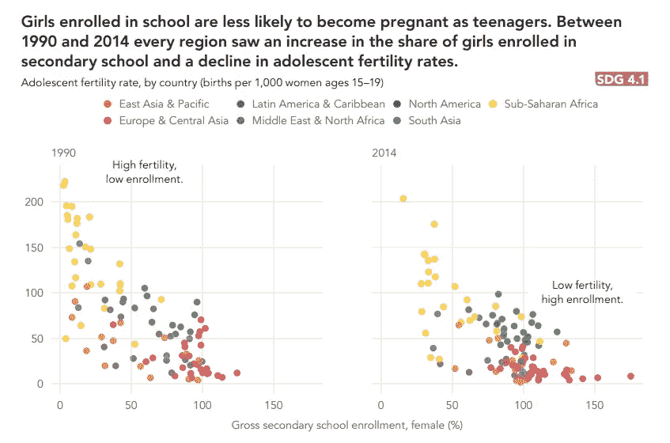
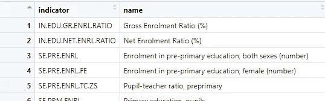
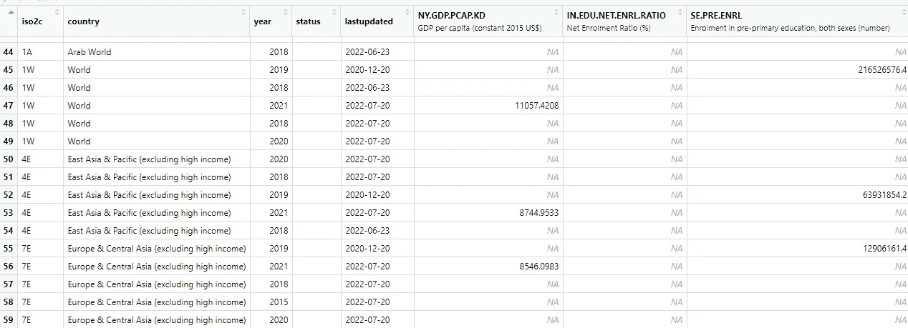
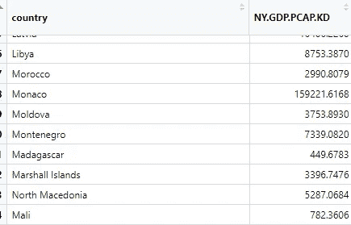
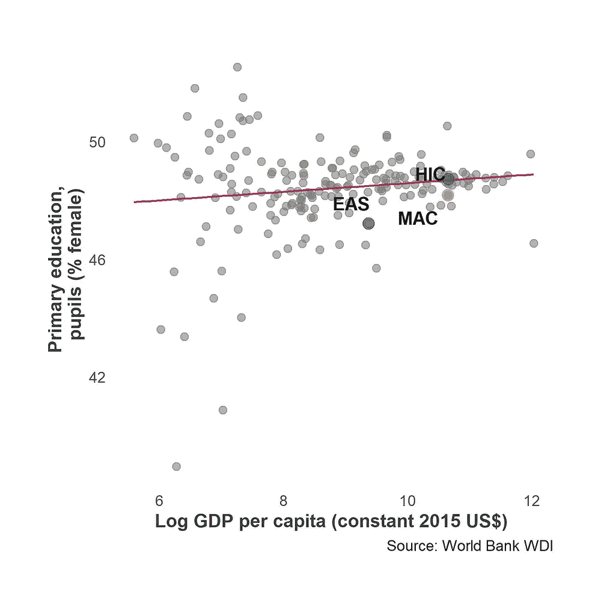
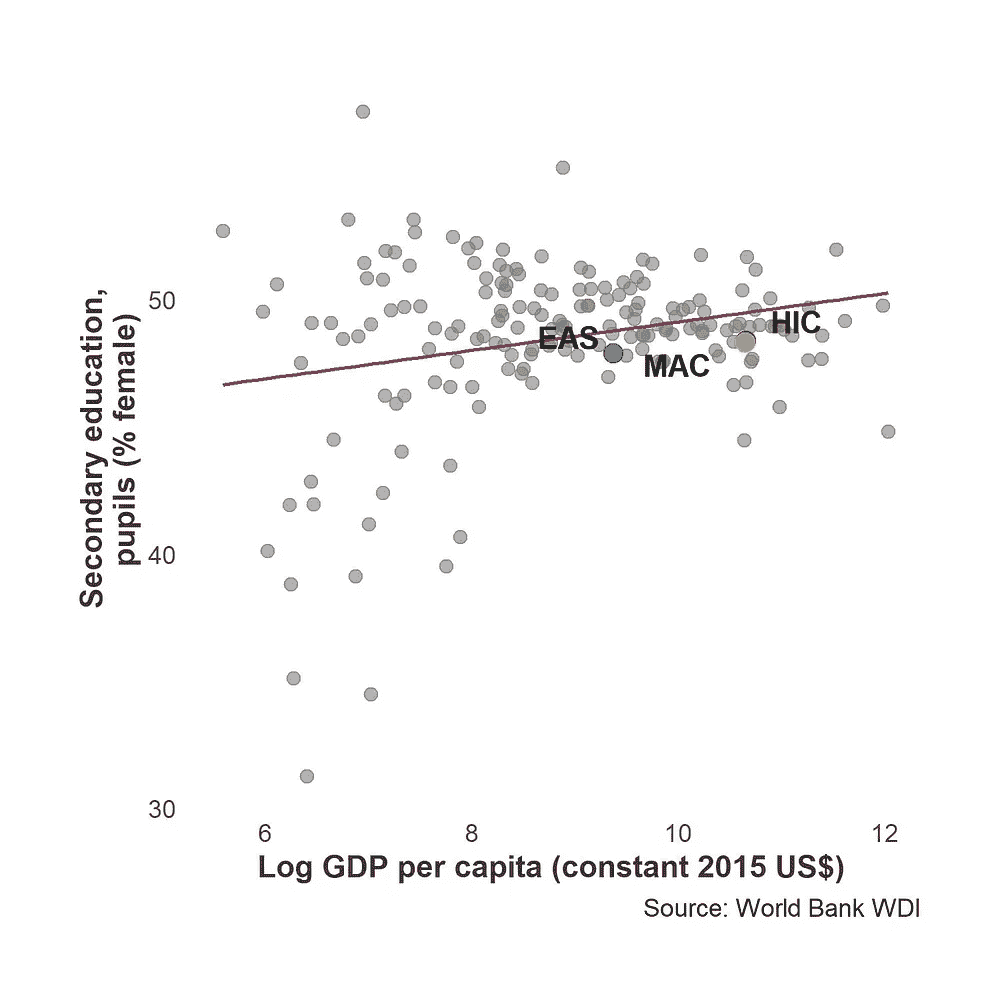
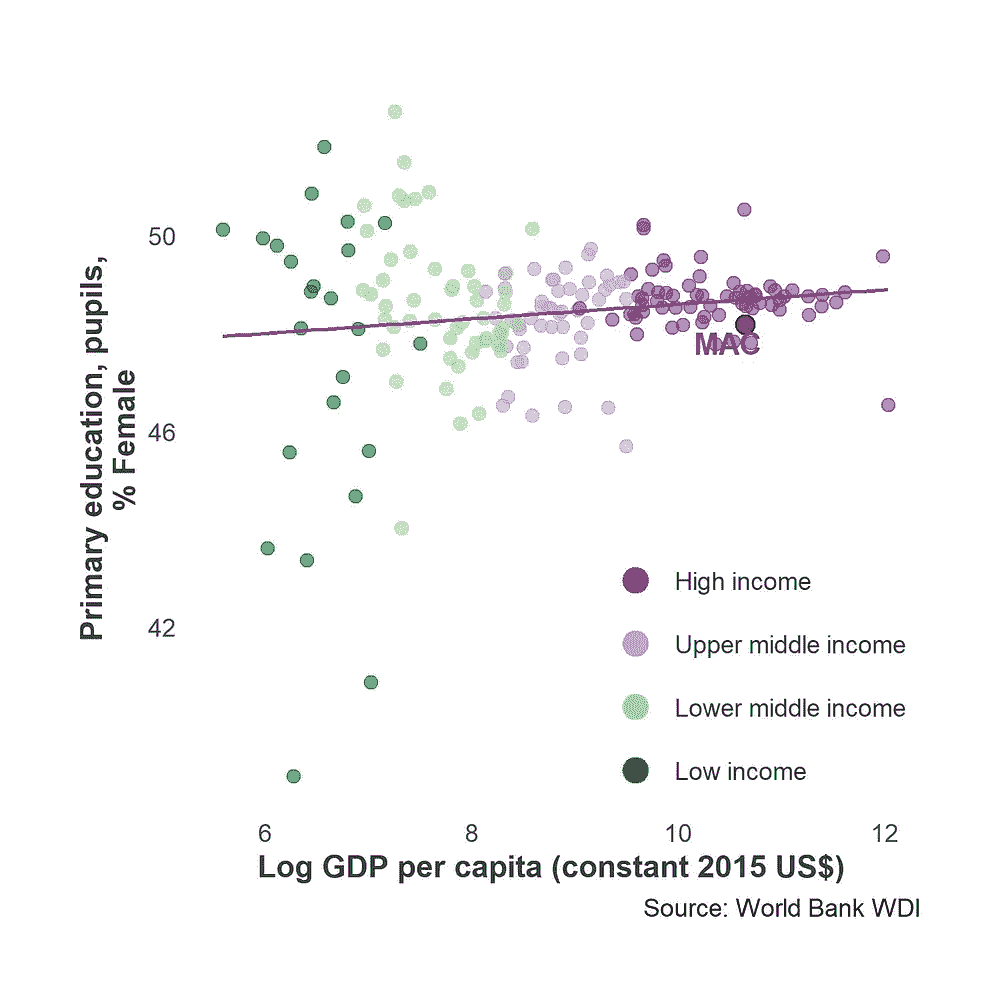
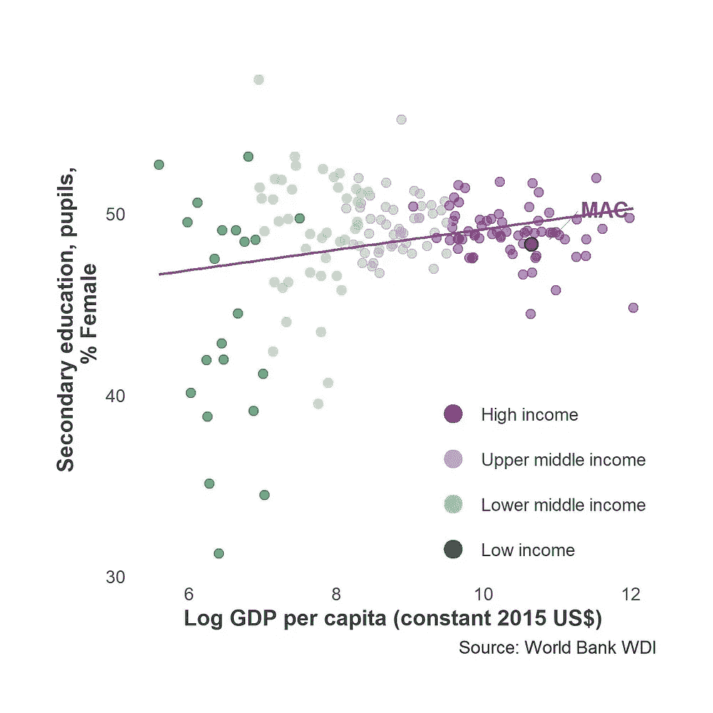

# 在 R 中使用 WDI 包的经济学数据

> 原文：<https://blog.devgenius.io/data-visualization-for-economics-using-wdi-package-in-r-d2da5a542f8b?source=collection_archive---------5----------------------->

过早辍学的女孩更有可能过早结婚或生孩子，而这种成本会越来越大:

*   在女孩们在情感或生理上还没有准备好的时候就成为妻子或母亲会影响她们自己和孩子的健康。
*   较低的教育程度也意味着即使在家庭内部，代理也较少。
*   过早辍学减少了进入劳动力市场的机会，导致更高的贫困率和更低的社会参与率。

下面的[图](http://Atlas of Sustainable Development Goals 2018)将开发女孩潜力的重要性分为两个指标:生育率和入学率。在明确这种关系之前，我们经历了许多背景(还有更多)。

来源:【2018 年可持续发展目标图集

同样，有如此多的发展指标，以至于选择正确的关系来探索一个问题可能会令人生畏。仅世界发展指标就有超过 1400 个指标。

在这篇文章中，我演示了如何一次绘制多个散点图。Vincent Arel-Bundock 的 [**WDI 包**](https://cran.r-project.org/web/packages/WDI/WDI.pdf) 和 [**ggplot2**](https://ggplot2.tidyverse.org/) 都是你需要的。WDI 允许你从 [**世界银行数据目录**](https://datacatalog.worldbank.org/search/dataset/0037712/World-Development-Indicators) 中直接找到并调用指标给 r

这种练习有助于快速获得多种视觉效果，以了解团体或国家相对于彼此的立场。本练习将考察不同国家的财富水平登记指标([人均国内生产总值，2015 年定值美元](https://data.worldbank.org/indicator/NY.GDP.PCAP.KD))，但你也可以用其他指标代替。

人均 GDP 是衡量国家财富的一个常用指标。此处，数值以对数标度表示。由于财富增长可能是指数增长，对数 GDP 创造了更线性的人均 GDP 增长。

*   记住 [**关联≠因果**](https://towardsdatascience.com/correlation-is-not-causation-ae05d03c1f53#:~:text=About%20correlation%20and%20causation,correlation%2C%20but%20it's%20not%20causation.) 。除了阅读现有的研究和文献，这些情节有助于理解发展的一般模式和群体的立场。绘制多个时间点的图表(如上)或一次绘制许多事情的图表(一个国家是否在十项主要发展指标中有几项未达标？)缩小了我们的发现范围。
*   请访问 [DIME Analytics](https://www.worldbank.org/en/research/dime/data-and-analytics) 的 [Stata 可视化库](https://worldbank.github.io/stata-visual-library/)和 [R Econ 可视化库](https://worldbank.github.io/r-econ-visual-library/)，了解对发展和经济学有用的更多可复制的可视化示例。

## 第一步。检索数据

加载包:

加载库

我们将使用的第一个 WDI 命令 WDIsearch()返回包含指定字符串的指示器列表。从列表中提取指标。

搜索指示器

该查询返回了 27 个指标。下面是输出的预览:

ind(列表)输出

我们稍后将使用 name 列。

要获取数据，请运行 WDI()。该命令有非常灵活的参数来获得您正在寻找的数据的精确组合。这个例子寻找每个国家最近的人均 GDP 值和注册指标。一些国家有相当过时的数据，所以我只查询了过去 10 年的数据。

*注意:API 并不完善，一些不可用的指标将被跳过。我有一个警告消息，是关于一些已经下载的指示器的，所以一定要检查你的输出。*

从 WDI 获取数据()

dataframe 为每个指标、一个国家的地区、收入和贷款组返回一列。搜索还包括聚合。

因为指标在不同的年份更新，您会注意到数据集在不同的国家和年份是唯一的，并且指标中有许多缺失值。

下一步将介绍如何为制图准备数据集。

数据库(数据帧)输出

## 第二步。准备数据集

因为我们正在查看给定时间内国家之间的快照，所以我们不需要 *year* 变量。相反，我们将折叠指示器，以允许 *country* 成为 ID 变量。

首先，提取指示器列名的列表。然后，对于所有这些列，用第一个可用值填写每个国家的所有行。这将为拥有超过一年数据的每个国家创建相同的行。现在，您可以通过 iso3c(国家代码)删除数据中的重复项。

请注意，这个步骤只起作用，因为每个指标只有一个值，所以它将所有年份合并为一个。

将国家作为 ID

现在，每个国家的所有数据都应该在一行中:

清洗后的数据库

回到我们提取指示器名称和标签的第一步，我们将把这个列表与查询结果合并。稍后，我们将使用 *df_ind* 遍历图表的指示器。

最后，从数据集中删除聚合数据，因为匿名化后它们实际上无法与国家数据点进行比较。我包括了两个例外——**东亚和太平洋**和**高收入**作为澳门特区的对等参照，它们将在图表中突出显示。

## 第三步。循环绘制指示器

最后要做的事情是绘制一切。这段代码循环遍历每个指标，同时保持人均 GDP 不变。我已经对代码进行了注释，但是如果您有任何问题，请联系我们。

为了节省空间，我将在这里展示两个图，而不是二十多个图。但是你可以在这里做一些简单的比较:

各年级女生入学率和人均国内生产总值百分比。

一眼望去，澳门的人均 GDP 在全球名列前茅。它落后于女小学生，其财富份额低于预期。尽管如此，它在所有方面的价值都高于其地区平均值(东亚和太平洋地区)。

在两个年级之间，澳门的女生入学比例保持一致，而两个同龄群体的变化表明不同年龄的性别动态存在差异。

## **版本 2:**

您也可以通过突出显示图表中的其他点来转移您的焦点。当按收入组给国家着色时，我们看到，随着国家达到更高的收入分类，女性入学率的差异减少。差异的数量和方向也因年级而异。

对澳门来说，尽管入学人数不及其他高收入国家，但也不算太落后。

各年级女生入学率和人均国内生产总值百分比。按收入群体分类。

## **寻找指标的替代方式:**

如果您没有一组有针对性的指标可以查看，那么可以从[世界银行数据目录](https://datacatalog.worldbank.org/search/dataset/0037712/World-Development-Indicators)中查找元数据文件。我使用 zip 文件中的 WDISeries.csv。数据集包括指标名称、定义及其所属的主题。

我在下面添加了一个示例代码，在这里我将数据过滤为*公共部门:政策&机构*主题，提取 WDI 命令的指示器名称，以及图形 y 轴的标签。从这里开始，你可以重复上面的步骤，用公共部门变量来绘制人均 GDP。

感谢阅读，请让我知道这是否有用，如果有你想在未来看到的补充！