# 使用 PYTHON 实现数据可视化

> 原文：<https://blog.devgenius.io/data-visualization-using-python-6c76f9d7054e?source=collection_archive---------10----------------------->

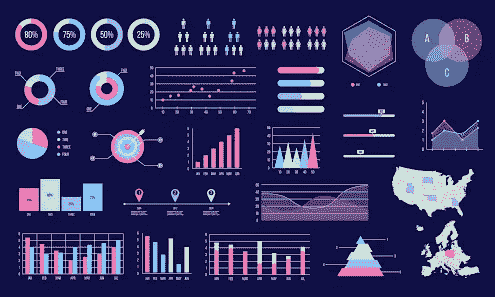

# 什么是数据可视化？

数据可视化是一门学科，它试图通过将数据置于可视化的环境中来理解数据，从而揭示出可能无法检测到的模式、趋势和相关性。

数据可视化有助于获得洞察力，并了解在给定的上下文中过去发生了什么。对特征工程也有帮助。

数据可视化的主要优势如下:

*   它简化了复杂的定量信息。
*   它有助于轻松分析和探索大数据。
*   它确定了数据点和变量之间的关系。

# 绘制绘图

Matplotlib 是一个 Python 2-D 绘图库，也是最广泛使用的数据可视化库。它提供了一套丰富的绘图 API 来创建各种绘图，如散点图、条形图、箱形图和分布图，并带有自定义样式和注释。matplotlib 的详细文档可以在[https://matplotlib.org/.](https://matplotlib.org/.)找到

Seaborn 也是一个基于 Matplotlib 的 Python 数据可视化库。它为绘制创新和信息丰富的统计图提供了高级界面(来源:【https://seaborn.pydata.org/】[)。](https://seaborn.pydata.org/)

Matplotlib 是一个用于在 Python 中创建数组的 2D 图的库。Matplotlib 是用 Python 编写的，使用 NumPy 数组。和熊猫读专栏，造剧情结合的很好。

Seaborn 构建在 Matplotlib 之上，是一个用 Python 制作优雅图表的库。

为了创建图形和绘图，我们需要导入 matplotlib.pyplot 和 seaborn 模块。为了在 Jupyter 笔记本上显示绘图，我们需要提供一个指令%matplotlib inline。

**注**:只有提供了指令，才会在笔记本上显示情节。

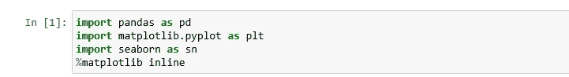

正在导入所需的库。

**导入数据集**

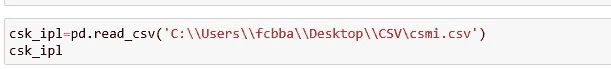

正在将数据集加载到 pandas。

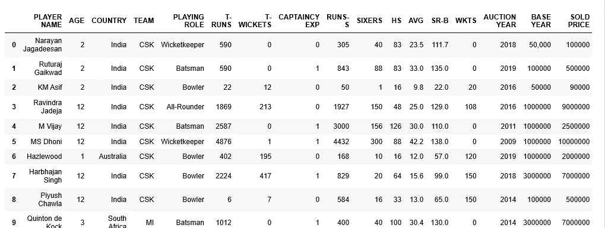

数据集(即 csmi.csv)

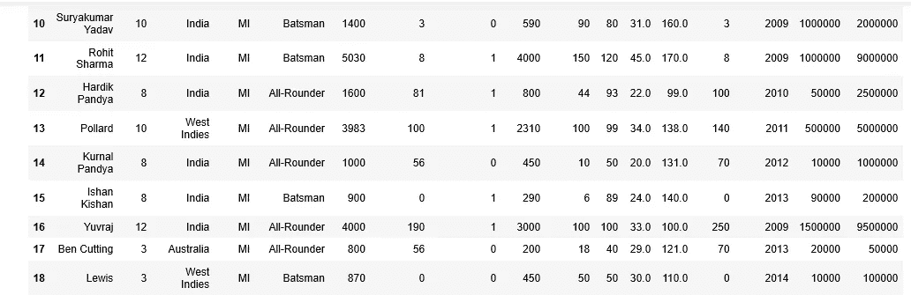

数据集(即 csmi.csv)

**数据集包含参加 ipl 比赛的球员列表，具有以下特征**

年龄=打了几个赛季，T-RUNS =在测试格式中得分的回合，T-WICKETS =在测试格式中得分的回合，RUNS-S =在 T20 格式中得分的回合，AGE =平均，HS =最高分，SR-B =击球中的击球率，WKTS =在 T20 格式中得分的回合数。

## **条形图:**

条形图是定性变量的频率图。条形图可用于评估数据集中出现次数最多和最少的类别。在对几个组进行比较时使用。

要画条形图，调用 seaborn 库的 barplot()。DataFrame 应该在参数数据中传递。若要按每个年龄类别显示平均销售价格，请将销售价格作为 y 参数传递，将年龄作为 x 参数传递。图中显示了一个条形图，用于显示每个年龄类别的平均销售价格。

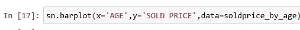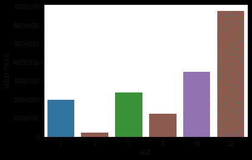

图 1:平均售价与年龄的柱状图。

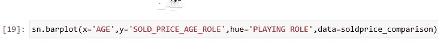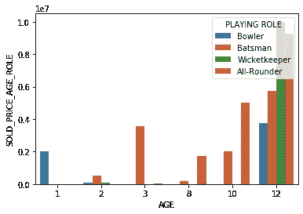

图 2:玩家角色的平均售价与年龄的柱状图。

在图 1 中，可以注意到年龄类别 1 的平均销售价格较高。我们可以创建条形图，通过第三个变量进行分组。

在下面的例子中(图 2)，显示了每个年龄类别的平均销售价格，但是按照第三个变量分组，即角色。参数 hue 将第三个变量作为参数(即扮演角色)。

**直方图:**

直方图是显示一组连续变量的频率分布的图表。直方图提供了对变量、异常值、偏斜度等潜在分布的洞察。要绘制直方图，调用 matplotlib 库的 hist()方法。

下面是一个如何绘制销售价格直方图并了解其分布的示例。

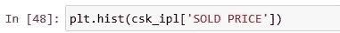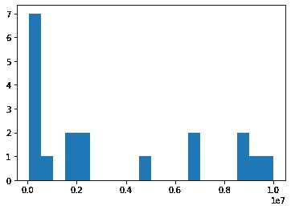

图 3:售出价格直方图。

**密度或分布图:**

密度图描绘了连续时间间隔内的数据分布。密度图类似于平滑的直方图，可直观显示连续时间间隔内的数据分布。因此，密度图也能让我们了解人口的分布情况。

要绘制分布图，我们可以使用 seaborn 库的 distplot()。结果变量“销售价格”的密度图如图 4 所示。

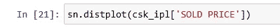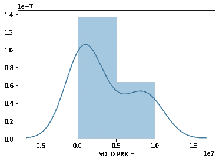

图 4:销售价格的分布图。

**方框图:**

箱线图是数字数据的图形表示，可用于了解数据的可变性和异常值的存在。箱线图是通过识别以下描述性统计数据来设计的:

*   下四分位数、中位数和上四分位数
*   最低和最高值。
*   四分位数间距(IQR)。

**何时使用**:当我们需要使用数据分布的整体统计信息时，应该使用它。它可用于检测数据中的异常值。

**了解箱线图:**

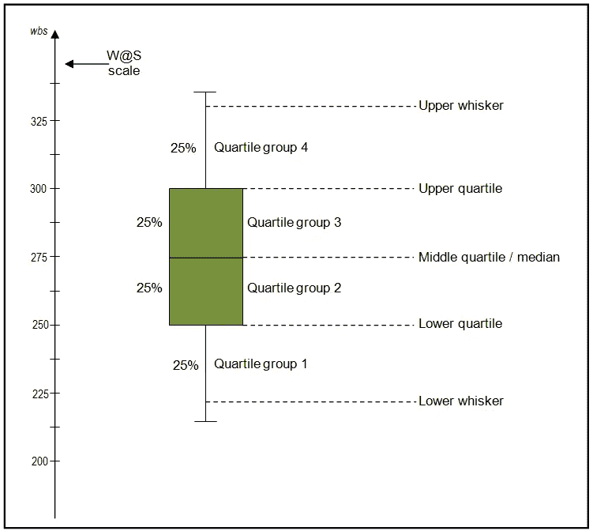

[https://images.app.goo.gl/1aN94TiK4s1889XS6](https://images.app.goo.gl/1aN94TiK4s1889XS6)

使用 IQR、最小值和最大值构建箱线图。IQR 是第三个四分位数和第一个四分位数之间的距离(差)。这个盒子的长度相当于 IQR。数据可能包含超出 Q1-1.5 iqr 和 Q3+1.51QR 的值。箱线图的须延伸至 Q1-1.5 iqr 和 Q3+1.5 iqr；超过这两个极限的观察值是潜在的异常值。

要绘制盒状图，调用 seaborn 库的 box plot()。售出价格的箱线图如图 5 所示。

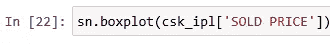

要获得箱线图中的最小值、最大值、25 个百分点(第一个四分位数)和 75 个百分比(第三个四分位数)值，可以使用 matplotlib 的 boxplot()方法。

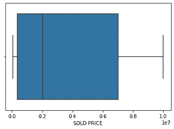

图 5:销售价格的箱线图。

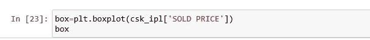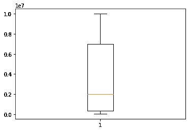

图 6:带中线的销售价格箱线图。

上面的代码行创建了一个如图 6 所示的方框图，并在变量 box 中返回了方框图的细节。caps key in box 变量返回分布的最小值和最大值。这里是拍卖的最低价格是 50，000，最高价格是 100，000，000。

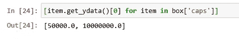

whiskers key in box 变量返回 25 和 75 个四分位数处的分布值。这里的最小值是 3，50，000，最大值是 70，00，000。

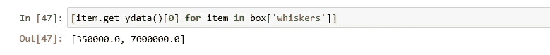

因此，四分位数范围(IQR)是 70，00，000–3，50，000=66，50，000。

框中的中间值关键字变量返回分布的中间值。这里的中间值是 20，000，000。

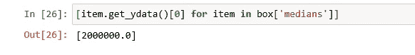

**比较分布:**

不同类别的分布可以通过重叠分布来进行比较。比如 ***有队长 EXP*** 和无队长 EXP 的玩家售价可以对比如下。可以通过绘制每个类别的分布图并将它们重叠在一个图中来比较分布。

有和没有队长经验的销售价格对比图如图 7 所示。

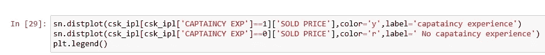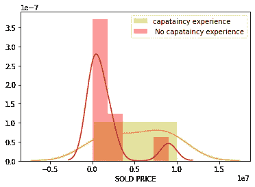

图 7:比较有和没有队长经验的销售价格的分布图。

**散点图:**

在散点图中，两个变量的值沿两个轴绘制，产生的模式可以揭示变量之间的相关性(如果有)。该关系可以是线性的或非线性的。散点图对于评估关系的强度以及发现数据中是否有异常值也很有用。

散点图在回归模型构建过程中用于确定初始模型，即是否在回归模型中包含某个变量。

matplotlib 的 scatter()方法可用于绘制散点图，该散点图采用两个变量。我们将只为扮演角色的击球手绘制散点图。

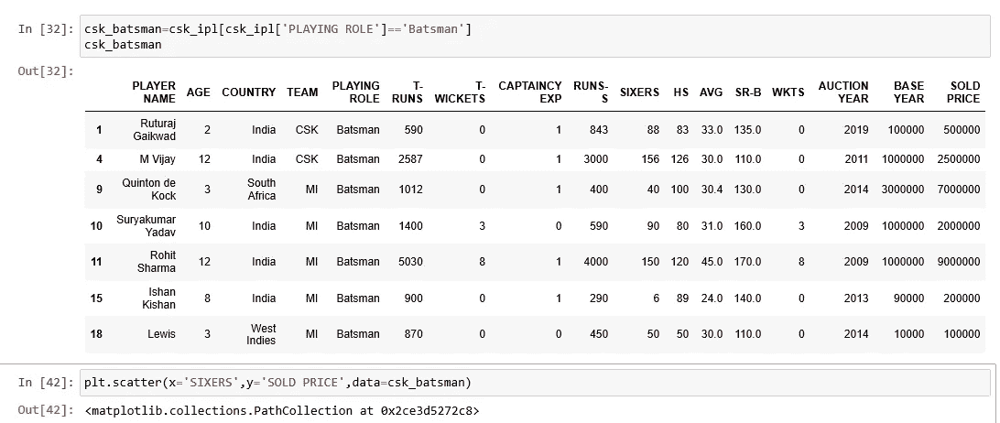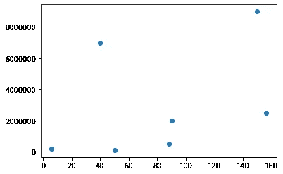

图 8:卖出价格与第六批的散点图。

要绘制变量之间的方向关系，可以使用 regplot()的(图 9)。

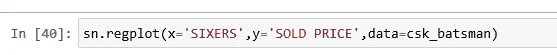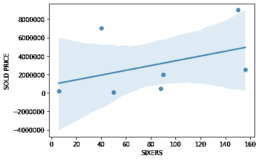

图 9:带回归线的卖出价格与六倍价格的散点图。

图 9 中的线显示击球手打出的六分的数量和卖价之间存在相关性。

**配对图:**

如果有许多变量，不方便为每一对变量画散点图来了解关系。因此，可以使用 pairplot()方法在单个图表中描述一对关系。

在这个例子中，我们将探讨四个变量的关系，HS，AVG，76 人，售价，我们认为这可能是决定击球手售价的影响因素(图 10)。

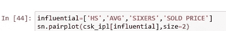

该图像矩阵一样绘制，每行和每列由一个变量表示。每个单元格描述了由行和列变量表示的两个变量之间的关系。例如，第二行第三列的单元格显示了 AVG 和 76 人之间的关系。矩阵的对角线显示了变量的分布。

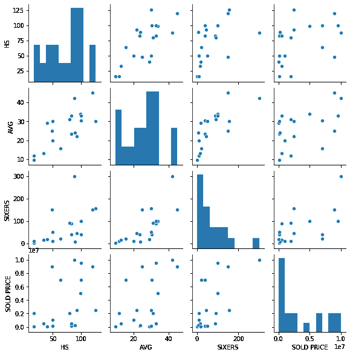

图 10:变量之间的配对图。

**关联和热图:**

相关性用于度量两个连续随机变量 X 和 y 之间线性关系的强度和方向，它是一种统计度量，表示两个变量一起变化的程度。正相关意味着变量一起增加或减少；负相关意味着如果一个变量增加，另一个就会减少。

1.  相关值介于-1.0 和 1.0 之间。符号表示是正相关还是负相关。
2.  -1.0 表示完全负相关，而+1.0 表示完全正相关。

可以使用数据帧的 corr()方法计算相关值，并使用热图进行渲染。

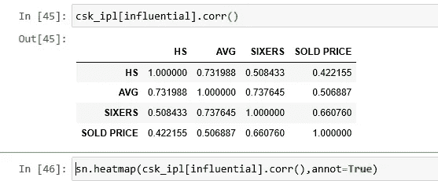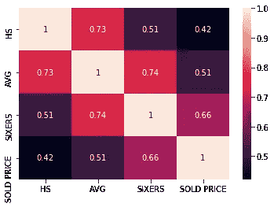

图 11:相关值的热图。

彩色地图比例沿热图显示。将 annot 属性设置为 true 会在热图的每个框中打印相关值，并提高热图的可读性。这里的热图显示，AVG 和 76 人显示出正相关。

## 使用 python 实现:

 [## saimanoj 1234/数据可视化

### python 代码。通过在 GitHub 上创建帐户，为 saimanoj 1234/数据可视化开发做出贡献。

github.c](https://github.com/saimanoj1234/Data-Visualization)