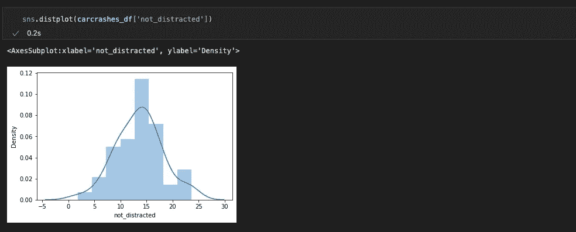

# 使用 Seaborn 实现数据可视化📈—如何设置 Seaborn 并创建分布图

> 原文：<https://blog.devgenius.io/data-visualization-with-seaborn-how-to-set-up-seaborn-create-distribution-plots-e3a3abdb8b28?source=collection_archive---------3----------------------->

## Seaborn 教程 2022[第 1 部分] — Seaborn 设置、导入数据、分布图

欢迎数据科学家和编码新手！我很高兴你找到了我的频道，并希望我能在一些相关的话题上帮助你。今天我们将讨论 seaborn 的设置，导入 Seaborn 数据集以及分布图。Seaborn 是一个构建在 Matplotlib 之上的数据可视化库，在数据科学社区中非常流行。在 Seaborn 成为一名专业人士绝对是你未来数据科学家职业生涯的一个好赌注。为什么要用 Seaborn 而不是 Matplotlib？—好吧，使用 Seaborn，您可能只用一行代码就能得到相同的结果。它只是有助于加快数据 viz 过程。信息和灵感来自德里克·巴纳斯的 YouTube 频道。让我们在海边直跳🚀

按 vegxcodes

# 调教⚡️

我在 Visual Studio 代码集成开发环境中使用 Jupyter 笔记本。因为我也在使用 Github Copilot 扩展，所以在 VS 代码中使用 jupyter 笔记本非常方便。

首先我们需要安装 Seaborn，你可以运行:pip install seaborn 或 conda install seaborn，这取决于你是否使用 anaconda。

下一步是导入⬇️教程所需的所有库

按 vegxcodes

除了导入 Numpy、Pandas、Matplotlib 和 Seaborn，我们还添加了一些额外的设置:

1.  %matplotlib 内联➡️直接在笔记本中显示绘图
2.  %reload_ext 自动重新加载➡️以自动重新加载模块
3.  %autoreload 2 ➡️自动重新加载模块
4.  warnings . filter warnings(" ignore ")➡️忽略警告(可选)

# 导入数据⚡️

让我们导入 seaborn 数据集 car_crashes，并使用 head 方法查看数据，该方法默认返回前 5 个观察值。

按 vegxcodes

我们将使用这个数据集进行可视化。让我们加入 Seaborn 的能力并开始编码🚀

# ⚡️分布图

让我们来看看司机没有分心的事故分布图。seaborn 的 distplot 函数返回一个直方图，如下图所示。⬇️

按 vegxcodes

如果你想删除线(内核密度函数)，你可以设置 kde 为假，并改变仓。你可以把箱子想象成一桶桶的数据。条柱的大小决定了区间的大小，从而决定了哪些数据点被计数到哪个条柱。下面我们已经删除了 kde，并将仓位大小改为 10 ⬇️

按 vegxcodes

今天到此为止！希望你能了解一些关于 Seaborn 的事情。请随意继续，并尝试自己的图书馆。我将在下周上传第二部分！快乐编码和学习🚀

*感谢您阅读这篇文章！如果你想支持我，你可以这样做。请在 Medium 或 Twitter、Instagram、抖音或 YouTube 上关注我。
2。为文章
3 鼓掌。留个短评*

我真的很感谢每一种支持！随着时间的推移，您与内容的每一次互动都将帮助我成长并提供更好的内容。🚀

*谢谢你，蔬菜代码*

## ⚡️资源

链接 1:【https://www.youtube.com/watch?v=6GUZXDef2U0 