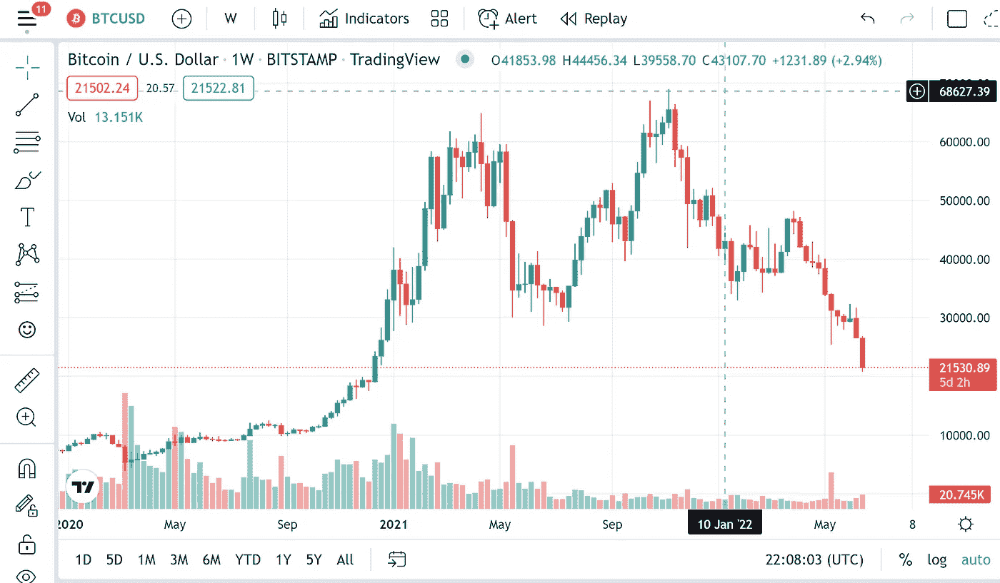
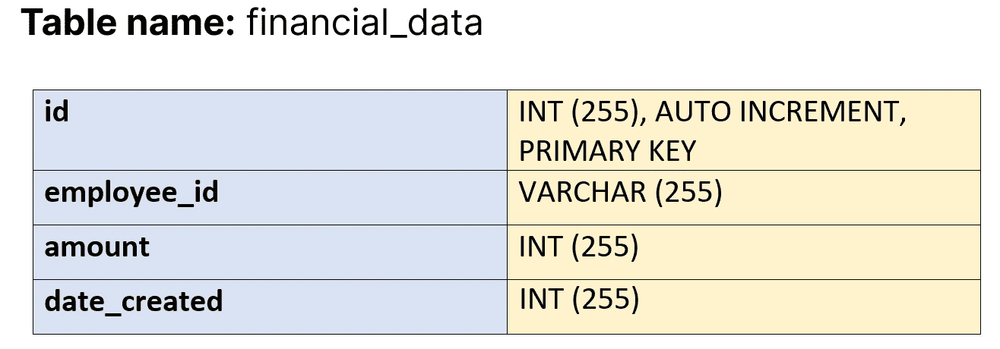
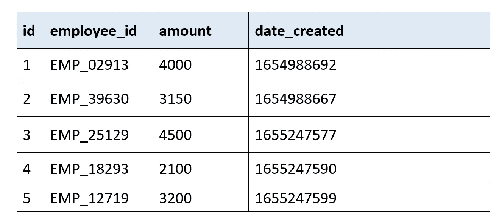
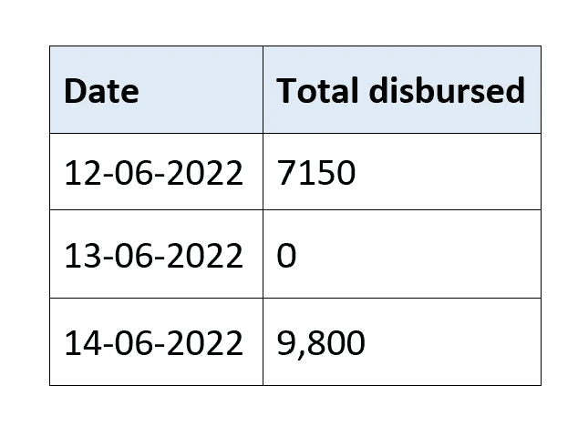
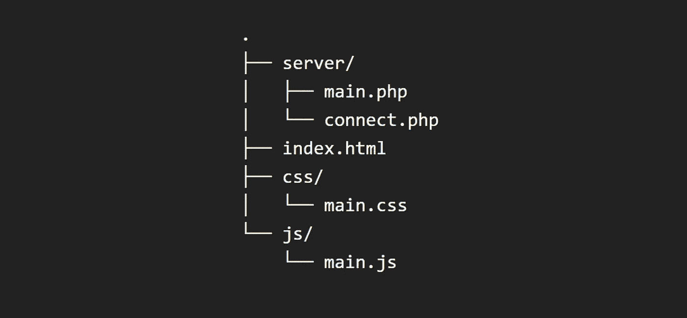
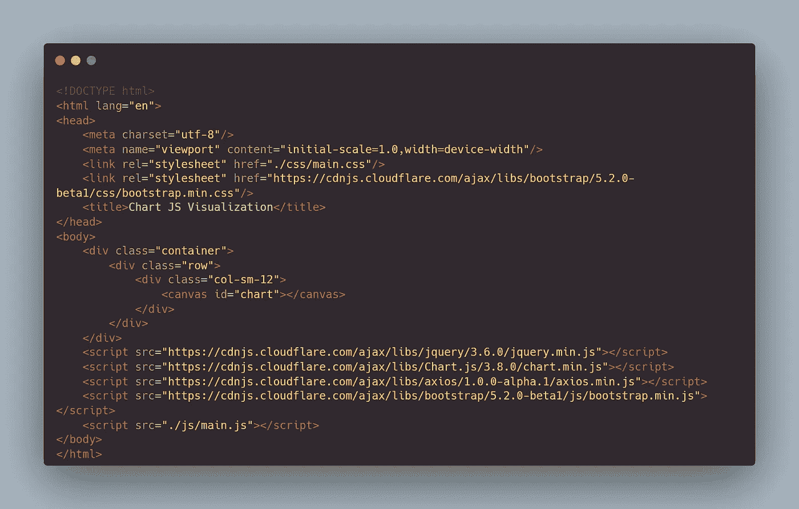
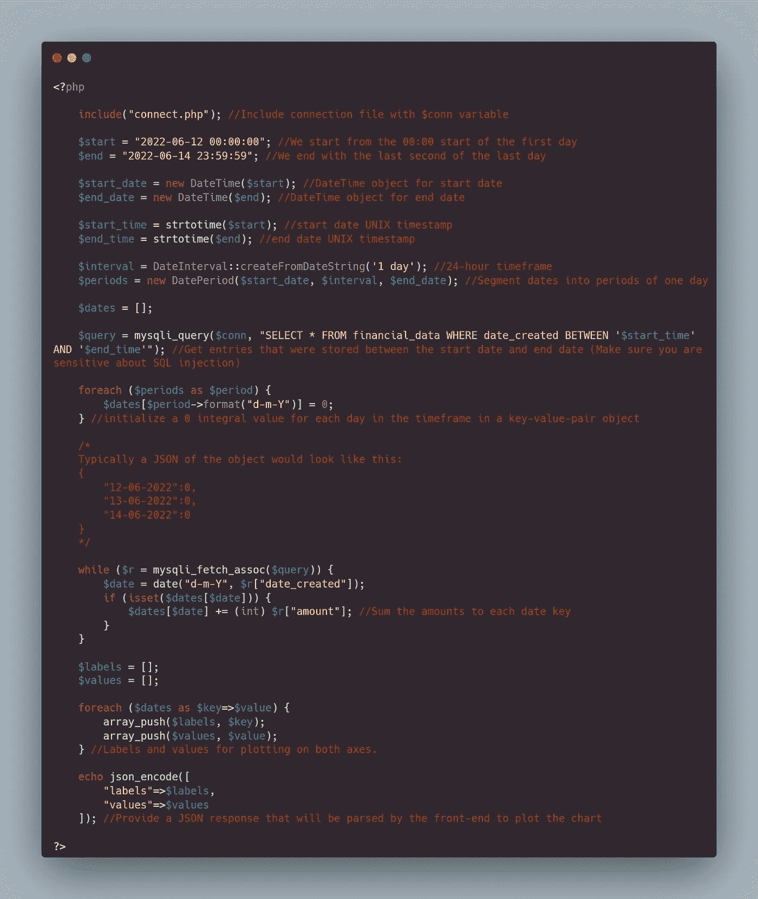
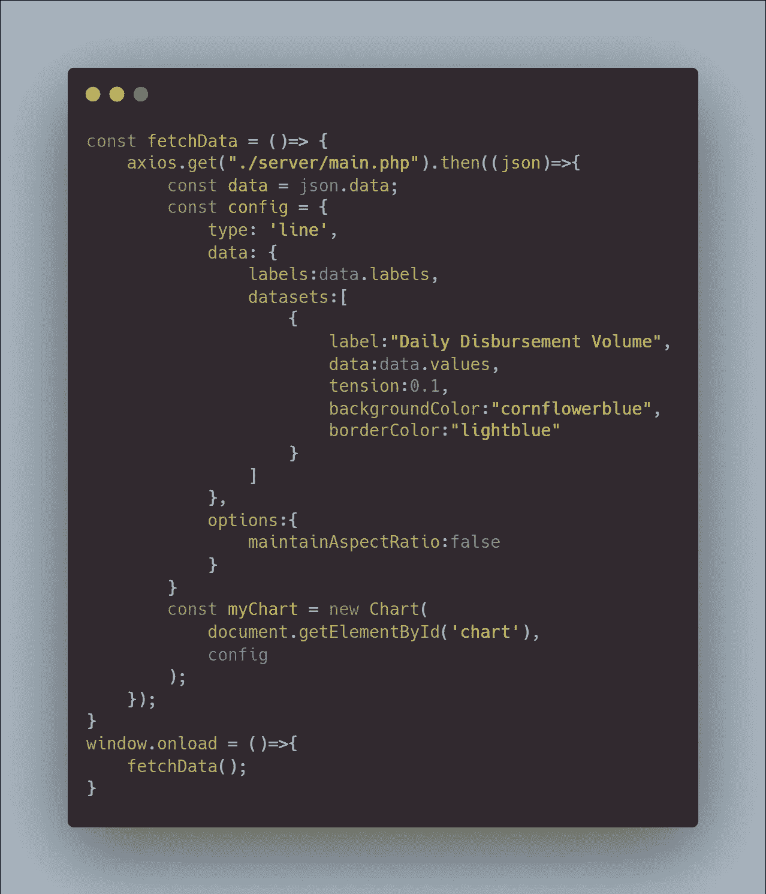
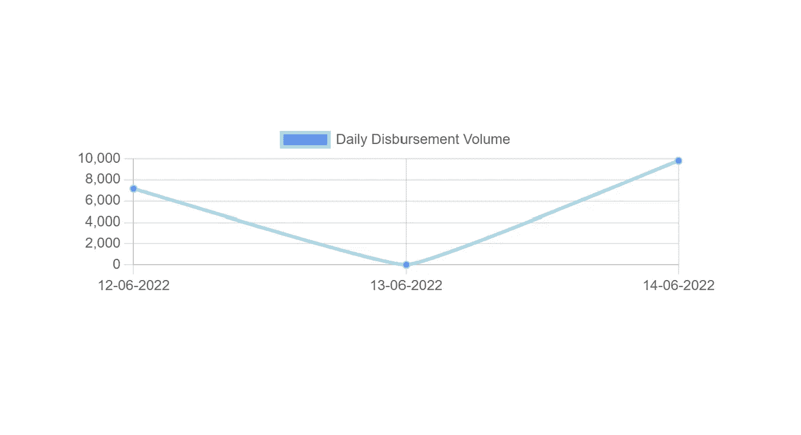

# 用普通 PHP 实现数据可视化:用 Chart.js 和 PHP/MySQL 制作图表的入门指南。

> 原文：<https://blog.devgenius.io/data-visualization-with-vanilla-php-a-introductory-guide-to-charting-with-chart-js-and-php-mysql-f8e34a107c36?source=collection_archive---------5----------------------->

图片来源:https://raconteur.net

视觉数据比任何其他形式的数据更快地传达给大脑，这是一个不争的事实，因此需要可视化。就数学和统计学而言，这已经走了很长的路，并且多年来已经被证明是数据科学中的一个重要学科。

> “眼睛是身体的窗户，通过它来感受世界和欣赏世界的美丽。由于有了眼睛，灵魂满足于呆在肉体的监狱里，因为没有眼睛，这种肉体的监狱就是折磨。”
> 
> —莱昂纳多·达·芬奇(1452-1519)

数据科学中的可视化是以图表的形式或通过任何其他图像手段来表示数据。在这篇文章中，我将讨论如何使用 [**Chart.js**](https://www.chartjs.org/) 和普通 PHP(或纯 PHP)以图表(饼状图、折线图、条形图等)的形式操作和表示跨时间框架的数据。这不是一个详尽的指南，但将证明对您的开发有用。

PHP 是一种通用脚本语言，最常用于编写 web 应用程序后端代码。它是由拉斯马斯·勒德尔夫在 1994 年创造的。毫无疑问，它是网络上最常用的后端编程语言；尽管它的采用逐渐被更新更健壮的技术所取代。

仅仅看一眼图表就可以更容易地做出快速估计和技术/金融分析，这一事实在涉及外汇市场图表、加密货币市场图表和财务报告图表时显而易见，人们可以快速观察价格的涨跌趋势。这样，就更容易说市场是熊市还是牛市。性能图也不能遗漏:)

图片来源:[https://tradingview.com](https://tradingview.com)

如果你知道加密货币图表是如何解读的，你会看到比特币(BTC)的价格目前正对美元下跌。因为**的可视化，它很容易阅读。**

如今，创建(或绘制)图表并不是一件困难的事情，因为有大量的开源工具可供使用。一般来说，对绘制在两个轴上的数据的处理是导致完成任务的难度的重要因素。

折线图、条形图或饼图由点系统中的 x 轴和 y 轴组成，该系统称为笛卡尔坐标系。

在本系列中，我们将使用一个简单的 MySQL 表、PHP 和 JavaScript (ES6)以及 Chart.js。

# 把事情安排妥当

首先，我们将创建一个数据库表。本指南假设您已经创建了一个数据库，并且有一个名为 **financial_data** 的表，其结构如下:

从上图中可以看出，创建该表是为了填充与雇员相关的金额。在使用 Unix 时间戳插入行时，我们可以使用整数来表示给定时间点的货币值。

让我们假设我们已经用一些类似上面的数据填充了这个表，我们想要绘制一个图表来显示从付款的第一天到最后一天每天支付的数量。

一个简单的操作方法是获得第一个日期，获得最后一个日期，然后从开始到结束分成几天。

上表包含的日期范围从 2022 年 6 月 12 日到 2022 年 6 月 14 日(三天间隔)。我们通常会这样分类:

这很公平，也很容易计算，因为我们处理的是一小块数据。在更大的范围内，我们肯定需要自动化统计过程，还需要通过使用折线图来实现可视化。我们很快会深入探讨这个问题。

# 让我们开始编码吧

我们已经得到了设置所需的一切，以及为我们的可视化练习整理的数据。我们现在所要做的就是编写网页和后端代码，这将帮助我们以编程方式操作数据，并反过来为我们提供一个图表，以帮助我们对日常支出进行一目了然的可视化。

为了启动和运行，我们将使用 Chart.js、Bootstrap 5 和 JavaScript (ES6)作为简单的前端，通过 axios.js 向我们的后端发出 HTTP 请求，后端将使用 PHP 编写，使用 MySQL 数据库表进行数据存储。

我的假设是，您必须设置数据库和表(financial_data ),并正确填充上面提供的记录。为了获得相同的结果，并在本指南的后续步骤中确认您的正确性，重复这一点至关重要。

万岁！我们深入研究数据科学:)

## 目录设置

让我们从创建项目目录开始。我通常会做一个基本的设置来存放我们代码库的文件。

“js”文件夹旨在保存项目的所有 JavaScript 文件。我们将创建“main.js”来处理将在“index.html”文件中完成的所有脚本，该文件是该项目的入口文件。

“css”文件夹旨在保存我们将要创建的所有样式表(如果需要的话),我们通常使用 main.css 进行这种方式的项目。

“server”文件夹包含“main.php”和“connect.php ”,用于处理所有请求并连接到我们的数据库，以检索绘制图表所需的数据。

## 前端编码

我们将有一个使用 Bootstrap 5 的容器的基本 HTML 页面设置。所有资源都将从 CDN 加载(引导、axios、jQuery 等)。

最可靠的前端库 cdn 之一是 [CDNJS](https://cdnjs.com) 。您可以使用那里的资源来构建您的项目。它由 jQuery、Bootstrap、Vue、d3、axios、语义 UI 和更多对你想要的项目有用的东西组成。

因此，让我们开始为 HTML 页面导入资源。请注意，要发出 HTTP 请求，您需要为资源提供服务，因此您可以在 VS 代码中使用您的实时服务器或任何其他方式在本地运行项目(127.0.0.1)。

原谅我的主题:)

。/索引. html

从上面我们会注意到，我们已经使用 Bootstrap 和 HTML5 canvas 设置了一个具有全跨度行/列的容器，该容器将用于使用 Chart.js 初始化图表。在我们的例子中，它的 ID 是“chart”。

你可以访问官方的 [Chart.js](https://www.chartjs.org/) 文档来全面了解 Chart.js 是如何配置的，因为我们不会深究。

然后，我们将编写我们的后端代码，该代码将返回一个 JSON 对象，其中包含我们将用来绘制图表的数据。这是给 main.php 的。本文将假设您已经连接到 connection 的一个数据库，并且已经将它包含在 main.php。

。/server/main.php

上面的代码片段将开始日期和结束日期之间的持续时间排序为一天的时间间隔。完成后，我们遍历数据库中的行，并添加与时间戳相对应的每天的数量。

**PS:** 我不认为我们会使用 CSS 文件:)

。/js/main . JSP

上面的 main.js 文件从后端获取数据，并使用它来绘制图表。

Chart.js 日常支出的可视化结果。

万岁！！我们已经使用数据库表(financial_data)中的数据成功绘制了图表。看看上面的结果。

典型的 Chart.js 配置具有以下属性:

**类型**

这用于配置我们正在绘制的图表类型(在我们的例子中，它是一个折线图)。

**数据**

这是将用于定义图表标签和数据集的对象。它包括:

*   **标签:**标题用于确定要绘制的图表的 x 轴标签。它可以是任何字符串或数值。
*   **datasets:**datasets 是一个 y 轴坐标数组，将根据 x 轴标签绘制。我们将讨论重要的钥匙。它们如下:
    * **标签:**这是数据集的标签。可以在上面的图表中看到“每日支出量”。
    * **数据:**这是要绘制在 y 轴上的点的数组。从上图中我们可以看到日期标签分别为**7150**、 **0** 和**9800**。
    * **backgroundColor:** 指定图表中点的填充颜色和标签背景颜色。
    * **边框颜色:**指定图表的线条颜色以及标签边框颜色。
*   **选项:**这用于指定图表的行为和其他特征。

有了所有这些，我们可以确定我们可以探索各种各样的选项，并使用不同的标准(如时间框架、公式等)来处理数据。以及以图表的形式可视化结果数据。

# 摘要

虽然可视化是数据科学和管理中非常重要的一个方面，但掌握编程技能也是非常重要的，这样可以更容易地执行数据操作和跨轴绘制数据。它不是特定于语言的任务，可以用任何语言复制，甚至可以从头开始构建。

太棒了。非常感谢你的阅读。

你可以看看我写的其他文章。请发表评论并留下您的反应:)