# 数据即在谷歌 Colab 的 D3

> 原文：<https://blog.devgenius.io/data-viz-with-d3-in-google-colab-342660d5849b?source=collection_archive---------7----------------------->

在 Google Colab 笔记本上开始使用 D3

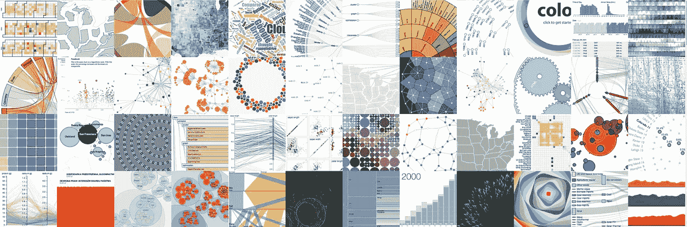

由 D3.js 生成的可视化示例，由 d3js.org([https://github.com/d3/d3.github.com/tree/master/ex](https://github.com/d3/d3.github.com/tree/master/ex))提供

这并不意味着对 [D3.js](https://d3js.org) 本身的详细介绍，而是作为在 [Google Colab 的](https://colab.research.google.com/)托管 Jupyter 笔记本上使用 D3 的一个快速(但干净)的开始。

对于 D3 本身的介绍，包括基础的 web 标准(HTML、SVG、CSS 和 JavaScript)，我推荐下面的文章、教科书和教程:

## 文章

*   [D3 . js 的搭便车指南](https://medium.com/@enjalot/the-hitchhikers-guide-to-d3-js-a8552174733a)
*   [用 D3.js 进行交互式数据可视化](https://towardsdatascience.com/interactive-data-visualization-with-d3-js-43fc3428a27e)

## 书

*   [由](http://shop.oreilly.com/product/0636920026938.do)[斯考特·玛瑞](https://twitter.com/alignedleft)开发的用于 Web 的交互式数据可视化
*   [D3.js 在行动](https://www.manning.com/books/d3-js-in-action)由 [Elijah Meeks](https://twitter.com/Elijah_Meeks)

## 教程

*   [官方 D3 教程](https://github.com/d3/d3/wiki/Tutorials)
*   [D3.js 教程—初学者数据可视化](https://www.freecodecamp.org/news/d3js-tutorial-data-visualization-for-beginners/)
*   [D3 和画布分三步](https://www.freecodecamp.org/news/d3-and-canvas-in-3-steps-8505c8b27444)

# 这篇文章是关于什么的？

重申一下，这只是对在 Google Colab 中编写和运行 D3 的一些有用特性的简单介绍。这些例子几乎一对一地适用于您使用 Jupyter 笔记本在几乎任何环境中所能做的事情。

# 入门指南

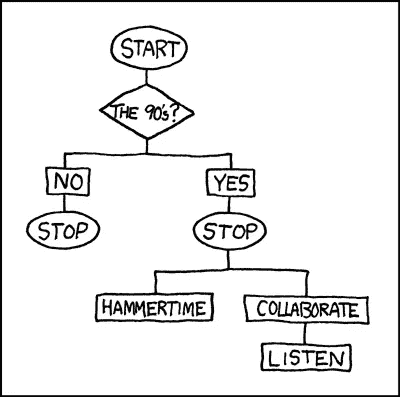

[《入门》，XKCD 的 90 年代流程图](https://imgs.xkcd.com/comics/90s_flowchart.png)

如果你还不熟悉[谷歌 Colab](https://colab.research.google.com/) ，或者只是想复习一下 Jupyter 笔记本，我建议从 [Colab 的文档](https://colab.research.google.com/notebooks/basic_features_overview.ipynb)开始。

你可以 [**把这个 Colab 笔记本**](https://colab.research.google.com/drive/1Xbo9wU7kLKqxNgSCfmpVNSGrHdgZVZC6?usp=sharing) 连同下面的例子一起复制到下面。

# 在显示输出中呈现 HTML

你首先应该熟悉的是在笔记本中呈现 HTML 的两种最简单的方法。第一个是用“魔术”`%%html`，它允许你把整个单元格块渲染成 html。

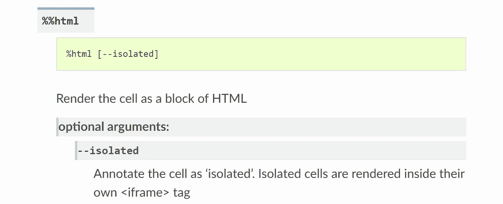

第二种是`IPython.core.display.HTML`，这是一种更 pythonic 式’的编写和呈现 HTML 的方式，不需要把块变成专门的 HTML 块。

在下面的例子中，我们将主要使用这种方法，但是在其他情况下，简单地使用单元格魔术更好，因为它使用起来稍微简单一些，特别是当您需要的只是一个 HTML 块时。

**使用** `IPython.core.display.HTML`:

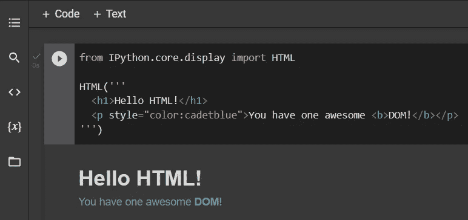

# D3.js 简介

既然我们有了一个快速(和干净)的方法来介绍 HTML(以及 CSS、Javascript 和 SVG ),让我们从一个相对简单的 D3 例子开始，在这里我们将利用 D3 的一些元素来创建一个风格化的数字块。

注意:提醒一下，我们不会在本文中涉及 D3 的细节。我们假设您已经熟悉了其中的许多概念，但只是想要一些带有更多“主体”和“颜色”的模板，以补充您在 Jupyter 笔记本环境中学习库的初级阶段。

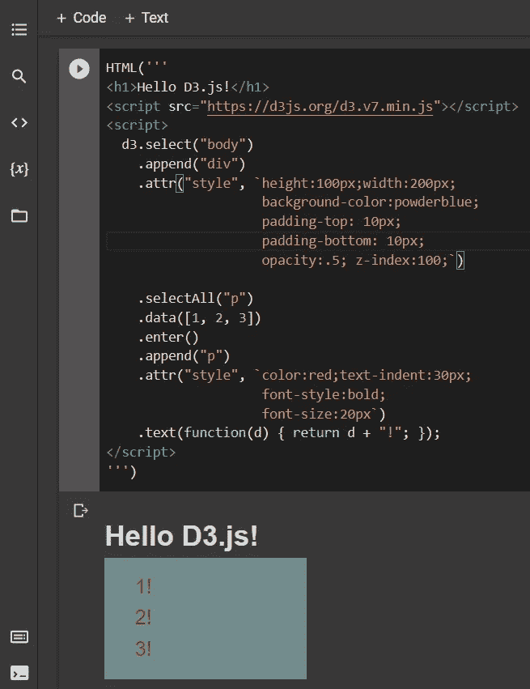

# 从“字符串”使用 python 的模板类

既然我们已经有了一些很可能被复制或以其他方式塞满我们工作空间的代码，我想介绍一下 python 流行且无处不在的[模板](https://docs.python.org/3/library/string.html)类。

模板的[文档](https://docs.python.org/3/library/string.html)开始如下:

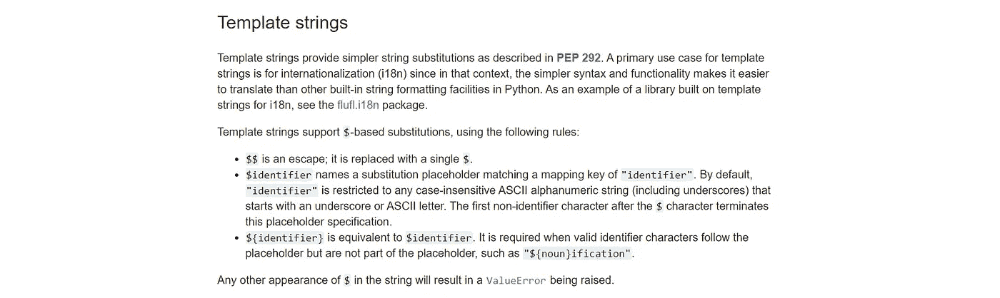

[3.10.2 文档 Python 标准库文本处理服务字符串](https://docs.python.org/3/library/string.html)

现在，我们可以将两者结合起来，将我们的`d3_script`代入我们的模板，如下所示。

```
HTML(first_template.substitute({'d3_script' : d3_script}))
```

再次查看我们在 Google Colab 中的输出。

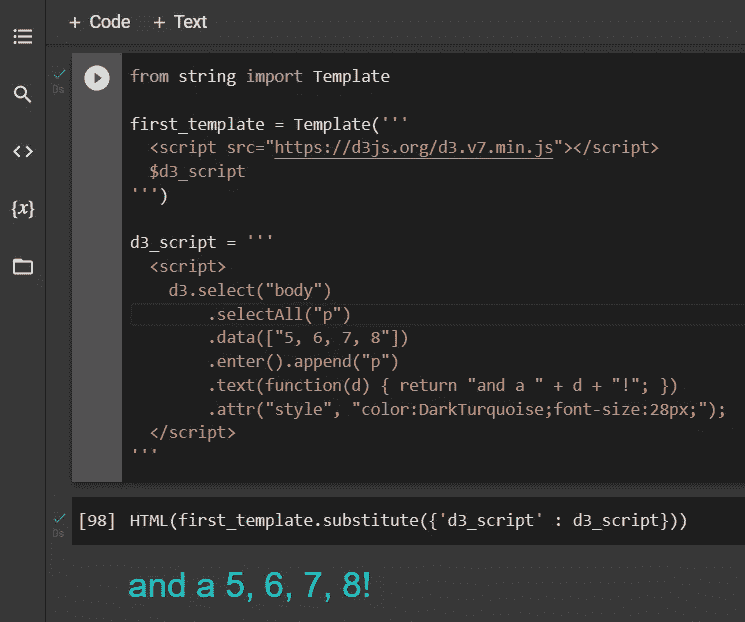

# 在单元运行前执行代码？

现在，您可能会提前考虑每个单元格如何至少包含`<script> src=’https://d3js.org/d3.v7.min.js'></script>`。考虑到你可能会写一个非常详细的包含大量 3d 可视化的一步一步的笔记本，你可能不希望在你的艺术作品中尽可能地加入重复的文本。

这就是函数`get_ipython().events.register(...)`特别方便的地方。我们可以在每个单元正式执行之前为用户“注册”一点(或许多)要运行的代码。

我们通过调用`get_ipython().events.register(‘pre_run_cell’, my_super_awesome_script_gets_referenced_here)`来实现。

我们将首先定义一个名为`load_d3_in_cell_output`的函数，它将为每个单元格加载 D3.js。

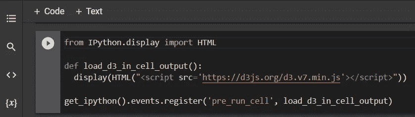

在演示我们的新功能时，我还会偷偷放入一个我们上面提到的替代渲染工具的例子，常用的 Python“magic”，`%%html`。

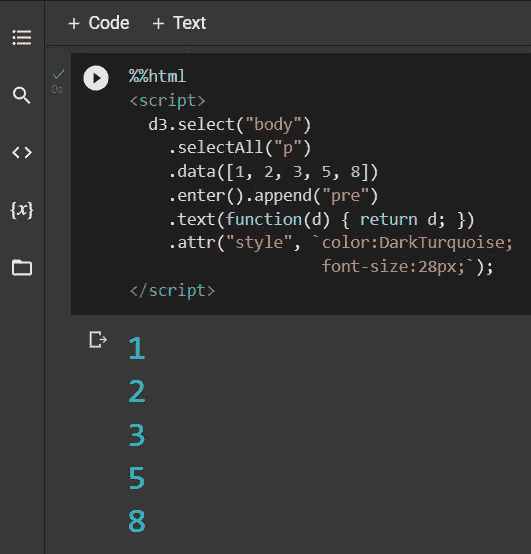

# D3 可视化

## 简单条形图

借鉴我们之前关于 Python 的[字符串的经验。模板](https://docs.python.org/3/library/string.html)类，我们将从一个`<head/> and included <style/>`元素开始下一个例子，定义一些我们不想在后续渲染中重复的 css 属性。

接下来，我们将把上述内容包含在一个模板中，我们再次用`Html(...)`渲染，我们也可以用`%%html`调用它。

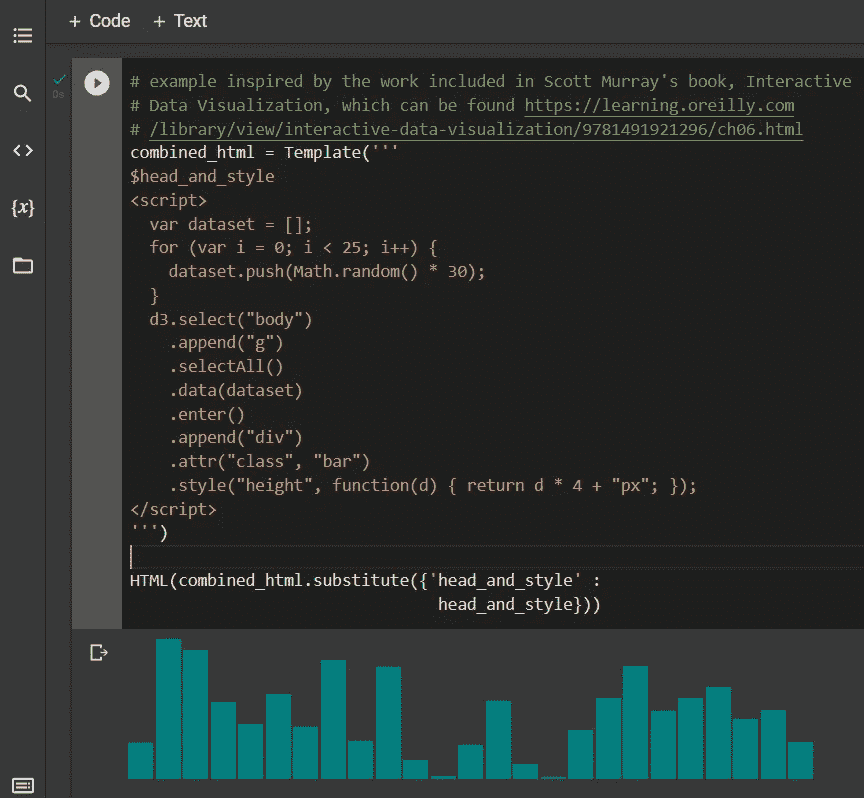

我们的下一个例子有点偏离我们上面的综合努力，而是更能说明我们可以用 D3.js 创建的一些相对简单的`<svg/>`元素。

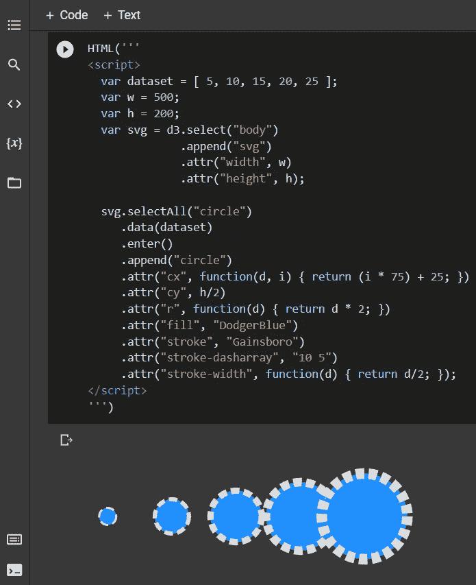

# 暂时就这样吧！

显然，D3 有更多的功能，甚至你可以做更多的事情来利用 Google Colab 制作你的可视化。在随后的文章中，我们将更深入地探讨“交互式可视化”等主题，并利用 Google Colab 的免费(或非常便宜)资源，使用相当大的数据集渲染更复杂的视觉效果。

与此同时，我很期待看到你的成果。如果你有任何关于 D3 和 Colab (Jupyter)的建议，欢迎直接给我发消息，或者在下面评论这篇文章。

如果你自己写了一些文章或构建了有趣的例子，我也很乐意在这里引用你的作品。

一如既往，别忘了[秀出你的作品](https://austinkleon.com/show-your-work/)！！真的很有帮助。

[](https://medium.com/@gmsharpe/membership)

请考虑用上面的会员推荐链接注册一个中等会员——谢谢！

# 信用

感谢[斯考特·玛瑞](https://twitter.com/alignedleft)和他在[为网络进行的交互式数据可视化](http://shop.oreilly.com/product/0636920026938.do)的工作，为本文中的许多例子提供了基础

[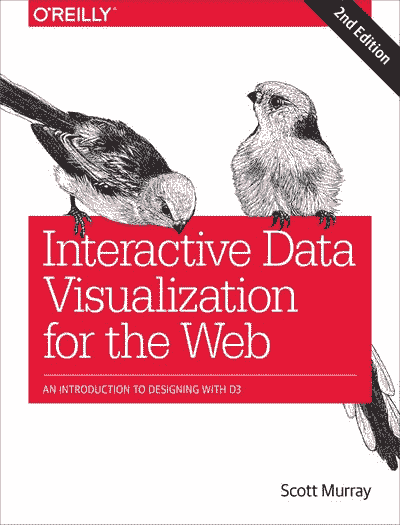](https://learning.oreilly.com/library/view/interactive-data-visualization/9781491921296/)