# 数据仓库/流自动化:使用 NiFi 从 MySQL 到 HDFS/Hive

> 原文：<https://blog.devgenius.io/data-warehouse-automation-mysql-to-hdfs-hive-using-nifi-7076fffe23f7?source=collection_archive---------9----------------------->

## (使用 NiFi 将数据从 MySQL 传输到 Hive)

# 背景

在办公室的一个美好的日子里，我被要求从 MySQL 到 hive 摄取一个表。我们使用 NiFi，所以我创建了一个流来接收该表。几天后，我被要求接收另一个表，我更新了流以包含另一个表。然后又有一个请求进来，我再次更新了流。然后这个过程一直持续到我觉得筋疲力尽才继续更新流量。所以我想，如果我可以建立一个 NiFi 流，它可以检测表列表(以摄取)并自动摄取。

## 要求

*   建立一个数据传输服务，每 5 分钟从上游系统(MySQL)加载数据到 HDFS/Hive。
*   它应该增量地(基于时间戳或整数值)或完全地接收表。
*   我们不想在每次新表到达时都构建一个接收作业。相反，它应该由表列表自动创建。

## 这是如何工作的？

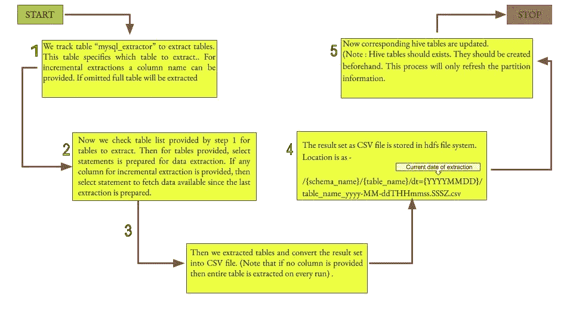

## mysql_extractor 表的 Create table 语句:

> 创建表` MySQL _ extractor`
> (
> ` table_id ` int(11)NOT NULL，
> ` catalog ` varchar(50)DEFAULT NULL，
> ` TABLE _ name ` varchar(50)DEFAULT NULL，
> ` max _ value _ col ` varchar(50)DEFAULT NULL，
> 主键(` TABLE _ id '，' catalog '，' TABLE _ name ')
> )；

## 流:` MySQL_To_Hive_Auto_Ingest '

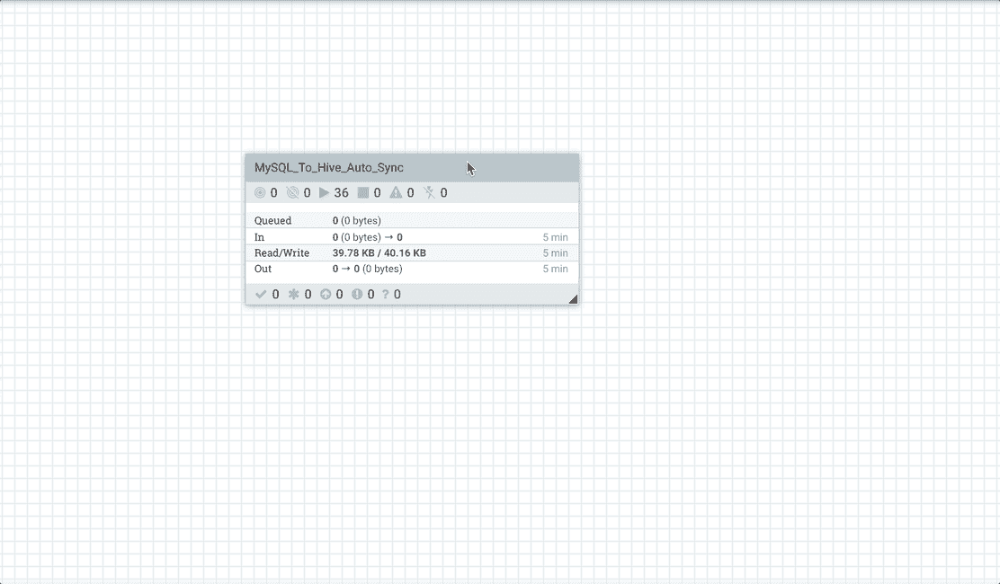

让我们来看看它的实际应用:

我们在 MySQL 中几乎没有表。我们希望接收一个表 salesmgr_dtl。

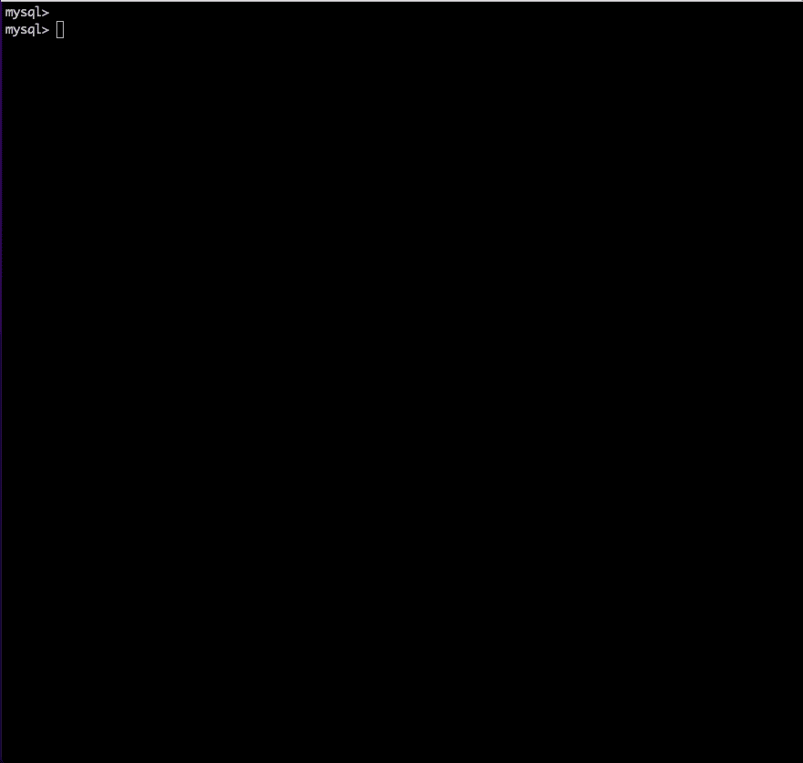

现在让我们检查一下我们的 nifi 处理器是否启动并运行。

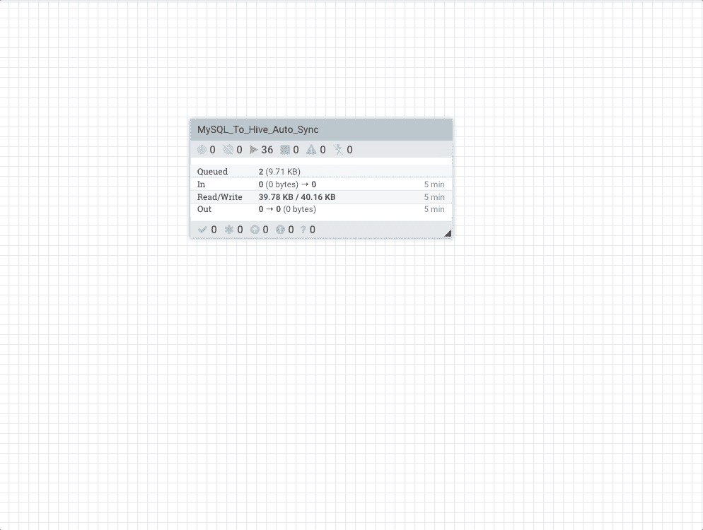

现在让我们开始摄取。我们希望基于 **`salesmgr_id`** 列摄取表**` ugs . data _ lake . sales mgr _ DTL`**。
那么我们要做什么？我们将在提取表中创建一个条目(命名为 **`mysql_extractor`** )。
我们将提供` table_id`(PK 列)、` schema_name`(PK 列)、` table_name`(PK 列)和` max_value_col `(用于增量提取的列)。

在我们开始讨论之前，让我告诉你在 HDFS 还没有这个表格的数据。

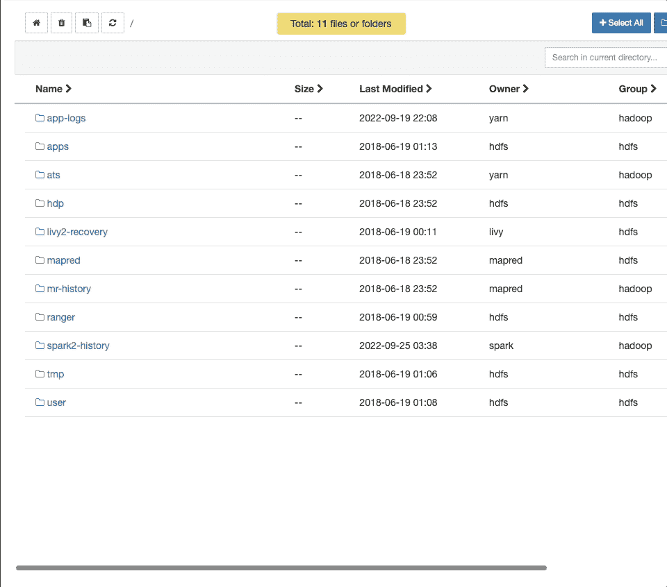

看，有没有看到任何文件夹**"/ugs _ data _ lake/sales mgr _ DTL "**

让我们也检查一下蜂房。我们已经创建了一个分区表“salesmgr_dtl”。这里我们使用 dt 列进行分区，它不是 mysql 表中的列。它的值是我们的提取作业运行的日期。我们可以看到还没有可用的数据和分区。

现在，为了开始摄取，我们必须在“mysql_extractor”中插入一条记录。让我在“mysql_extractor”中插入一个表细节。我们希望每次添加新的销售经理时，该表都会自动接收。

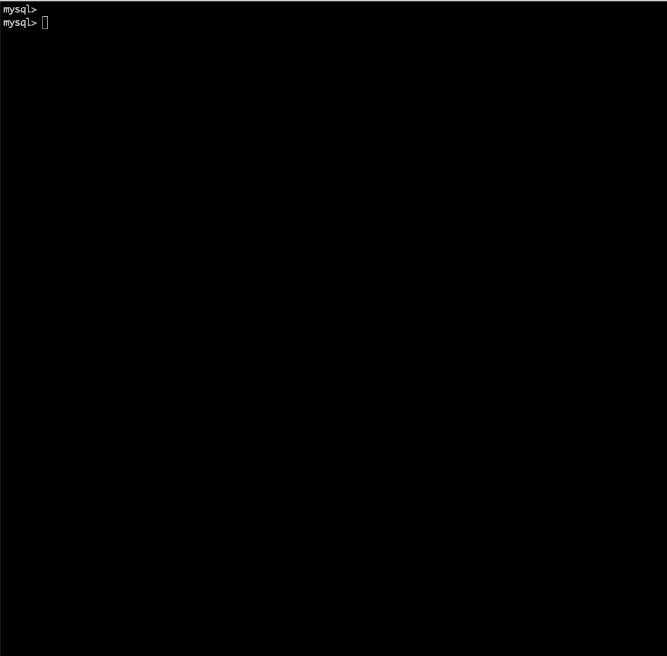

现在让我们在 hdfs & hive 中进行验证，并用 MySQL 进行验证。

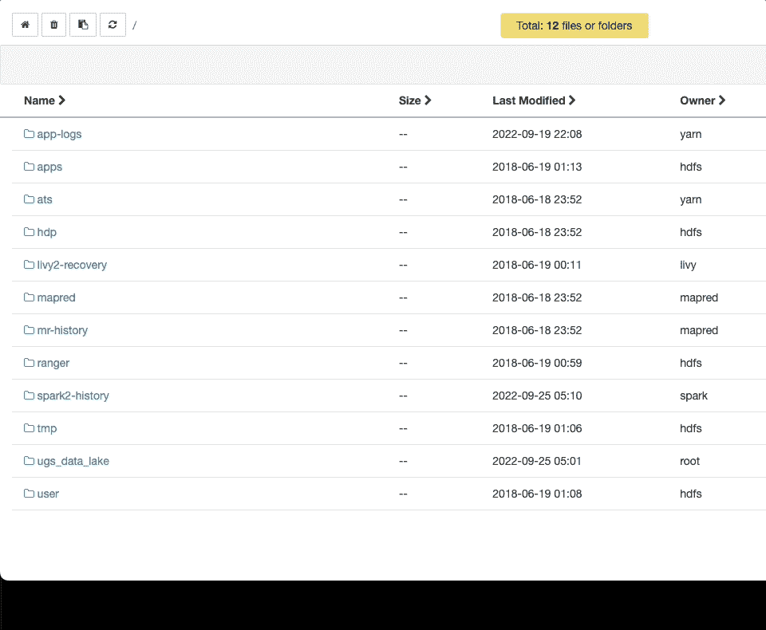

酷！成功了。我们可以看到 salesmgr_dtl 有了新的分区 **dt-2022-09-24** 和 8 条与 MySQL 相同的记录。
现在让我们通过添加一些新的销售经理来再试一次。我们在 2022-09-25 20:18 添加了新记录(salesmgr_id 9-16)

让我们在 5 分钟后验证一下，我们可以看到 HDFS 新文件中的记录 9 到 16 是在 20:20 创建的。

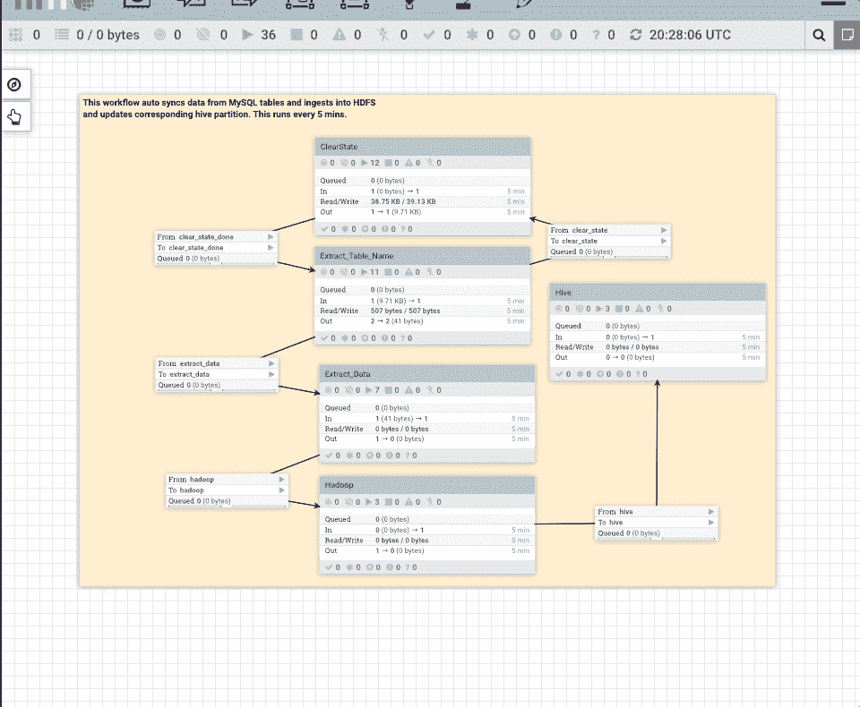

让我们检查一下 Hive 表，我们应该有总共 16 条与 upstream(MySQL)相同的记录

现在让我们试试另一张桌子。这一次，事务表有一百万条记录。
我们想要基于列“date_id ”(一个时间戳列，带有添加/更新记录的时间戳值)摄取表“ugs_data_lake.sales_dtl”。
我们把它插入 mysql_extractor 表中。

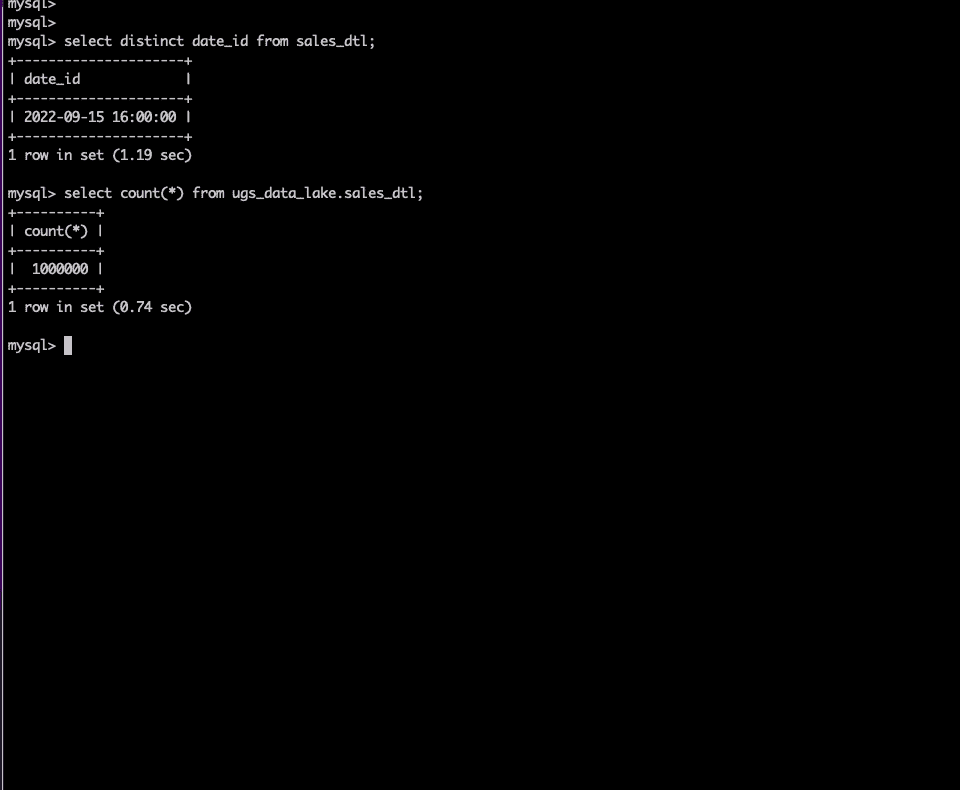

让我们在 HDFS 验证一下。我们应该能在 5 分钟内得到数据。这里我们可以看到 10 个文件(每个 100000 条记录)，这是由于流配置。

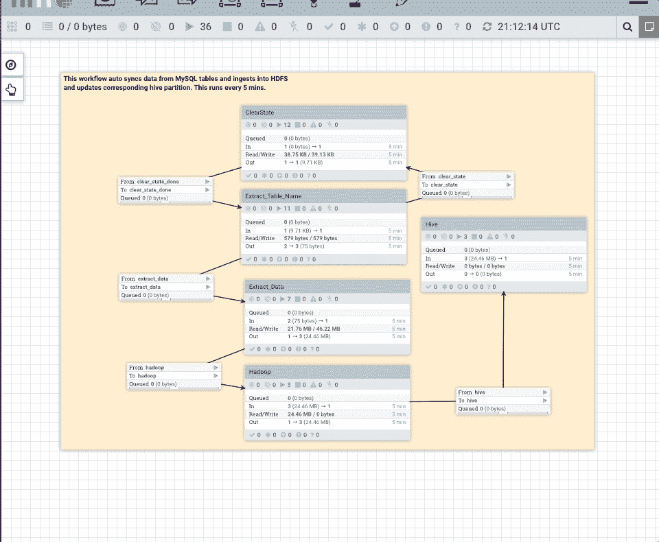

在配置单元中验证

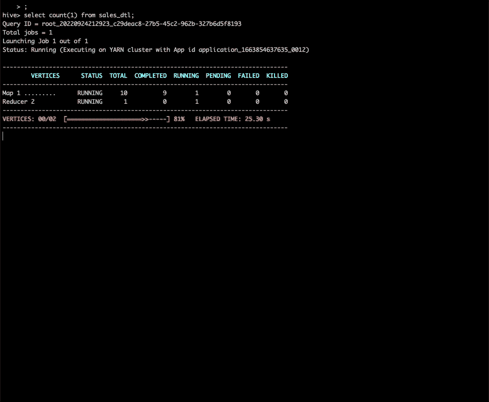

让我们在上游表中多摄取 100 万条记录。

我们去 HDFS 和蜂房看看

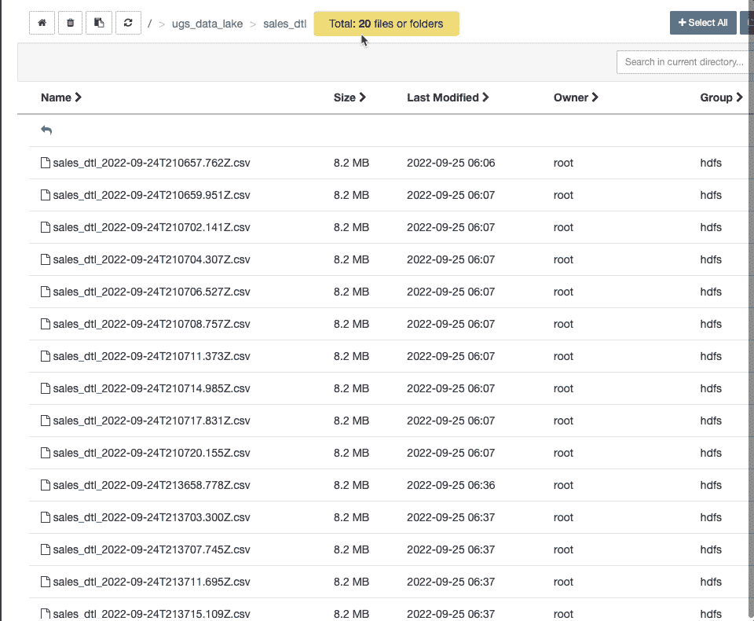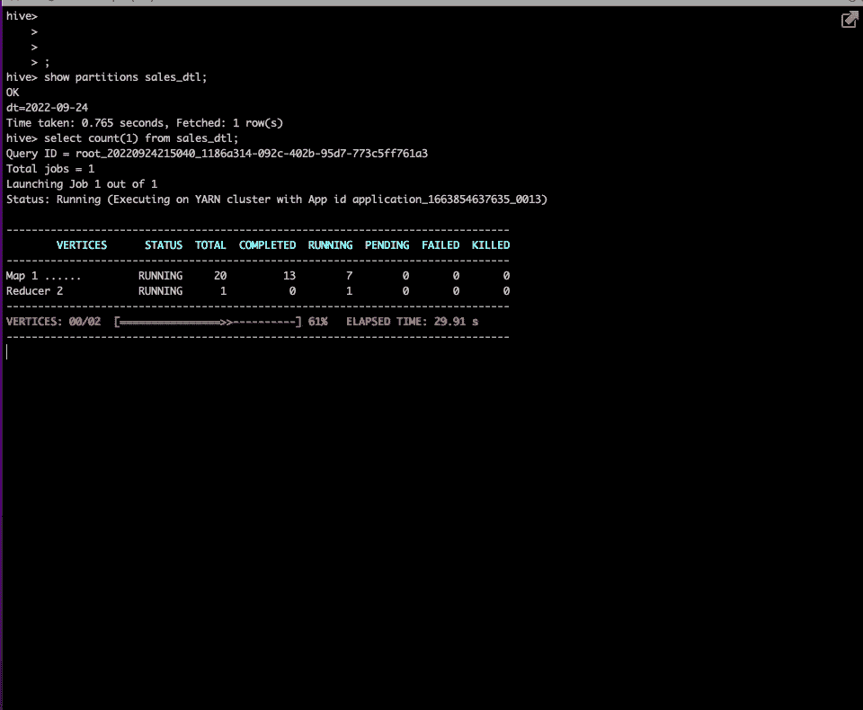

# 摘要

1.要获取一个表，您只需在表“mysql_extractor”中插入表的详细信息。一旦您提供详细信息，此表将每 5 分钟被 HDFS/Hive 接收一次。
2。如果您想要摄取整个表，请将 max_value_column 指定为 NULL。
3。对于配置单元，您必须事先在配置单元中手动建立表格。

# 注意

这个流可以被更新以提供 orc 文件而不是文本(csv)。ORC 是 hive 中使用的最有效的列级格式。对于 hive 中的 CRUD，您的表应该在 ORC 文件格式之上。

**演职员表**

帮我设计这个流程的 Shiv Kanaujiya 。