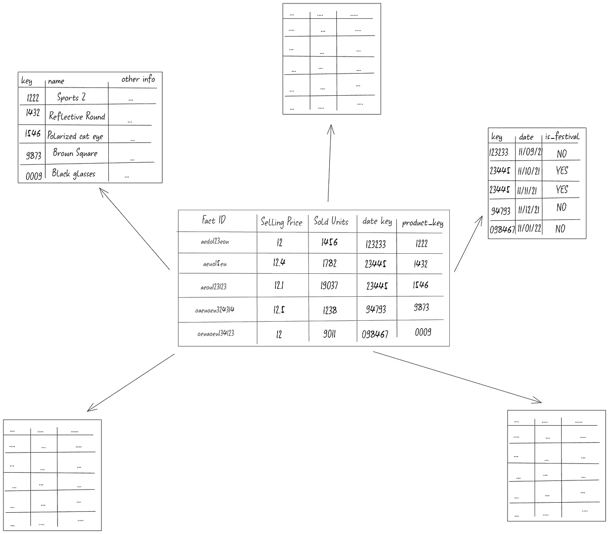

# 数据仓库速成班

> 原文：<https://blog.devgenius.io/data-warehouse-crash-course-f761d015bd70?source=collection_archive---------4----------------------->

雅克·迪利斯在 [Unsplash](https://unsplash.com?utm_source=medium&utm_medium=referral) 上的照片

# 什么是数据仓库？

简单地说，数据仓库可以被认为是一个简单的关系数据库，其唯一的目的是存储用于分析的数据。由于我们不使用它来进行用户交互，该数据库是专门为使用它进行分析而构建的。因此，数据仓库是专门为分析目的存储数据的中央存储。数据可能来自不同的来源，如 API、其他非分析数据库(OLTP)、流等。

# 为什么需要数据仓库？

如果我们想存储和检索数据，我们可以用我们常用的数据库来做，对吗？那为什么要为它创建一个全新的系统呢？嗯，有几件事使这些典型的数据库系统不适合分析目的。让我们从为什么数据仓库适合于分析目的开始，然后我们将弄清楚为什么普通的数据库不能满足这样的需求。

随着时间的推移，公司发现他们的数据分为两类，运营数据和分析数据。运营数据由用户活动生成，如银行交易。运营数据的本质是快速生成的少量数据。例如，用户更新他们的个人资料。从数据库的角度来看，它需要存储/更新很少字符的数据，而这些请求可能随时发生，并且可能数量巨大。操作数据由用户应用程序使用，因此是为用户应用程序构建的。

另一方面，分析数据不具备这种性质。分析数据被存储以供 BI/BA 应用程序处理，因此需要为它们进行结构化。数据通常以非常少的方式大量生成/处理。例如，对银行交易进行分析是一项通常一个月左右进行一次的任务，涉及的数据量非常大。

从技术上讲，我们可以使用我们常用的数据库进行分析，尽管这样会非常低效。因此，我们知道分析数据具有完全不同的属性和用途，这就是为什么我们创建了一个名为数据仓库的新系统来有效地存储和处理这些数据。

# 运营和分析系统有什么不同？

操作系统通常是面向消费者的，它们被设计来使数据操作，如检索和存储数据，对应用程序来说更容易。由于应用程序通常有很多更新，所以看到这种系统的模式变化并不罕见。这些系统接收大量的流量，因为它是面向消费者的。小而频繁的操作。诸如标准化之类的技术被用于设计这样的系统，这些系统通常被称为 OLTP 或在线跨国处理系统。

而另一方面分析数据有着完全不同的需求，比如它不面对消费者，因而得不到快速而简短的数据请求。它批量获取数据操作，通常每次操作都会处理、传输或存储大量数据。该模式是专门为分析应用程序设计的，或者说是 BI/BA 应用程序。当您在 OLTP 系统中使用规范化时，维度建模用于 OLAP 系统。

# 数据仓库的组件:

[简·侯伯](https://unsplash.com/@jan_huber?utm_source=medium&utm_medium=referral)在 [Unsplash](https://unsplash.com?utm_source=medium&utm_medium=referral) 上拍照

可以使用常规的关系数据库管理系统来构建数据仓库，或者我们可以使用称为基于立方体的 DBMS 的特定 DBMS。基于立方体的 DBMS 以不同的方式存储数据。数据仓库的概念不会因为拥有不同的数据库管理系统而改变。

# 事实数据表:

照片由[通讯社在](https://unsplash.com/@olloweb?utm_source=medium&utm_medium=referral) [Unsplash](https://unsplash.com?utm_source=medium&utm_medium=referral) 上的跟踪拍摄

事实表是数据仓库的分析中心。事实表包含事实。事实是有意义的数值(很少有文本事实),可以使用各种聚合操作(如加法或平均)进行聚合。一个事实可以被认为是一种度量。例如，如果我们正在为一家零售店设计一个数据仓库。出于分析目的，我们希望汇总销售的单位数量和每个单位获得的利润。从而使它们成为我们事实表中的事实。事实表有 4 种类型(见最后一个标题)

# 粒度:

当在事实表中存储事实时，您必须决定以什么样的详细程度存储它们。这种详细程度被称为粒度。在我们前面的例子中，如果我们可以通过存储销售价格和成本价格而不是获得的利润来增加利润事实的粒度。粒度可能会根据您的需求而变化。决定粒度是工程师的工作。因为在数据仓库中，数据来自多个来源，所以最好以相同的粒度存储所有数据。

# 尺寸:

请记住，事实上我们只存储可以聚合的数字或数据。虽然这些数字被用于一半以上的分析，但我们需要更多的信息来进行完整的分析。或者只是为了让这些存储在事实表中的数字有意义。委婉地说，我们需要一些存储事实的上下文。该上下文存储在通过外键关系链接到事实表的另一个表中。这个包含事实表上下文的表称为维度表。在我们的零售商店示例中，假设我们有存储产品名称、重量、高度等的维度。

# 架构:

有两种类型的模式通常用于数据仓库。这种模式通常在 RDBMS 中实现。

*   星形模式:

它的中心是事实表，所有维度表都直接链接到事实表，形成了一个星形。因此称之为星型模式。与雪花模式相比，它没有那么复杂，通常使用星型模式是最佳实践。

*   雪花模式:

事实表仍然位于中心，维度表仍然连接到事实表，但是可能有更多的表连接到维度表。使其成为雪花状结构。

# 数据集市:

考虑到在同一个数据仓库上运行着不同的分析过程，因为分析过程通常需要大量的数据，这是一个很好的变化，数据仓库会变得不堪重负。这就是为什么我们创建面向从数据仓库派生的特定数据类的子集存储库。这个子集存储库被称为数据集市。它们通常具有与数据仓库相同的模式。

# ETL:

ETL 是将数据加载到数据仓库或数据集市的过程。我们知道数据是从各种来源存储的。不同的源需要不同的 I/O 处理方式，这也意味着存储的数据结构不同。因此，在将这些数据推送到我们的中央存储库之前，我们需要**从源中提取**数据，**根据我们的数据仓库转换**数据，**将数据加载到我们的数据仓库中。这个过程被称为 ETL。**

ETL 的类型:

*   初始 : ETL 只执行一次，我们不需要在同一个数据源上再次执行这个过程。
*   **增量:** ETL 定期进行。保持在特定的时间间隔引入新数据，通常是每周或每月一次。

# 事实表的类型

1.  **事务事实表:**事务粒度事实表包含来自事务的数据。它存储相同类型交易的数据。所有要存储的事实应该是相同的，并且所有存储的事实应该是同时发生的。
2.  **定期快照事实表:**不是按事务粒度存储数据，而是按特定的时间间隔聚集数据并存储。
3.  **累积快照事实表:**当要存储的数据是分阶段结构化时使用。例如学生应用程序。一个学生申请要经历不同的阶段，它必须被存储起来。为了存储这样的数据，在事实表中为指向相同维度的每个阶段添加一个新列。
4.  **无事实事实表:**行数作为事实本身时。例如，事实表包含注册和尝试网络研讨会的学生。没有存储任何事实，但是我们可以通过计算行数来查询有多少学生注册了网上研讨会。