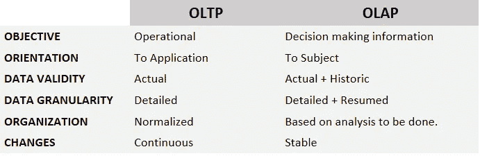
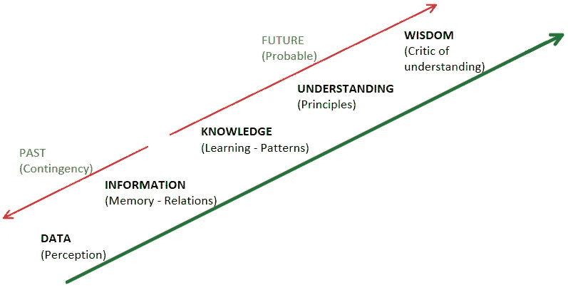
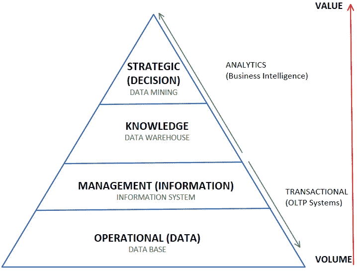
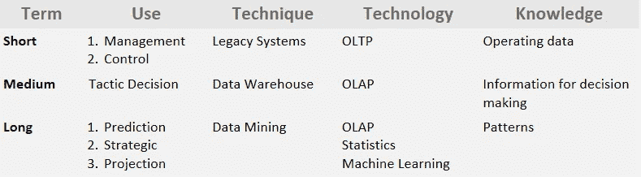
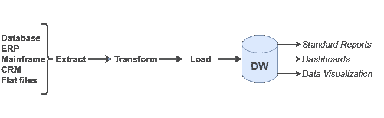
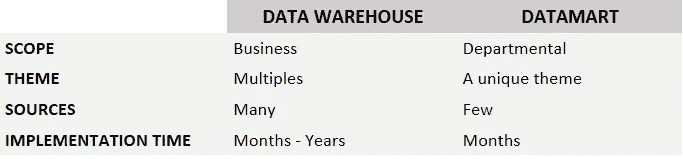
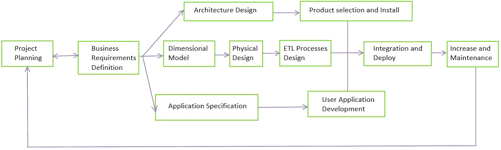
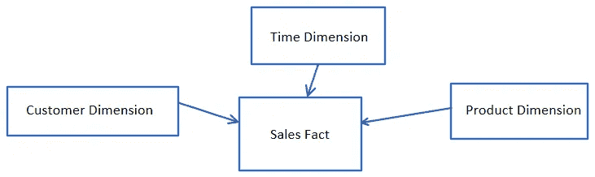
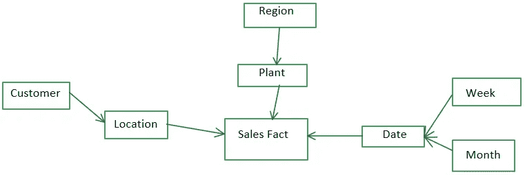

# 数据仓库关键概念

> 原文：<https://blog.devgenius.io/data-warehouse-key-concepts-f892468c2acb?source=collection_archive---------10----------------------->

数据仓库是商业智能和分析的一个重要分支。从数据仓库概念开始，需要理解 OLTP(联机事务处理)和 OLAP(联机分析处理)系统之间的一个重要区别。

1.  **OLTP:** OLTP 系统顾名思义就是工作在运行环境中执行事务的系统，通常是 CRUD(创建/读取/更新/删除)事务；这些系统通常以规范化的格式存储最大细节级别的数据，例如让我们以规范化的关系数据库为例；这些信息对于支持日常服务非常有用，并且处于不断变化之中。
2.  **OLAP:** 另一方面，OLAP 系统是支持决策的系统，这些系统通常被设计为在指标的执行信息层面上执行。OLAP 系统的结构是多维的，也称为 OLAP 立方体，存储许多级别的数据，使用历史信息来分析许多来源。

在下表中，OLTP 和 OLAP 有一个具体的区别:

OLTP 与 OLAP 系统

有三种类型的 OLAP 物理方案:

*   *莫拉普(多维 OLAP)*
*   *ROLAP(关系 OLAP)*
*   *霍拉普(杂交 OLAP)*

我们最感兴趣的是 MOLAP，它是开发 OLAP 系统时最常用的。

# BI 和 DW

商业智能是从公司获取数据并将其转化为价值(洞察力)的过程，对该数据进行分析，旨在使用 OLAP 系统为高层管理提供决策支持；为此，有必要根据要进行的分析来区分哪些是给定管理要求的有用信息。

在接下来的图片中，信息阶段的重要区别将有助于我们理解 BI 在公司中的角色:

数据/信息/知识/智慧之间的差异

在这幅图中，来自数据库的数据和关系信息是过去的事件，这些事件通常已经在操作环境中生成，根据知识，这些事件还没有发生，但是通过一套 BI 工具，我们可以预测和估计可能会发生什么。为了更好地理解这种差异，我建议您尝试将它们与下一张图进行对比，并思考每一级别的数据使用中使用了哪种信息:

数据使用水平

如您所见，事务系统通常存储已经发生的事件。BI 系统主要是使用交易系统生成的数据将大量数据转化为价值的系统。此外，您可能已经注意到数据仓库处于知识级别，这是因为数据仓库是所有 BI 工具在其基础上工作的基线，因为数据仓库负责从所有可用于分析的关键来源收集数据，并将它们放入单一格式和位置。举个例子，假设一家公司有 excel 格式的股票管理，在一个 OLTP 系统中销售交易，这个 OLTP 系统将数据存储在一个 SQL 数据库上；在这里，DW 从电子表格和 SQL 数据库中获取信息，将其集成到单个数据库中，以便对这两种信息进行分析。

时间线中 BI 的方法很难定义，因为 BI 是一个巨大的领域，但为了理解 DW 在 BI 中的位置，让我们考虑下表:

BI 方法

最后，让我们定义 BI 和 DW:

> **数据仓库。:**指在一个地方集成和存储来自多种来源和格式的数据。
> 
> **商业智能。:**指用于分析和解释从公司不同系统收集的数据的工具和应用程序，包括数据仓库工具。

# 数据仓库理论

如前所述，数据仓库包括以任何格式将所有来源的数据收集到一个单一的位置和格式。这个位置通常是另一个数据库，但被设计为用于 DW，事实上我们可以将这个数据库称为 DW 本身，因为 DW 本质上是另一个数据库。

在构建 DW 之前，我们需要知道 DW 必须:

*   ***整合:*** 整合在一致的结构和不同层次的细节中；这意味着在 DW 中也有恢复的数据，比如说有多少人访问了一个特定的商店。
*   ***主题:*** 数据是按主题组织的，也叫时间、客户或产品等维度与他人之间的关系。
*   ***历史:***DW 输入不同的值，这些值随时间变化。
*   ***非易失:***DW 中存储的数据是红色的，不可修改。

创建数据仓库的步骤如下:

1.  从来源(数据库、CRMs、平面文件等)提取信息。
2.  将数据转换和清理为单一格式。
3.  加载到 DW 中。
4.  在仪表板上显示分析数据。

创建数据仓库的步骤

提取、转换和加载过程可以被视为集成步骤，也称为 ETL 过程。在提取步骤中，按照惯例，将数据加载到一个**暂存区**中，该暂存区也是一个数据库，在加载到最终的 DW 之前，可以根据需要对数据进行转换和清理。

在此过程中还有另一个概念需要考虑，即**数据集市(DM)** ，这些是范围有限的小型数据仓库，或者也可以将其视为包含特定主题的特定数据的小型存储库。为了更好地理解 DWs 和 DMs 的区别，请看下表:

数据仓库与数据集市

现在，我们知道了数据仓库的基本概念和特征，让我们开始设计它。

# 数据仓库设计

在我们开始设计数据仓库之前，了解开发 DW 有两种主要方法是很重要的:

1.  **INMON(自顶向下):**这种方法用于开发关系数据仓库。
2.  **KIMBALL(自下而上):**这种方法用于开发维度数据仓库，其中我们有维度表、事实表，并且 DW 是从数据集市构建的。下图是金博尔方法:

金博尔方法流程

最让我们感兴趣的是 KIMBALL 方法，我们可以将维度模型步骤作为 DW 逻辑设计。在进入设计流程之前，让我们先了解一些关键概念:

> **度量:**数值表示的事实属性或度量。也称为指标，这些是描述事实或事件的数量。
> 
> **事实:**事件或项目交易，我们可以将每个事实视为 DB 中的一个寄存器。
> 
> **维度:**来自确定事实背景的事实的特征(有助于回答涉及谁、何时何地发生等问题)；一些常规维度是时间、地理、客户、产品。维度是事实的上下文，往往是离散的。
> 
> **层级:**维度之间的父子关系。
> 
> **事实表:**存储事件和度量，并有一个由所有相关维度键组成的键值。事实表必须至少与时间维度相关。
> 
> **维度表:**存储属性。
> 
> **粒度:**信息的详细程度，粒度越大意味着数据越详细；例如，销售数据是日常数据，工资是月度数据。在时间维度中，数据粒度可以是一年、半年、三年等等。

为了设计一个数据仓库，我们需要理解这个数据库由一个事实表组成，这个事实表由一个或多个维度和度量组成，这些维度和度量是描述事实的指示器。在维度模型中，我们有两种类型的设计:

1.  **启动模式。:**建立事实表和维度表之间的关系，中心是所有维度表汇聚的事实表。

星形模型示例

1.  **雪花模型:**该模型只是星型模型的扩展，但是在这些类型的模型中，维度被分解为层次结构。

雪花模型示例

您可能已经注意到，DW 中的表之间的关系不是一种规范化的关系，而是一种基于分析的关系，并且是非规范化的。现在您已经知道了设计数据仓库的两种维度模型，我们可以看看设计数据仓库的步骤:

## **设计数据仓库的步骤:**

1.  定义用户需求。
2.  根据需求定义存储的数据粒度。
3.  定义维度。
4.  构建事实表。
5.  在事实表中定义度量。

# ETL 过程

ETL(提取、转换、加载)过程对于从许多来源收集数据以向数据仓库提供数据非常有用，并且该过程是创建数据仓库的设计中的关键步骤。然后，让我们来定义它们:

> **提取:**将多种来源、不同格式的数据提取到一个暂存区，供数据处理。
> 
> **转换:**清理(纠正、标准化和完成，识别冗余、离群值和缺失值)和验证(识别重复和空值，完整性)数据。该过程负责数据的标准化和同质化，包括诸如改变格式、排序过程、过滤、交叉信息、添加等操作。
> 
> **Load:** 将数据加载到 DW 中，这可以在批处理中完成；加载可以是完全刷新或增量加载。

转换过程也用于对数据进行操作，只将必要的数据加载到数据仓库中；这里，改变格式不仅意味着改变文件的格式，还意味着改变数据仓库中信息存储的格式。

在进行 ETL 过程时要记住的重要事情是完整性控制，有两种类型的控制:

1.  **预防:**装载前控制完整性。
2.  **检测:**确保数据加载后信息的准确性和完整性；包括将来自 DW 的数据与操作源(控制总数、加载的寄存器数量、原始值与清除值)进行比较的报告。这种检测可以在进程结束时完全完成，也可以在加载数据时分阶段完成。

正如您可能已经注意到的，ETL 过程并不难理解，但是实现起来却是一个漫长的过程。为了实践这个概念，我建议你学习软件来制作 ETL 过程；如果您非常熟悉 Excel，我建议您首先使用 Power BI 进行 ETL 过程，如果您更熟悉使用更复杂的数据库(如 SQL Server ),我建议您学习 Talend Open Studio 来执行 ETL 过程，因为该软件允许进行更复杂的操作和 ETL 过程的自动化。

当然，还有许多其他工具来自动化 ETL 过程，如果您想比较它们以选择业务环境中的工具，我在这里留给您一些比较因素:*成本、风险、易用性、支持、需求、速度、数据质量、控制工具、连接性。*

## 数据仓库探索

一旦建立了数据仓库，它应该能够让用户进行 OLAP 操作，如下所示:

*   **上钻:** *切换到具体维度。*
*   **展开:** *切换到通用尺寸。*
*   **Slice-dice:** *通过维度可视化数据的操作。*
*   **透视:** *允许选择可视化顺序的操作。*

当然，最终用户不直接与数据仓库交互，有一套分析软件允许我们为最终用户构建仪表板，这些仪表板应该能够执行我们刚刚提到的所有 OLAP 操作。

# 数据仓库安全性

如果您正在进行数据仓库的开发，考虑到这是一个执行软件，记住数据的安全性是很重要的。如果任何信息不正确，它可能会导致公司基于您的软件所做的任何决策陷入非常困难的境地。然后，与这里的任何其他软件一样，需要考虑安全性，以下是安全性的三个关键特征:

*   *保密性*
*   *诚信*
*   *可用性*

我还会留下一些在管理数据时有用的提示:

*   *定期监督储存*
*   *保护数据安全*
*   *管理信息的可用性*
*   *确定存储在数据仓库中的数据粒度，这样就不会将所有信息集中在一个地方。*
*   *分配谁负责数据*

# 考虑

理解数据仓库和 ETL 过程很重要，因为它有时可以用作为人工智能解决方案开发和实施收集数据的工具，因为它提供的工具可能非常有助于管理来自许多来源的大量数据，这些数据可用于训练模型。

希望这对你有用，我非常鼓励你开始学习 DW 工具。