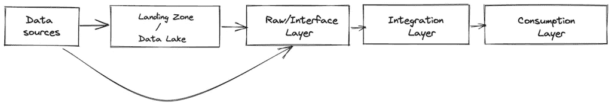
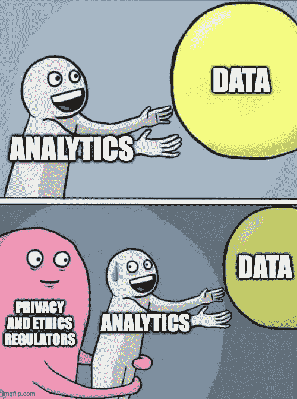

# 数据仓库，什么，为什么，何时和如何

> 原文：<https://blog.devgenius.io/data-warehouse-the-what-why-when-and-how-f4f2b56a6205?source=collection_archive---------10----------------------->

文章首发@ own your data . ai。

在过去的几年中，技术发生了巨大的变化，分析领域分成了不同的小组，每个小组都陈述了他们对数据仓库的看法，以及部署此类系统的低效率。关于什么是数据仓库，为什么你可能需要它，什么时候，你会在这篇文章中发现。

# 什么

根据数据仓库之父比尔·恩门的说法，数据仓库是“一个面向主题的、集成的、时变的、非易失的数据集合，以支持管理决策过程”，其中:

*   面向主题=数据围绕主题(客户、订单、销售、交易、产品)建模；
*   集成=数据集成自多个系统(包括第三方应用程序)；
*   时变=数据版本化；
*   非易失性=数据不被覆盖；
*   管理决策过程=考虑关键绩效指标，如销售数量、收入、利润和损失等。

# 为什么

## 基地

让我们看一下 1992 年需要数据仓库的背景:

*   由于缺乏计算能力，运营系统无法计算 KPI
*   互联网仍在建设中，如果一家公司要在另一个地区拓展业务，他们将为该地区安装数据中心和应用程序。在任何地区都有 It 部门是很常见的。现在想象一下，你如何在数据分散的情况下计算公司层面的 KPI。

当然，许多公司和应用程序都经历了现代化阶段。公司将转向数据集中化，在其所有分支机构中推出相同的运营应用程序。虽然在这种情况下，可以从操作应用程序中生成报告，但现实情况是(现在仍然是)一些计算量太大，无法在不影响用户的情况下在操作数据库上执行。

一个可操作的应用程序到底意味着什么？这一切都可以追溯到在线事务处理，它定义了任何面向用户的应用程序，从博客平台到社交媒体到网上商店，以及任何其他类型的用于管理“用户之旅”或“客户”(医院中的病人、银行的客户、电信公司或零售店中的客户)的应用程序。任何仪表板应用程序也是操作应用程序，因为它需要提供身份验证、基于角色的访问等等。

KPI 计算(以及任何其他相关分析)的要求是什么？它们与在线分析处理的定义密切相关，在线分析处理定义了任何分析应用程序(产品)，从商业智能到统计学、数据科学到机器学习。这类应用通常需要海量数据:例如，某一地区某一类用户在某一时期的所有交易等。除此之外，分析应用程序还需要环境:我的客户看起来怎么样，他的概况如何等等。通常，运营应用程序在管理特定类型的用户时，并不了解客户的全部情况。

但现在是 2022 年，我们经历了云革命，我们可以轻松地增加计算能力，因此我们不再需要数据仓库。我认为这部分是对的。如果我们检查在业务的运营方面发生了什么，我们会看到运营团队开始构建微服务。随着业务的增长，将会构建其他应用程序来支持它:电信扩展到电视服务，或者社交媒体平台扩展到聊天等。与此同时，我们看到，在一个人的公司系统之外，也有关于客户的相关数据:只要看看金融领域的“了解你的客户”范式或社交媒体营销活动中的不道德设置就知道了。

所以，是的，虽然我们现在的技术环境与 1992 年时不同，但运营应用确实朝着数据去中心化的方向发展。因此，现在很难准确反映一个人的业务状况。

## 扩展

与以往任何时候相比，关于偏见、数据隐私和被遗忘权的讨论正在定义我们处理数据的方式。数据管理试图通过以下概念来解决这些需求:

*   数据谱系:数据在哪里、如何以及由谁使用？
*   数据质量:我的高质量数据是否可用于决策？

数据仓库结合了元数据(文档)的非易失性和随时间变化的特性，被许多人用于数据管理。由于是非易失性的，数据仓库确保了数据不会改变:这在金融和医疗等受监管的业务中是非常需要的。由于数据仓库是时变的，所以它可以确保在一段时间内返回相同的结果，而不管执行的时刻如何(除了 bug 之外)

# 什么时候

每个人都需要数据仓库吗？当然不是。如果您有一个运营应用程序，并且如果您可以增加计算来维持您需要用来评估业务的基本 KPI，请确定您没有数据仓库。

我认为，当您需要集成来自多个来源的数据时，您需要考虑数据仓库的概念，它是集成发生的地方。

# 怎么做

## 建筑

数据仓库中的标准数据流是:

根据不同的因素，人们可能会:

*   遵循自下而上或自上而下的方法，实现集中式数据仓库
*   按照数据网格/数据结构/数据共享方法，实施多个分散的小型数据仓库

那么什么是数据湖呢？如果我们看看历史，数据仓库将只处理需要的数据。我们处于 ETL 范例中，当我们高度依赖业务需求时:数据只有在需要时才会到达仓库。使用 ELT 方法，我们将所有数据加载到一个数据湖中，稍后对其进行转换。没有规定说转换步骤不应该朝向数据仓库类型的系统。

## 技术堆栈

数据仓库的技术体系与存储解决方案的发展紧密相关。数据仓库可以建立在以下基础上:

*   交易数据库(Postgres、Oracle 等。)
*   分析数据库(Teradata、雪花等。)
*   文件系统(AWS S3、Hadoop 等)
*   流动
*   知识图表
*   等等。

根据所选的存储解决方案，可能需要决定使用什么工具来与数据交互:从 SQL 到 PL/SQL 到 Python 到 Scala，有许多方法可以实现加载和转换数据的管道。

来自上面的数据处理流程高度依赖于技术栈:在某些情况下，您甚至不需要所有的层。最重要的是，消费层可以包含一个或多个数据共享选项，例如:

*   数据集市；
*   语义层；
*   数据可视化工具；
*   运营部门使用的 API 数据摘录。

# 结论

数据仓库是帮助在公司内部建立分析数据管理的范例。它不是一个技术解决方案，而是处理数据时实践的组合。

如果数据仓库最初被发明时是为了商业智能(“收集数据以支持管理层的决策过程”)，那么它可以很容易地扩展到现代分析(数据科学和机器学习)。加载到数据仓库中的数据经过数据质量检查和转换，以确保非易失性和时变性，这是任何数据应用程序都需要的过程。