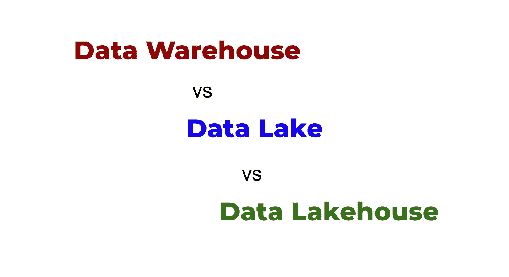
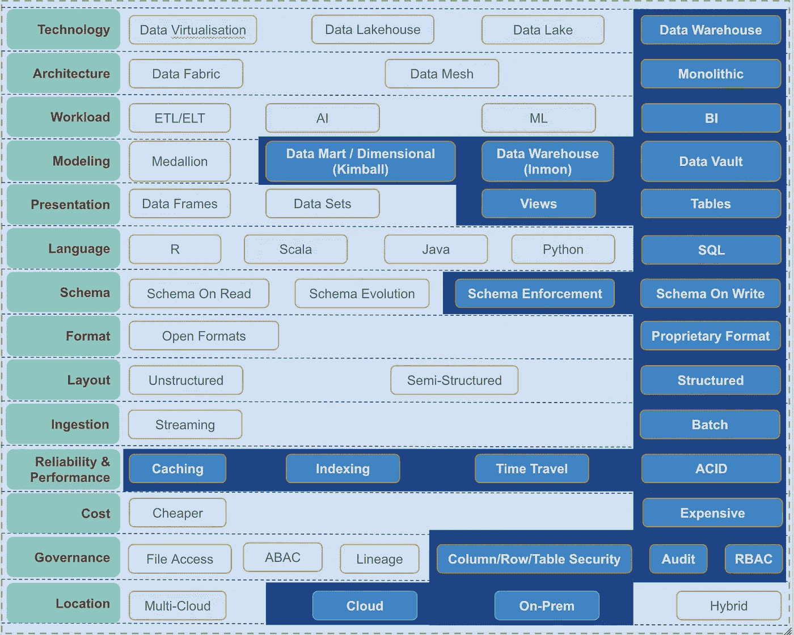
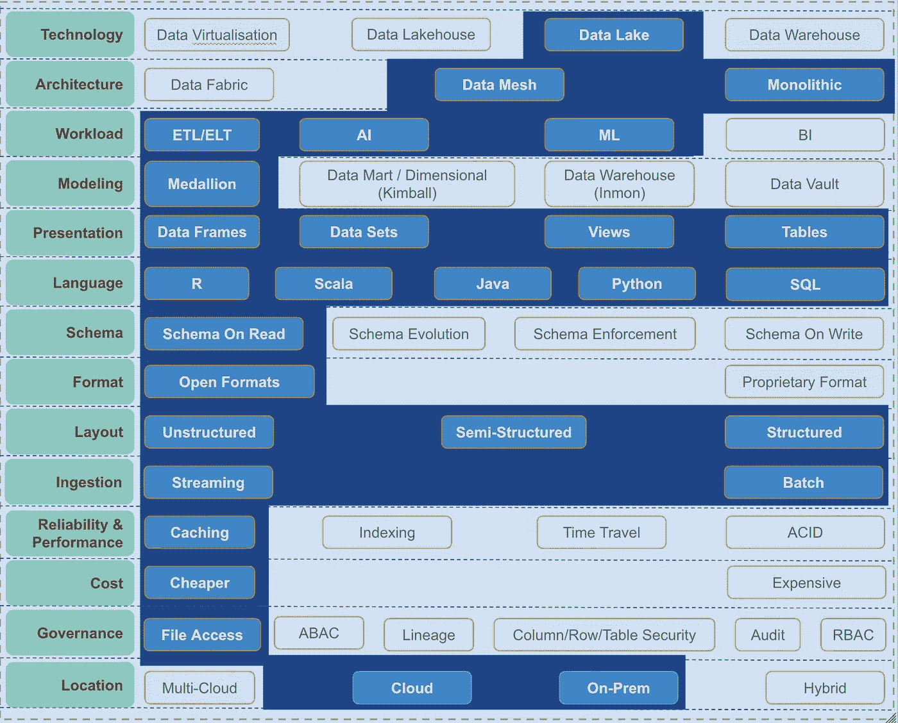
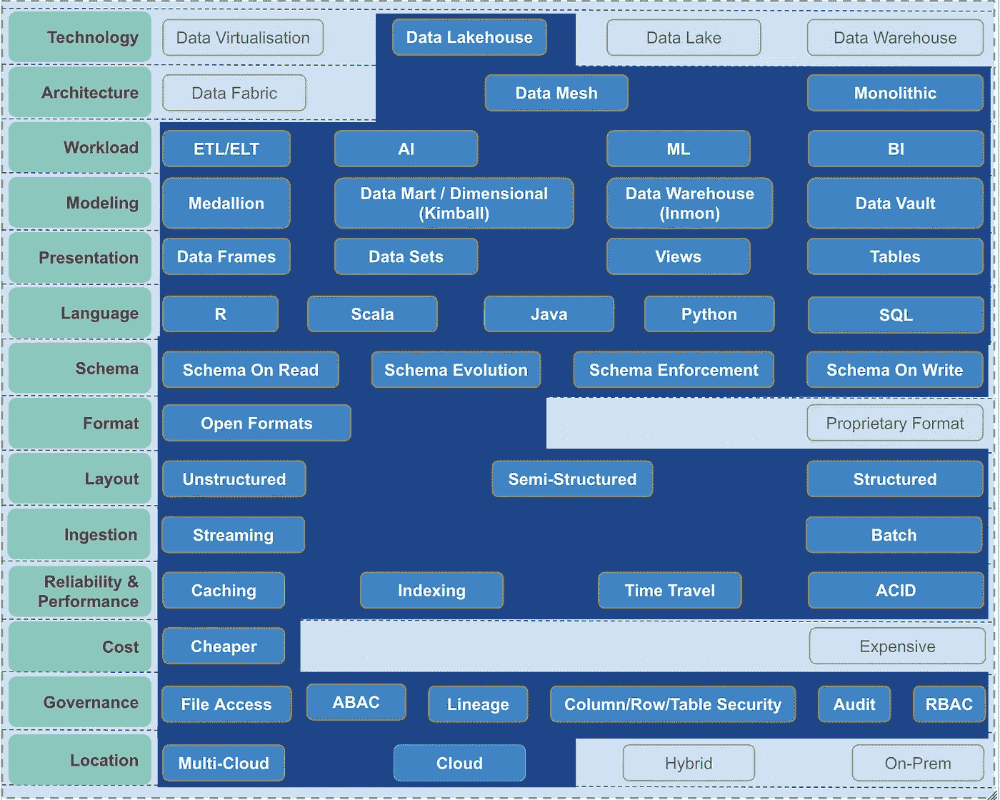

# 数据仓库 vs 数据湖 vs 数据湖库，有什么区别？

> 原文：<https://blog.devgenius.io/data-warehouse-vs-data-lake-vs-data-lakehouse-f0488df9206b?source=collection_archive---------5----------------------->

数据湖库是数据分析领域的一种新技术。它帮助企业和组织对任何数据(无论是结构化数据还是结构化数据)进行所有的数据分析工作负载，如 AI、ML 或 BI。

在此图中，我将尝试阐明在数据分析领域中也在使用的三种技术之间的区别:数据仓库、数据湖和数据湖库。

首先，让我们从数据仓库开始。

数据仓库

如您所见，数据仓库是一项已经存在了 40 年的伟大技术。它让企业使用 SQL 轻松实现商业智能。数据仓库的主要缺点是它仅适用于 BI 工作负载，不能很好地处理非结构化数据(原始文件、图像、视频等)。)或者半结构化(比如 JSON)的数据。

接下来是数据湖。这是一种大数据分析技术。它主要是为了对数据仓库无法处理的非结构化数据执行数据分析。数据湖利用 Hadoop 和 Apache Spark 等大数据技术。

数据湖

数据湖的问题在于它们不容易管理和使用。它们需要大量的管理和工程空间来运行和扩展。此外，由于数据湖没有强大的治理模型，您可能很快就会让多个团队创建他们自己的数据湖，这将数据湖变成了数据沼泽(即互不连接的数据孤岛)。

最后，数据湖房子。数据湖库是一个新的类别，可以看作是数据湖和数据仓库的超集。

数据仓库

如果企业利用像 Lakehouse 这样的技术，将会节省金钱和时间。与数据仓库不同，Lakehouse 涵盖了任何数据布局(结构化或非结构化)和任何到达速度(高速如流式传输，或低速如批处理)的所有分析工作负载(BI、AI、ML)，并在他们选择的云上运行。此外，为了避免数据沼泽，Lakehouse 实施了强有力的治理，以确保不存在数据孤岛。

关于每种产品的功能还有更多要说的，但这只是一个简单的概述。此功能的 PDF 版本可从[这里](https://drive.google.com/file/d/1goRHpSvuo3cHNaXtAeYXZxQpycB12Iji/view?usp=sharing)获得。