# 使用 Google BigQuery 的数据仓库

> 原文：<https://blog.devgenius.io/data-warehousing-using-google-bigquery-9e390978d955?source=collection_archive---------11----------------------->

图片来源 [**Unsplash**](https://unsplash.com/photos/klWUhr-wPJ8)

如今，**数据**越来越庞大，每秒**海量**([**大数据**](https://medium.com/dev-genius/heard-big-data-lets-know-it-a3aac6cf5ae7) 本质上就是如此)，而**源**正以**指数**的速度增长，如电子邮件、交易数据、日志文件、文本文件、音频文件、电子商务网站(亚马逊、Flipkart、Myntra 等)。)、医疗保健、供应链和物流(Delhivery、联邦快递)。随着这些数据呈指数级增长(如前所述)并且高度非结构化，存储这些数据变得很复杂(使传统的存储方法变得毫无用处)。因为这些**问题**和**挑战**，**数据仓库**就出现了。

一个**数据仓库**本质上是**将来自各种**来源**的**数据聚集到一个中央的、一致的数据存储库中，以生成**业务** **洞察**并辅助有效的**决策**。

为了创建**数据仓库**，我们将使用 **BigQuery** ，这是一个由 **Google 云平台**提供的**无服务器**、**完全管理的、多云端数据仓库**平台即服务( **PaaS** )服务。

# 数据仓库是如何工作的？

它**将来自各种管道**和**来源**的数据聚集到一个**集中**的、一致的数据存储库中，该存储库具有预定义和固定的**模式**以生成业务**洞察**并帮助**决策**过程。

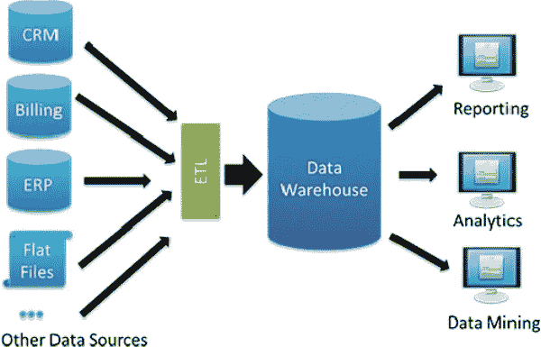

图片来源 [**数据块**](https://databricks.com/glossary/unified-data-warehouse)

在上图中，来自多个**源**的数据在指定的时间跨度内从多个应用程序加载，收集的数据被**格式化**到已经存在的数据仓库的**预定义**和固定**模式**中。然后，组织使用这些经过**处理的**数据以各种方式加以利用，例如报告、分析、数据挖掘等。

数据**来源**可以来自不同的地方(医疗保健、ERP、交易处理系统、供应链等。)和各种**格式**(结构化、非结构化、半结构化等。).

现在什么是数据仓库，如何工作已经知道了，现在有一些基于**云**的数据仓库**工具**，比如 Google **BigQuery** ，Amazon **RedShift** ，Azure **Sypnase** ， **Teradata** 等。

在本文中，我们将重点关注 **BigQuery** ，

# 什么是大查询？

它是由**谷歌云平台提供的**无服务器**、**全托管、多云端数据仓库**平台即服务( **PaaS** )服务。**

我们可以直接访问来自外部来源的数据，并在**大查询**中分析该数据，而无需使用联邦查询导入该数据。它还为 SQL 提供了一个查询引擎来编写 SQL 查询，并具有内置的机器学习功能。

它提供说明性和描述性分析、用于存储数据的数据存储以及集中式数据管理和计算机资源。它有完整的事务支持。

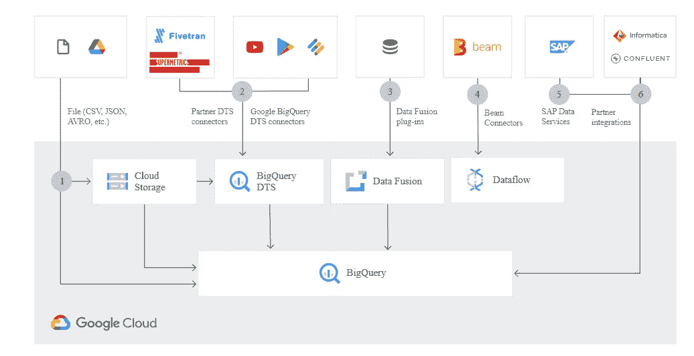

图片来源 [**谷歌云**](https://cloud.google.com/bigquery)

# 大查询架构

大查询架构帮助客户经济高效地开发数据仓库，而无需担心基础架构、安全性、数据库操作和系统工程。

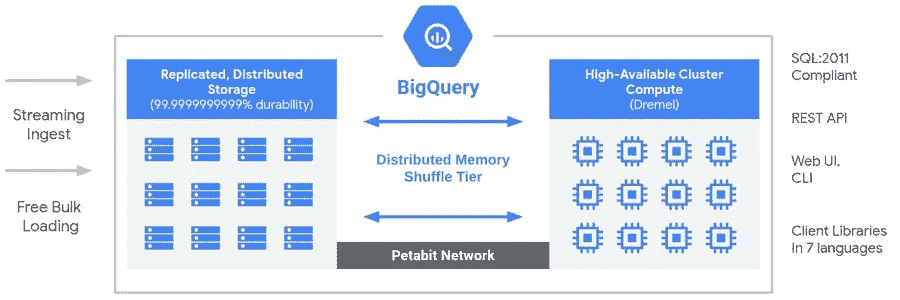

图片来源 [**谷歌**](https://storage.googleapis.com/gweb-cloudblog-publish/images/BQ_Explained_2.max-900x900.jpg)

大查询架构使用各种**低级**基础设施技术，比如 Borg、Dremel、Colossus 和 Jupiter。

**巨像:**巨像执行数据恢复、复制、分布式管理操作，确保数据安全。

Dremel: Dremel 是一个多租户集群，它将 SQL 查询转换成用于执行查询的执行树。

**木星:**存储和计算资源使用木星网络进行通信。

**Borg:** Borg 通过在大查询中执行服务之间的自动化配置、管理和协调来进行编排。

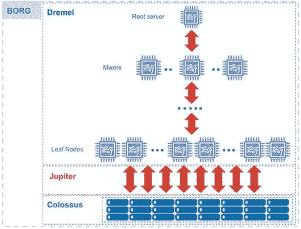

图片来源 [**谷歌云**](https://cloud.google.com/blog/products/data-analytics/new-blog-series-bigquery-explained-overview)

# 使用大查询构建数据仓库

假设我们有一家销售 K-pop 商品的**电子商务**公司，该公司存储来自两个不同来源的数据，即本地商店和在线商店，**根据公司需要存储的用于执行同行绩效分析的详细信息类型，从网站收集**数据。

现在，在 Big Query 中开发一个数据仓库来**聚合来自所有这些来源的**数据，执行一些操作，查询数据以获得有价值的**见解**，并做出**有效的**决策。

**在 GCP 创建项目，**

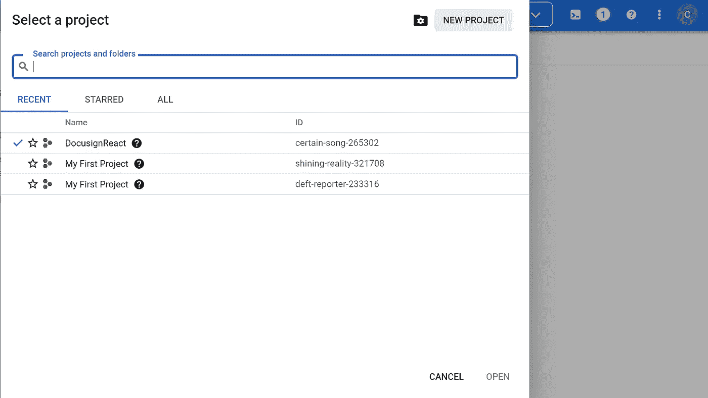

谷歌云平台

**在大查询中创建数据集**

*资源- >大查询- >项目名称- >创建数据集*

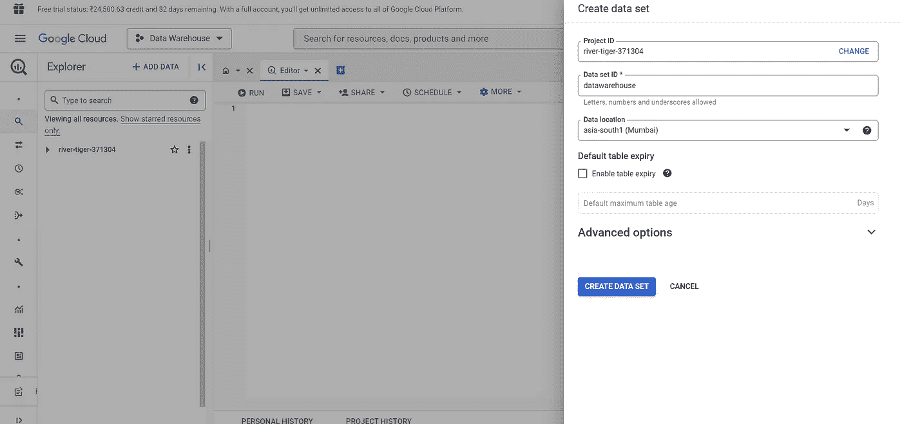

为已创建的项目创建数据集

从 [**kaggle**](https://www.kaggle.com/datasets/ericwan1/kpop-merchandise-prices) 下载一个数据集加载到刚刚创建的数据集中，

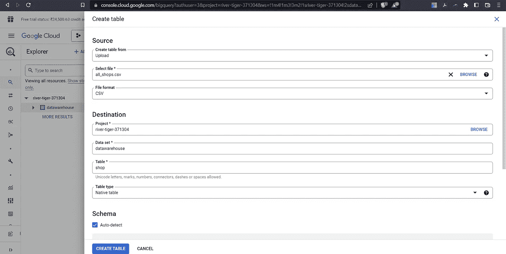

将表上传到已创建的数据集

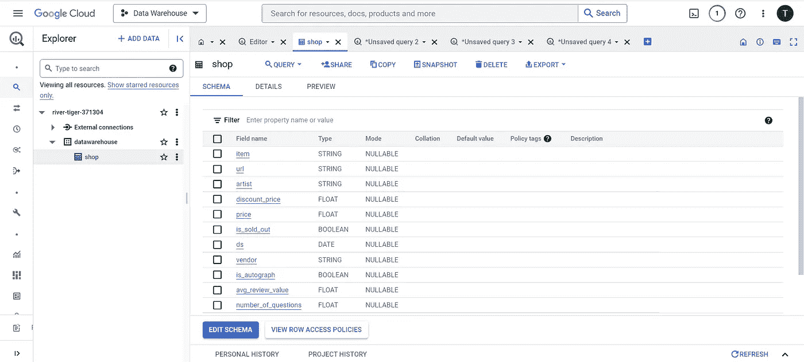

显示模式的导入表

分析导入到数据集中的表，

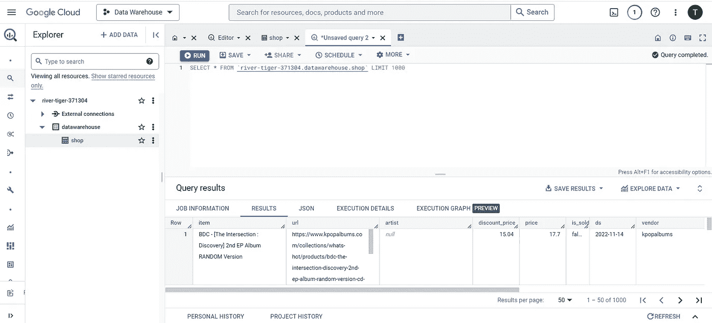

查看表中的前 1000 行

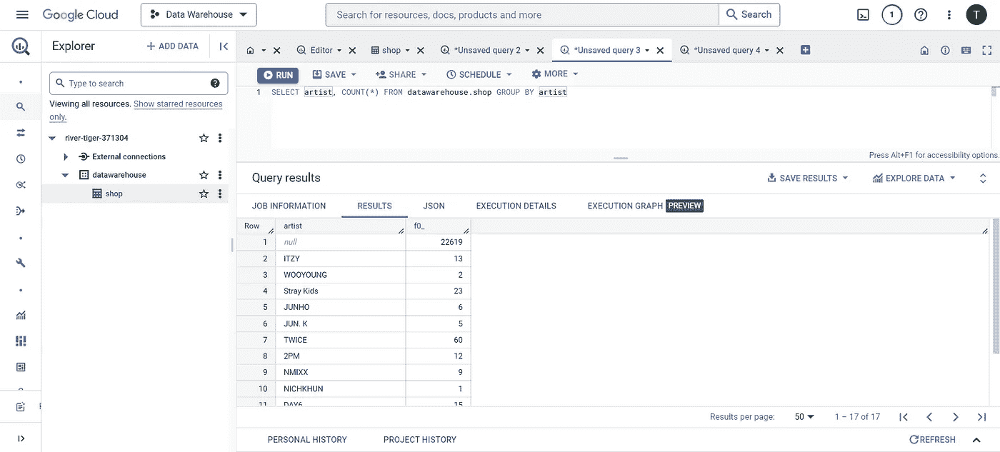

看到个别艺术家和他们各自的分位数

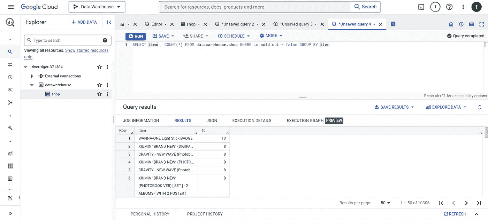

查看未售完的商品及其数量

> **参考文献**
> 
> [https://www . analyticsvidhya . com/blog/2022/08/building-data-warehouse-using-Google-big-query/](https://www.analyticsvidhya.com/blog/2022/08/building-data-warehouse-using-google-big-query/)
> 
> [https://cloud.google.com/bigquery](https://cloud.google.com/bigquery)
> 
> [https://www.cloudskillsboost.google/quests/68](https://www.cloudskillsboost.google/quests/68)

如果你喜欢这篇文章，关注我，你也可以做下面的事情。

我们上 **LinkedIn** 连线吧:

[https://www.linkedin.com/in/tripathiadityaprakash](https://www.linkedin.com/in/tripathiadityaprakash)

或者我的**网站**:

【https://tripathiaditya.netlify.app/ 

或者推特

[https://twitter.com/tripathiadityap/](https://twitter.com/tripathiadityap/)