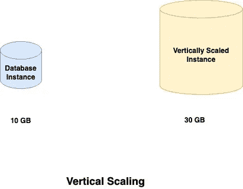
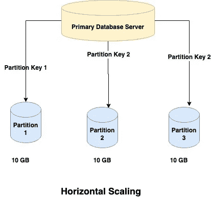
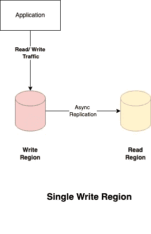
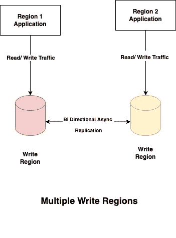

# 数据库:101

> 原文：<https://blog.devgenius.io/database-101-13d593ec4078?source=collection_archive---------5----------------------->

这篇博客是我们从零开始讨论**云**概念的系列文章的一部分，面向的是入门知识有限的读者。本文属于*中级*系列，因为它涉及到构建数据库和相关的基本概念。

云系列中的一些早期博客如下:

[**负载均衡 101**](/load-balancing-101-8251350c033f)[**缓存 101**](/caching-101-634ef4f8ed1b)[**AWS 云上的灾难恢复**](/disaster-recovery-on-aws-cloud-building-blocks-e013bffd6244)

# 什么是数据库？

数据库是存储在 [***文件系统***](https://en.wikipedia.org/wiki/File_system) (小型)或 [***私有/公共云***](https://en.wikipedia.org/wiki/Cloud_computing) (大型)上的分布式集群的数据的结构化集合。在其最早的发明中，它们作为 [***导航数据库***](https://en.wikipedia.org/wiki/Navigational_database) 可用，即检索用户必须扫描整个数据库解决方案的任何信息数据。近年来， [***关系型***](https://en.wikipedia.org/wiki/Relational_database) 用固定模式表示实体关系，以及*NoSQL 型数据只能作为键&值对存储，是数据库风格的常见形式。*

*数据库构成托管业务应用程序的 ***持久*** 层，即服务器关闭后，数据在存储中保持不变。与部署拓扑的计算层不同，数据库被称为功能架构的 ***有状态*** 层，因为数据状态是一致的，除非被用户/管理员操作删除。*

# *数据库扩展:水平与垂直*

*为了存储跨地理位置的分布式应用程序的业务数据，数据库管理系统需要进行扩展，以确保满足最终客户的正确性能 SLA。*

## *垂直缩放*

*在数据库的垂直扩展中，单个实例的大小被扩展以适应增加的处理需求。垂直扩展的好处是对应用层透明，但是实例只能垂直扩展到一个硬限制，通常这是一个更昂贵的操作。**例题**-[Azure SQL](https://azure.microsoft.com/en-in/products/azure-sql/database/)*

**

## *水平缩放*

*在水平扩展中，添加额外的节点/分区/碎片来平衡扩展增加的客户需求。数据基于分区键分布在不同的节点上，这种方法的一个主要限制是不能在一个数据库查询中查询不同分区的数据。**举例** - [**Mongo 数据库**](https://en.wikipedia.org/wiki/MongoDB) ， [**蔚蓝宇宙**](https://cosmos.azure.com/)*

**

# *数据库的分类*

*可以根据各种参数对数据库进行分类，如底层系统背后使用的*存储结构类型、实体之间的关系等。*下面列出了一些最常用的分类*

# *文件结构*

*根据用于存储实际应用程序数据的文件结构，数据库可以分为两种类型*

## ***平面文件***

*平面文件数据库以单个文本文件的形式存储实际用户数据，每行代表一条记录。制表符和逗号作为分隔符，这个数据库只能存储单个表，而实体之间没有任何关系。*

## ***多文件/结构化***

*结构化数据库有多个表，每个表以行和列或键/值对的形式存储数据，这取决于数据库的底层提供。*

# *实体关系*

*根据数据/实体之间的关系，数据库中的存储可以分为两个基本类别*

## *SQL/关系数据库*

*SQL 数据库以行和列的形式存储数据，并在存储的实体之间定义了关系。它们是纵向扩展的，即通过增加系统属性，如 *CPU、RAM、存储等。* **示例**-[-**Azure SQL**-](https://azure.microsoft.com/en-in/products/azure-sql/database/)*

## *NoSQL 数据库*

*NoSQL 数据库以默认格式存储数据，而不是传统的表，以*键/值对、文档、Json 的 e* tc 的形式。它们可以水平扩展，以满足高容量事务系统的高 TPS 需求。**举例**-[蒙哥数据库](https://en.wikipedia.org/wiki/MongoDB) ， [**蔚蓝宇宙**](https://cosmos.azure.com/)*

# *写区域支持*

*现代云数据库可以跨区域托管，以支持高可用性和灾难恢复需求。但是，根据写入区域的配置，它们可以分类如下*

## *单一写入区域*

*关系数据库通常以主动-被动模式设置，只有一个云区域提供写功能。如果发生区域性中断事件，必须进行故障切换，因此在读/写区域之间切换，反之亦然。**示例**-[-**Azure SQL**-](https://azure.microsoft.com/en-in/products/azure-sql/database/)*

**

## *多重写入区域*

*非关系数据库通常以 [**主动-主动**](http://relational%20databases%20are%20usually%20setup%20in%20active-passive%20mode%20with%20only%20one%20cloud%20region%20serving%20for%20the%20write%20capabilities%20.%20in%20case%20of%20a%20regional%20outage%20event%2C%20these%20have%20to%20be%20failed%20over%20%2C%20so%20switch%20between%20the%20read/write%20regions%20and%20vice-versa.) 模式设置，多个云区域提供写功能。如果发生区域性中断事件，这些会自动故障切换到工作写入区域，以确保业务连续性。**举例**-[-**天蓝色宇宙**](https://cosmos.azure.com/) ， [**AWS 极光**](https://docs.aws.amazon.com/AmazonRDS/latest/AuroraUserGuide/CHAP_AuroraOverview.html)*

**

# *摘要*

*数据库是公共云或私有云上的分布式可扩展部署的基本构造块。数据库事务中一个流行的概念是**，它帮助评估数据库决策。每个云供应商都提供一系列数据库解决方案，可用于构建分布式应用程序所需的客户/供应商和其他业务数据。最受欢迎的几个有: [**AWS 数据库、**](https://docs.aws.amazon.com/whitepapers/latest/aws-overview/database.html) [**Azure 数据库**](https://azure.microsoft.com/en-in/product-categories/databases/) 、 [**GCP 数据库**](https://cloud.google.com/sql/) 。***

****如需反馈，请留言至****Amit[dot]894[at]Gmail[dot]com****或联系*[*https://about.me/amit_raj*](https://about.me/amit_raj)*的任何链接。****