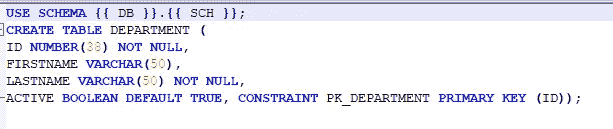

# 数据库变更管理工具:雪花模式变更概述

> 原文：<https://blog.devgenius.io/database-change-management-tool-schemachange-with-snowflake-overview-b62dec744e0a?source=collection_archive---------1----------------------->


在这篇博客中，我们将讨论如何利用数据库变更管理工具 SchemaChange 在雪花中部署数据库对象和 dml 脚本。这可以通过多种方式和市场上的多种工具来实现。您还可以开发自己定制工具来实现一定级别的管理

**schema change 的简要背景**

Schemachange 是一个简单的基于 python 的工具，用来管理你所有的[雪花](https://www.snowflake.com/)对象。它遵循一种命令式的数据库变更管理(DCM)方法，并受到了 [Flyway 数据库迁移工具](https://flywaydb.org/)的启发。当与版本控制系统和 CI/CD 工具相结合时，数据库变更可以通过使用现代软件交付实践的管道来批准和部署。因此，schemachange 在实现数据库(或数据)开发中起着关键作用。

DCM 工具(也称为数据库迁移、模式变更管理或模式迁移工具)遵循两种方法之一:声明式或命令式。关于数据库 DevOps 的背景，包括关于声明式和命令式方法之间的差异的讨论，请阅读由 Jeremiah Hansen[撰写的](https://www.snowflake.com/blog/authors/jeremiah-hansen/)[拥抱敏捷软件交付和带有雪花的 devo PS](https://www.snowflake.com/blog/embracing-agile-software-delivery-and-devops-with-snowflake/)博客文章。

要查看对 schemachange 所做更改的完整列表，请查看[变更日志](https://github.com/Snowflake-Labs/schemachange/blob/master/CHANGELOG.md)。

**请注意，schemachange 是一个社区开发的工具，而不是官方的雪花产品。它没有支持或保修。**

**重要方案变更指针:**

与**项目结构**相关的细节可以在这里阅读[。](https://github.com/Snowflake-Labs/schemachange#project-structure)

关于**改变脚本**的细节你可以在这里阅读[。](https://github.com/Snowflake-Labs/schemachange#change-scripts)

关于**可重复脚本命名**变更的详细信息可以在这里阅读[。](https://github.com/Snowflake-Labs/schemachange#repeatable-script-naming)

关于**认证**的细节可以在这里找到[。](https://github.com/Snowflake-Labs/schemachange#authentication)

## 运行脚本:

Schemachange 是位于 [schemachange/cli.py](https://github.com/Snowflake-Labs/schemachange/blob/master/schemachange/cli.py) 的单个 python 脚本。它可以按如下方式执行:

```
python schemachange/cli.py [-h] [-f ROOT_FOLDER] -a SNOWFLAKE_ACCOUNT -u SNOWFLAKE_USER -r SNOWFLAKE_ROLE -w SNOWFLAKE_WAREHOUSE [-d SNOWFLAKE_DATABASE] [-c CHANGE_HISTORY_TABLE] [--vars VARS] [--create-change-history-table] [-ac] [-v]
```

**模式改变有什么前提条件吗？**

是的，可以从 SchemaChange GitHub [自述文件](https://github.com/Snowflake-Labs/schemachange#readme)中找到。

**先决条件**
为了运行 schemachange，您必须具备以下条件:

1.  你需要安装最新版本的 **python 3** 。
2.  您需要安装最新的**雪花 Python 驱动程序**
    您需要在雪花中创建 schemachange 使用的变更历史表。
3.  首先，您需要创建一个数据库(元数据)来存储您的变更历史表(schemachange 不会在这方面帮助您)。
4.  其次，您需要创建变更历史模式和表。您可以手动完成此操作，也可以通过使用— create-change-history-table 参数运行 schemachange 来创建它们(只需确保运行 schemachange 的雪花用户拥有在该数据库中创建模式和表的权限)。
5.  您需要创建(或选择)一个用户帐户，该帐户有权应用您的更改脚本中的更改。
6.  不要忘记，该用户还需要对变更历史表具有 SELECT 和 INSERT 权限

来个快速演示怎么样？

如何下载或克隆 SchemaChange？

> https://github.com/Snowflake-Labs/schemachange.git

或者

去 https://github.com/Snowflake-Labs/schemachange.git


**对于 SchemaChange，哪些参数是必需的？**

> 以下两个参数都需要在环境变量中预先设置。如果没有设置 belwo，Schemachange 将在执行过程中失败。
> 
> **雪花 _ 私有 _ 密钥 _ 路径
> 雪花 _ 密码**

**我可以在哪里存储我的 CLI 参数值？**

您可以使用环境变量(Windows)来存储所有 SnowChange CLI 参数。如果您在管道中使用，那么您可以将其存储为机密或库。我在本地笔记本电脑上运行这个程序，所以我选择将它们存储为一个环境变量


使用 SchemaChange 需要任何安装吗？

不需要，你只需要从 GitHub repo 下载 zip 文件夹或将 GitHub repo 克隆到你的本地目录，就可以使用了。

如何查看 Snowchange CLI 命令的帮助？

> python cli.py **-h**

**如何提供我的自定义数据库修改脚本路径？**

> -f ROOT_FOLDER，— root-folder ROOT_FOLDER: *(可选)*数据库更改脚本的根文件夹。默认为当前目录。
> 
> python CLI . py**-f C:\ Rajiv \ schema change \ demo \ Citi bike**-a %雪花 _ ACCOUNT %-u %雪花 _ USER %-r %雪花 _ ROLE %-w %雪花 _ WAREHOUSE %-d %雪花 _DATABASE% —创建-更改-历史-表

**我们可以从 SnowChange CLI 创建 CHANGE_HISTORY(在默认数据库/模式中)表吗？**

> —创建-变更-历史-表格:*(可选)*如果变更历史表格不存在，则创建该表格。默认值为“False”。
> 
> python CLI . py-f C:\ Rajiv \ schema change \ demo \ Citi bike-a %雪花 _ ACCOUNT %-u %雪花 _ USER %-r %雪花 _ ROLE %-w %雪花 _ WAREHOUSE %-d %雪花 _ DATABASE %**—create-change-history-table**

**如何在 Schemachange 中部署时生成详细日志？**

> -v，— verbose: *(可选)*在执行过程中显示详细的调试细节。默认值为“False”。
> 
> python CLI . py-f C:\ Rajiv \ schema change \ demo \ Citi bike-a %雪花 _ ACCOUNT %-u %雪花 _ USER %-r %雪花 _ ROLE %-w %雪花 _ WAREHOUSE %-d %雪花 _ DATABASE %—create-change-history-table**-v**

**如何使用 Schemachange 在雪花中创建初始 DDL？**

1.  在工作目录中添加初始 DDL 脚本。(以下脚本是 Schemachange git 回购示例 citybike 演示的一部分)


2.在命令下运行。

> python CLI . py-f C:\ Rajiv \ schema change \ demo \ Citi bike-a %雪花 _ ACCOUNT %-u %雪花 _ USER %-r %雪花 _ ROLE %-w %雪花 _ WAREHOUSE %-d %雪花 _DATABASE% —创建-更改-历史-表

如果我的脚本包含 DML 语句，我想从 CLI 提交，该怎么办？

1.  在工作目录中添加 DML 脚本。(以下脚本是 Schemachange git 回购示例 citybike 演示的一部分)


> -ac，—自动提交:*(可选)*为 DML 命令启用自动提交功能。默认值为“False”。
> 
> python CLI . py-f C:\ Rajiv \ schema change \ demo \ Citi bike-a %雪花 _ ACCOUNT %-u %雪花 _ USER %-r %雪花 _ ROLE %-w %雪花 _ WAREHOUSE %-d %雪花 _ DATABASE %—create-change-history-table**-AC**

如何使用我的脚本中定义的动态变量进行部署？

1.  在工作目录中添加带有动态变量代码的 DDL 脚本。



> —变量 VARS: *(可选)*定义要在更改脚本中替换的变量的值，以 JSON 格式给出(例如' {"variable1": "value1 "，" variable2": "value2"} ')
> 
> 注意:在将键值作为参数传递时，我们必须使用两次双邀请逗号，否则它将开始抱怨"**schema change:error:argument-vars:invalid loads Value:' { DB:METADATA，SCH: SCHEMACHANGE}** ' "。


> python CLI . py-f C:\ Rajiv \ schema change \ demo \ Citi bike-a %雪花 _ ACCOUNT %-u %雪花 _ USER %-r %雪花 _ ROLE %-w %雪花 _ WAREHOUSE %-d %雪花 _ DATABASE %—vars " { " " DB " ":" METADATA " "，" " SCH " ":" schema change " " }-v-AC

**我可以用我的自定义表名覆盖 Change_History 表名吗？**

是的，你可以。看看下面你如何能达到同样的效果。

> -c CHANGE_HISTORY_TABLE，—CHANGE-HISTORY-TABLE CHANGE _ HISTORY _ TABLE:*(可选)*用于覆盖变更历史表的默认名称(即元数据。SCHEMACHANGE.CHANGE_HISTORY)

**注:**

确保在创建历史记录表之前预先创建了默认数据库& Schema。除了"-c "参数，您还必须传递"--create-change-history-table "，这样它将复制历史表结构并使用您提供的名称作为 CLI 参数。

> python CLI . py-f C:\ Rajiv \ schema change \ demo \ Citi bike-a %雪花 _ ACCOUNT %-u %雪花 _ USER %-r %雪花 _ ROLE %-w %雪花 _ WAREHOUSE %-d %雪花 _ DATABASE %—vars " { " " DB " ":" METADATA " "，" " SCH " ":" schema change " " } "—create-change-HISTORY-table-C "雪花 _HISTORY "

**我们能否试运行一下，看看将要部署的文件列表以及部署顺序，而不是实际部署？**

是的，我们可以通过使用—模拟运行参数来实现。

> —空运行:*(可选)*在空运行模式下运行 schemachange。默认值为“False”。
> 
> python CLI . py-f C:\ Rajiv \ schema change \ demo \ Citi bike-a %雪花 _ ACCOUNT %-u %雪花 _ USER %-r %雪花 _ ROLE %-w %雪花 _ WAREHOUSE %-d %雪花 _ DATABASE %-v-AC—vars " { " " DB " ":" " METADATA " "，" " SCH:" " schema change " " } "—模拟运行

**SchemaChange 关键观察:**

1.  Schema change 是一个轻量级的、非常简单的基于 Python 的工具，旨在管理雪花对象&只管理 dml 脚本。
2.  目前除了雪花之外，它不支持任何其他数据库。
3.  早先，SchemaChange 被称为 SnowChange。
4.  这是一个社区开发的工具，而不是官方的雪花产品。此外，它没有支持或保修。
5.  它只支持应用非常广泛的 SQL 脚本。
6.  因为 Schemachange 是用 Python 编写的，所以它可以很容易地包含在 CI/CD 管道中。所有流行的 CI/CD 工具都提供安装了 Python 的托管代理(或运行程序),因此不需要创建自托管代理或容器来运行 Snowchange。
7.  不需要复杂的安装。下载使用即可。只要你满足所有先决条件。
8.  变更文件也很容易管理，您可以在根文件夹下创建任意数量子目录。
9.  Schemachange 支持[口令认证](https://docs.snowflake.com/en/user-guide/python-connector-example.html#connecting-using-the-default-authenticator)和[私钥认证](https://docs.snowflake.com/en/user-guide/python-connector-example.html#using-key-pair-authentication)。

希望这篇博客能帮助你了解 **SchemaChange，一个数据库变更管理工具**。如果你对此有任何疑问，欢迎在评论区提问。如果你喜欢这个博客，请鼓掌。保持联系，看到更多这样的酷东西。谢谢你的支持。

**可以找我:**

**跟我上媒:**[https://rajivgupta780184.medium.com/](https://rajivgupta780184.medium.com/)

**在推特上关注我:**[https://twitter.com/RAJIVGUPTA780](https://twitter.com/RAJIVGUPTA780)

**在 LinkedIn 联系我:**[https://www.linkedin.com/in/rajiv-gupta-618b0228/](https://www.linkedin.com/in/rajiv-gupta-618b0228/)

**订阅我的 YouTube 频道:【https://www.youtube.com/channel/UC8Fwkdf2d6-hnNvcrzovktg】T22**


#坚持学习#坚持分享#每天学习。

# 参考资料:-

*   [https://www.snowflake.com/](https://www.snowflake.com/)
*   [https://github.com/Snowflake-Labs/schemachange#readme](https://github.com/Snowflake-Labs/schemachange#readme)