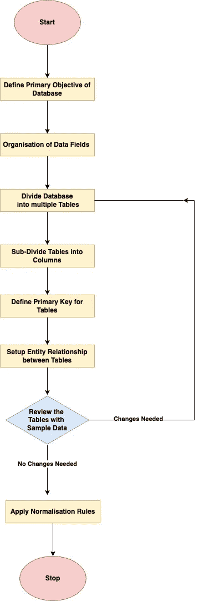
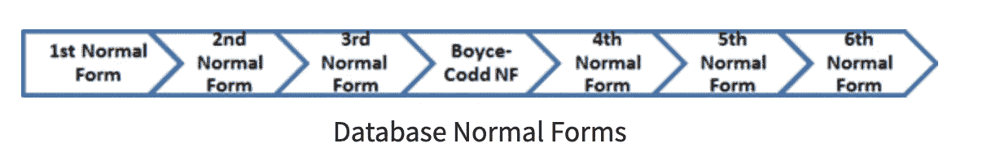
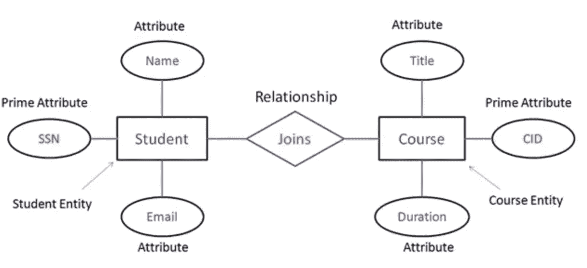

# 数据库设计

> 原文：<https://blog.devgenius.io/database-design-101-7c019d69b97f?source=collection_archive---------2----------------------->

这篇博客是我们从零开始讨论 101 个概念的系列文章的一部分，读者的入门知识有限。这篇文章属于*中级*系列，因为它涉及到理解**数据库设计原则的基础，**主要用于关系数据库用例。

101 系列中的一些早期博客如下:

[**API 101**](/api-101-773ec501b485) [**异步通信 101**](/async-communication-101-b04d5c95333a)[**数据库 101**](/database-101-13d593ec4078)

# 什么是数据库设计？

[**数据库设计**](https://en.wikipedia.org/wiki/Database_design) 是整个架构设计过程中的一个重要步骤，它使用数据库 ***模式、表格、视图等来确定与业务领域相关的数据的逻辑组织。*在用于应用程序设计的 [**MVC**](https://en.wikipedia.org/wiki/Model%E2%80%93view%E2%80%93controller) 模型中，模型层与实际的数据库进行交互，并且通常从任何数据库模式变化中抽象出来。**

# 常用术语

*   **行** —数据库表中的每个数据记录都存储为横线。订单管理系统中的每个客户记录都是唯一的一行。
*   **列—** 在数据库中，列存储特定类型的数据。*例如:字符串、日期、整数等*
*   **表格—** 行和列的集合称为表格。表是根据整体架构中的实体进行分类的，例如客户、订单、项目都是独立的。表是一个订单管理系统。
*   **查询—** 查询是用于创建、读取、更新、删除、截断数据库表中的数据的 SQL 命令。
*   **视图—** 视图是由原始表的行和列的子集创建的虚拟表，以提高复杂性和更好的访问控制。
*   **索引—** 索引用于通过使用磁盘上的额外存储来改进数据查找。
*   **主键—**用于唯一标识数据库表中行/记录的列或列元组。
*   **外键—** 用于导出多个表之间的关系，表的外键是连接器，因为它引用另一个表的主键。

# 数据库设计过程

# DDL 与 DML

在数据库管理系统上运行的查询操作可以大致分为两大类

*   **DDL** ，代表**数据定义语言**，定义数据库中表格的基本数据结构/模式。E *x-创建表格，修改表格。**DDL*q*查询影响表的列，并根据模式的需要定义任何约束。*
*   ***另一方面，DML** 代表**数据操作语言**，即使用 DDL 查询修改已经定义的模式的表内容。**E*x-Insert INTO table _ name，UPDATE table _ name*T23*。* DML 查询影响数据行 us***

# *数据库规范化*

*数据库规范化是一个设计步骤，它消除了以大型整体表形式存储的冗余数据，从而简化了整个查询的执行。这种规范化数据的主要目的是使用表之间的关系对数据进行逻辑存储。正如 Edgar Codd 最初提出的，从 1NF 到 6NF 的整个过程包括六个步骤，如下所述。大多数现代数据库遵循一个标准，直到 4NF 步骤。*

**

*详细阅读整体步骤—[https://docs . Microsoft . com/en-us/office/trouble shooting/access/database-normalization-description](https://docs.microsoft.com/en-us/office/troubleshoot/access/database-normalization-description)*

# *实体关系设计*

*实体是指 ***客户/订单/付款/项目*** 等，其属性以行和列的形式存储，并在逻辑上分组为数据库中的表。因此，在实际业务领域中这些实体之间导出的数据库设计部分被称为**实体关系设计**。*

**

***大学生 ER 图样本***

## *一对多关系*

*在订单管理系统中， ***vendor_table*** 和***product _ table***有一对多的实体关系，即一个供应商可以发送多个产品。*

## *多对多关系*

*在订单管理系统中，**产品**和**订单**实体具有多对多实体关系，因为单个产品可以出现在多个订单中，并且一个订单可以包含多个产品。为了解决这些用例，推荐使用包含**订单表**和**产品表**主键的连接表。*

## *一对一的关系*

*当实体的子类(如**产品**)具有表中所有行都没有的附加属性时，通常使用一对一关系。在这种情况下，建议使用主键为**产品标识**的**产品补充表**。*

# *查询优化*

*以下是一些适用于数据库模式和查询原则的一般建议，以确保满足最终客户和产品对数据库访问的正确性能 SLA 要求*

*   *在查询数据时，使用**选择字段**而不是**选择*** 来只读视图或控制器中的必要字段。此外，为了获取不同的项目**，选择 ID 优先于**选择不同的**命令。***
*   *使用**EXIST()**over**r COUNT()to**查找单个记录的存在，因为在 EXIST 命令的情况下，查询在表中的第一个匹配处停止。*
*   *使用一个 **WHERE** 子句，而不是 have for 条件查询，因为前者在实际分组之前过滤数据，从而使速度更快。*
*   *简化 **JOIN** 命令，因为从多个表中获取数据是最大的瓶颈。使用 JOIN 时，从结果集较少的表开始有助于减少总的执行时间。*

*使用聚集和非聚集索引，可以针对应用程序用例进一步优化对最常见列的数据访问。*

**如需反馈，请留言至****Amit[dot]894[at]Gmail[dot]com****或联系*[*https://about.me/amit_raj*](https://about.me/amit_raj)*的任何链接。**