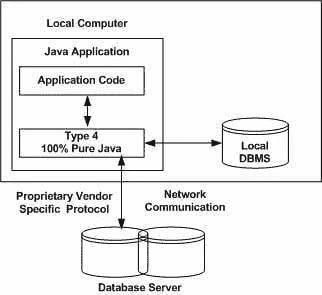

# 数据库驱动程序:将数据送到需要的地方

> 原文：<https://blog.devgenius.io/database-drivers-chauffeuring-your-data-to-where-it-needs-to-go-5212b2512ea0?source=collection_archive---------2----------------------->

大多数(如果不是全部的话)公司在他们的数据管道中的某个地方处理复杂和集成难题，这是由于不能或难以将某些系统相互连接。有时，您不得不添加另一种技术，仅仅是为了连接不同的系统并将您的数据传送到需要的地方。然而，在当今这个时代，少即是多。大多数出现的技术都是为了在更小的封装中提供更高的效率和更多的功能。如果您可以用更少的工具来满足您的数据管理需求，那么对于成本效益、效率和易用性来说，这是一个双赢的结果。输入数据库驱动程序。

# 神奇的适配器

简单地说，每个计算机系统都需要某种适配器或工具来连接到不同的其他计算机系统。你可以从物理或内部(计算机系统)的角度来思考这个问题。举个物理例子，我们都知道升级手机带来的主要挫折，当你的充电器和耳机不再适合手机底部不断缩小的端口时。但是，您可以购买一个适配器作为“中间人”来实现连接。对于计算机系统，这是相同的，但不同的。数据库驱动程序的工作方式类似于物理电话适配器，但是您可以开发一个适配器/连接器来扩展数据库功能，而不必投资一个额外的产品来添加到技术堆栈中。就像软件包的扩展。

通常，数据库供应商自己会提供驱动程序，这是一个明智的商业举措，因为它提供了易用性并增加了对其产品的可访问性。公司可能在内部开发这些驱动程序，或者雇佣外部资源来完成开发工作。好消息是，一旦构建了驱动程序，它们就很容易使用，并且可以在许多不同的集成中使用。**驱动程序和标准接口使用户能够连接到他们喜爱的 BI(商业智能)和分析工具，因此您不必为了使用新的数据库而学习新的系统。**

考虑由 jdatalab :
*提供的数据库驱动程序[的解释“类似于通过使用打印机驱动程序将打印机连接到计算机，DBMS(数据库管理系统)需要一个数据库驱动程序来实现其他系统中的数据库连接。该驱动程序就像一个适配器，将一个通用接口连接到一个特定的数据库供应商实现。[例如]要在 Java 应用程序中建立数据库连接，我们需要一个 JDBC (Java 数据库连接 API)驱动程序。为了连接各个数据库，JDBC 需要每种特定数据库类型的驱动程序。”](https://www.jdatalab.com/information_system/2017/02/16/database-driver.html#:~:text=A%20database%20driver%20is%20a,a%20specific%20database%20vendor%20implementation.&text=To%20connect%20with%20individual%20databases,for%20each%20specific%20dathttps://www.jdatalab.com/information_system/2017/02/16/database-driver.html#:~:text=A%20database%20driver%20is%20a,a%20specific%20database%20vendor%20implementation.&text=To%20connect%20with%20individual%20databases,for%20each%20specific%20database%20type.abase%20type.)*

因此，特定的驱动程序需要与目标系统的语言相匹配，以便数据库能够使用并理解正在传输的信息。您可以根据需要连接的应用程序的语言协议和规格，从 JDBC 和 ODBC 等驱动程序中进行选择。驱动程序在一端提供标准化的协议(如 JDBC 或 ODBC)供应用程序连接，在另一端提供专用协议以使用适当的数据库语言。有效地充当两个应用程序之间的翻译器。在后台，数据库驱动程序将其接收到的语言转换为应用程序能够实时理解的语言。标准化的驱动程序和插件使集成您的数据库和应用程序变得容易，例如 BI 工具、ETL 工具和前端应用程序。**最终，驱动程序使一切都变得更加简单，因此您不必在每次需要完成新的集成时都进行定制开发工作。**

# 数据库驱动程序的类型和使用案例

例如，假设您想将 Excel 文档与数据库集成在一起。无论你选择哪个供应商，都可能(*希望是*)有正确的驱动程序。您可以下载 Excel 驱动程序(技术上称为插件)或利用通用 ODBC 连接，一旦连接完成，您就可以通过编辑 Excel 电子表格来更新数据库中的数据，反之亦然！数据库中的表和列基本上是随着电子表格中的更新而实时更新的。

这个例子可以扩展到不同类型的语言、系统和应用程序。最初由微软(和 Simba)开发的 [ODBC(开放式数据库连接)驱动程序](https://docs.microsoft.com/en-us/sql/odbc/reference/what-is-odbc?view=sql-server-ver15)，使应用程序能够使用标准 SQL 访问 DBMS:“应用程序调用这些驱动程序中的函数，以独立于 DBMS 的方式访问数据。驱动程序管理器管理应用程序和驱动程序之间的通信。尽管微软为 Windows 计算机提供了许多 ODBC 驱动程序，但今天大多数 ODBC 驱动程序都是由别人编写的。任何人都可以编写驱动程序，今天在 Mac 和许多其他 UNIX 平台上都存在 ODBC 驱动程序和应用程序。

类似地，JDBC 驱动程序可以发送允许 Java 应用程序与数据库交互的 SQL 语句。根据客户机/服务器、用例以及集成需求的不同，目前实际上有四到五种不同类型的 JDBC 驱动程序在使用。例如，[教程点](https://www.tutorialspoint.com/jdbc/jdbc-driver-types.htm)解释了一个 100%纯 Java 的驱动:“一个纯基于 Java 的驱动通过 socket 连接直接与厂商的数据库通信。这是数据库可用的最高性能驱动程序，通常由供应商自己提供。这种驱动程序非常灵活，你不需要在客户端或服务器上安装特殊的软件。此外，这些驱动程序可以动态下载。”

[*图片来源*](https://www.tutorialspoint.com/jdbc/jdbc-driver-types.htm)

# 找到您需要的驱动程序

驱动程序已经存在了一段时间，今天仍然有大量的应用程序使用或需要它们。在现代应用程序开发中，这种模式可能正在改变，但并不是所有类型的应用程序都是如此。例如，BI 工具仍然依赖数据库驱动程序作为与所有类型的数据库交互的主要方法。虽然 JDBC 和 ODBC 可能是最流行的，但还有许多类型的数据库驱动程序。连接到的驱动程序。NET 和 SSIS，以及 Tableau、OSIsoft PI 和 BizTalk 等应用程序的适配器。有许多选项，您的数据库供应商应该通过清晰的解释和示例，为您的用例选择正确的驱动程序/适配器。

如果看不到所需的驱动程序，您可以向供应商或第三方请求自定义驱动程序。这些驱动程序确实是数据库和应用程序公司合作提供尽可能无缝的用户体验的一种很好的方式，所以不要犹豫询问您的特定项目可能需要什么！

一个小旁注；数据库供应商通常提供的另一种工具是 SDK(软件开发工具包),用于创建对开发人员更友好的体验。虽然驱动程序支持与其他应用程序的连接，但 SDK 为编写这些应用程序提供了指南。SDK 是“一个可安装包中的软件开发工具的集合”。它们通过拥有编译器、调试器以及可能的软件框架来简化应用程序的创建。”不同的类型也基于特定的编程语言和它们所服务的用例。乍看之下，我已经能够在网上找到比数据库驱动更多的关于 SDK 的信息，但也许这将是我下一篇文章的主题…

*很高兴收到你的来信！查看 HarperDB* *提供的* [*驱动程序的真实示例，如果您没有看到您喜欢的内容，请在我们的*](https://studio.harperdb.io/resources/drivers?utm_source=Medium&utm_medium=Drivers) [*反馈板上*](https://harperdb.featureupvote.com/?utm_source=Medium&utm_medium=Drivers) *请求您需要的驱动程序。*