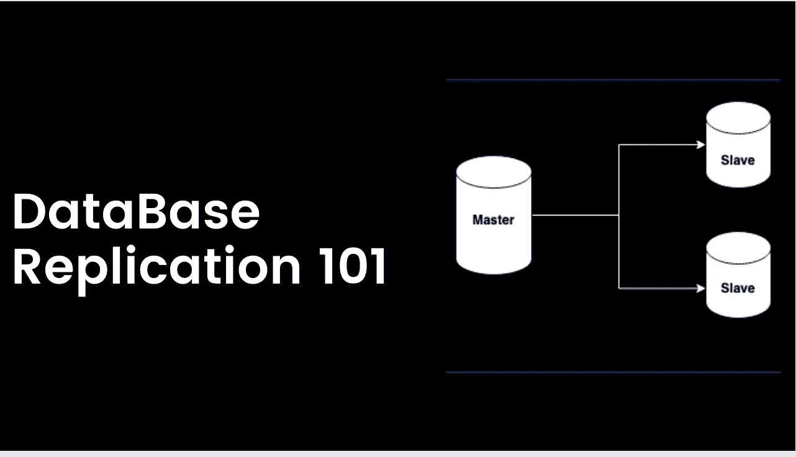
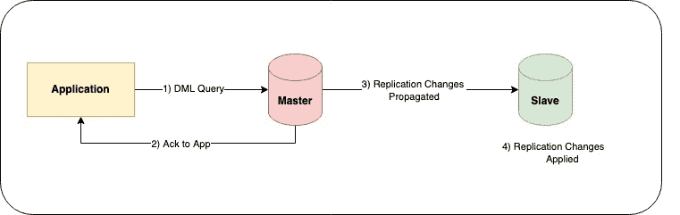
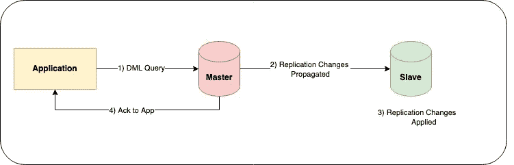
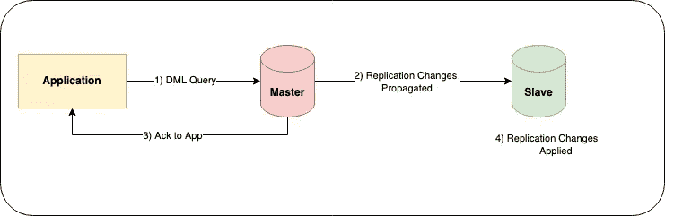
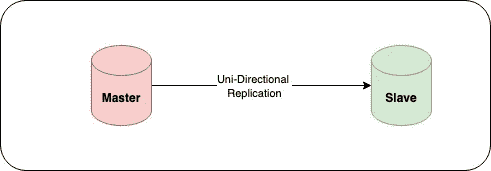
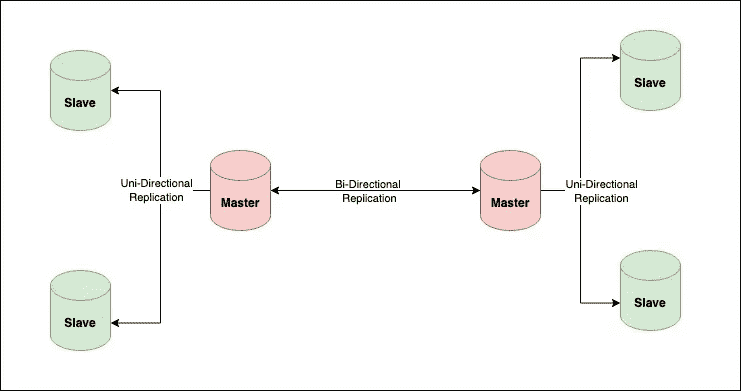

# 数据库复制 101

> 原文：<https://blog.devgenius.io/database-replication-101-d148514598a7?source=collection_archive---------14----------------------->

这篇博客是我们从零开始讨论 101 个概念的系列文章的一部分，读者的入门知识有限。本文属于 ***中级*** 系列，因为它涉及对**数据库复制**的理解，数据库复制主要用于复制分布在 [**数据中心、可用性区域和云区域**](https://aws.amazon.com/about-aws/global-infrastructure/regions_az/) 的多个节点中的应用程序数据，以确保在单个节点出现故障时的数据可用性。

101 系列中的一些早期博客如下:

[**数据库分片 101**](/database-sharding-101-4ef36046c29c) [**缓存策略 101**](/caching-strategy-101-3bc974d2a6cd) [**CORS 101**](/cors-101-72b462396deb)[**断路器 101**](/circuit-breaker-pattern-101-be2d7fdb656) [**优先级队列 101**](/priority-queues-101-40eb4f6f5ee9) **[**异步通信 101**](/async-communication-101-b04d5c95333a)**

# 什么是数据库复制？

数据库复制是将应用程序数据的多个副本创建到一个或多个数据库服务器中的过程。复制可以实时进行，即主服务器上的每个**数据库操作查询**都可以实时进行，或者在一天中以预定的频率定期进行。

此外，根据整个业务领域的**恢复点目标**需求，在生产中进行同步或异步技术之间的设计选择。数据复制的主要目标是**减少停机时间，提高数据可用性，并在某些情况下通过使用只读操作的读取副本来减少应用程序延迟**。

# 数据复制的类型

不同的云供应商有不同的数据复制技术来在多个数据库实例之间复制数据。然而，**将数据库事务标记为完成并触发返回给客户端**的确认的底层机制用于将技术分为以下类型

## 异步复制

在异步复制中，一旦主服务器上的数据更新，客户端就会收到确认。对从设备的复制在后台发生，并且使用 [**复制滞后**](https://severalnines.com/database-blog/what-look-if-your-mysql-replication-lagging) 度量来测量延迟。

由于存在延迟，因此在复制延迟期间，如果发生中断，从属服务器上的数据将会丢失。因此，这种方法在业务要求**零数据丢失**的应用中不是首选。

## 同步复制

在同步复制中，数据库事务仅在向从服务器传播并应用了 **DML 事务更改**后才会被标记为完成，即从服务器与主服务器一致。

由于**复制传播和将**应用到从设备是事务中的额外步骤，因此这种方法较慢，尤其是在跨区域写入事件的情况下。因此，对于有严格延迟要求的应用程序，这种方法不是首选。

## 半同步复制

半同步复制等待复制更改传播到辅助服务器，但是实际复制到从属服务器可能发生在确认发送回客户端之后。

# 多主机对单主机

复制策略可以根据作为数据库服务器一部分的**主节点(读/写)**的数量以及复制过程的**单向/双向**性质进行分类。

## **单主**

在单主设置中，数据仅写入主服务器，并使用不同的复制策略复制到从服务器( [**基于日志、基于快照、基于密钥等**](https://www.keboola.com/blog/database-replication-techniques) )。

给定用于主数据写入的单个节点，单主机设置总是一致的。如果主服务器出现故障，该设置需要一个额外的**故障转移步骤(手动/自动)**才能从客户端取回写查询。

## **多主**

在多主设置中，来自客户端的数据可以写入任何主服务器。复制工作**双向**以确保数据在**冲突解决**后最终保持一致，以更新相似的实体。

如果其中一个主服务器离线，剩下的主服务器可以处理来自客户端的写负载，因此在这个设置中需要**数据库故障转移**。

# 摘要

复制有助于满足关键业务领域的高可用性和灾难恢复需求，以便在停机时无缝运行。它与整体功能架构计算层的流量路由策略有效结合，解决了 RTO 和 RPO 一致性问题。大多数 PAAS 数据库，如 **Post Gress、My SQL、Azure SQL、Azure Cosmos、Aurora 等**都有自动复制设置，以简化最终客户的最小操作设置。

在本系列的专家博客中，我们将通过一个数据库示例来深入探讨基于日志、基于快照、基于键的复制策略。

*如需反馈，请留言至****Amit[dot]894[at]Gmail[dot]com****或联系*[*https://about.me/amit_raj*](https://about.me/amit_raj)*的任何链接。*