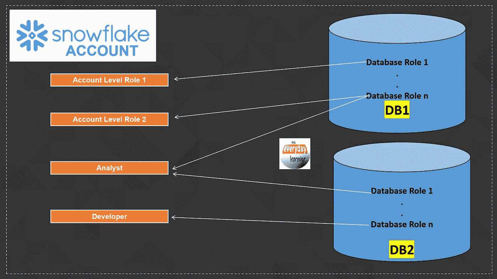

# 雪花中的数据库角色 V/S 帐户角色

> 原文：<https://blog.devgenius.io/database-role-v-s-account-role-in-snowflake-49e960b3924a?source=collection_archive---------1----------------------->



今天我们将讨论直接来自雪花烤箱的新鲜出炉的**所有版本**功能，即**数据库角色。**


这个功能很热…真的很热…！

希望你们都知道雪花的作用。与帐户级角色相比，数据库级角色的概念略有不同。

目前，**数据库的角色是一个**


让我们详细讨论一下这个问题。

# 雪花里的角色是什么？

在雪花中，您只能将任何对象的权限授予角色。权限不能直接授予任何用户，权限可以授予角色，角色可以授予用户。可以将角色授予其他角色，以创建角色层次结构和角色继承。雪花中几乎没有预先创建标准角色。要了解更多关于雪花和其他访问控制框架中的标准角色的信息，请参阅我最近的博客 。

# 我们在雪花中有角色类型吗？

我们在雪花中有以下角色类型:

1.  预先创建的**标准角色**，如帐户管理员、系统管理员等。
2.  在雪花中创建的任何其他**自定义角色**都是**账户级**角色。这些角色是使用“创建角色<角色名称>创建的”
3.  **数据库角色**是新引入的，旨在进一步加强数据库级别的安全性要求。这些角色是使用“创建数据库角色<角色名>创建的。

# 帐户角色和数据库角色有什么区别？


1.  帐户级角色驻留在任何数据库之外，而数据库角色驻留在特定的指定数据库内。
2.  帐户级角色可以对帐户中的任何或所有对象授予权限，而数据库级角色只能访问数据库级对象。
3.  帐户级角色可以出现在上下文中，或者可以使用“使用角色<role_name>选择，或者可以通过客户端连接请求传递，而数据库角色不能像普通帐户级角色一样使用。数据库角色只能授予帐户级角色。</role_name>
4.  帐户角色可以授予用户，而数据库角色只能授予帐户角色，而不能授予用户。
5.  帐户级角色范围是整个帐户，而数据库角色范围仅限于指定的数据库。
6.  帐户级角色可以分配给其他帐户角色以创建角色层次结构，而数据库角色不能授予同一数据库之外的其他数据库角色。数据库角色只能授予帐户级别的角色，以创建角色层次结构。
7.  **账户级角色**不能授予**数据库角色**，而数据库角色可以授予账户角色。
8.  数据库角色所有权只能由帐户角色持有，而帐户级别的角色所有权不能由任何数据库角色持有。

# 数据库角色的用例是什么？

1.  **轻松管理数据库级访问—** 数据库所有者可以轻松管理各自数据库内的数据库级访问。数据库中所有安全对象都可以被授予数据库角色，然后这些角色可以被分配给帐户角色。
2.  **增强安全性—** 现在有了数据库角色，可以更安全地设置安全边界，因为数据库角色可以在数据库外部访问，除非明确授予帐户角色。此外，它可以被授予当前数据库之外的其他数据库角色，这减少了由于任何雪花帐户中的角色授予管理失误而造成的角色爆炸或角色混乱。
3.  **细粒度共享雪花数据库—** 账户预配置雪花时提前共享雪花数据库。当你想从雪花数据库中分享使用信息时，没有办法限制每个人都必须导入整个雪花数据库。现在，有了共享数据库角色，数据使用者可以将每个共享数据库角色授予他们自己帐户中的一个或多个帐户级角色。随着共享数据库角色的引入，我们可以为使用消费者提供自定义窗口访问，而不是整个数据库访问。

# 如何创建或删除数据库角色？

为了创建数据库角色，雪花引入了新的语法。不能使用旧的“CREATE ROLE <role_name>”语法创建数据库角色。</role_name>

```
--Create Database role
CREATE OR REPLACE DATABASE ROLE RBACSCH_READ_ONLY;

--Drop Database role
DROP DATABASE ROLE RBACSCH_READ_ONLY;
```

# 如何列出数据库角色？

要在雪花中列出任何特定数据库所有数据库角色，您必须使用新语法。您不能使用旧“SHOW ROLES <role_name>”语法列出数据库角色。</role_name>

```
SHOW DATABASE ROLES IN DATABASE DBROLE_DEMO;
```

# 如何管理雪花中数据库角色的权限？

下面是如何将数据库角色授予帐户角色或同一数据库中的其他数据库角色的语法。

```
--Grant database role to account role
GRANT DATABASE ROLE DBROLE_DEMO.RBACSCH_READ_ONLY to role ROLE_ENV_ADMIN;

--Grant database role to another database role
GRANT DATABASE ROLE DBROLE_DEMO.RBACSCH_READ_ONLY TO 
DATABASE ROLE DBROLE_DEMO.RBACSCH_READ_WRITE;

--Grant securable object grant to database role
GRANT SELECT ON ALL TABLES IN SCHEMA DBROLE_DEMO.PUBLIC 
TO DATABASE ROLE RBACSCH_READ_ONLY;
```

# 要记住的事情:

1.  有关授予数据库角色的更多详细信息，请参见此处的[](https://docs.snowflake.com/en/sql-reference/sql/grant-database-role.html#grant-database-role)****。****
2.  **有关对象级授权到数据库级授权的更多详细信息，请参见此处的 [**。**](https://docs.snowflake.com/en/sql-reference/sql/grant-privilege.html#database-roles)**
3.  **由于这是预览版，我们可以预计到正式发布时行为会有一些变化。**

****敬请关注数据库角色的用例演示…！****

**希望这篇博客能帮助你深入了解**雪花数据库的角色**。如果你对此有任何疑问，欢迎在评论区提问。如果你喜欢这个博客，请鼓掌。保持联系，看到更多这样的酷东西。谢谢你的支持。**

****你可以找我:****

**【https://www.youtube.com/c/RajivGuptaEverydayLearning】订阅我的 YouTube 频道:**

****跟我上媒:**[https://rajivgupta780184.medium.com/](https://rajivgupta780184.medium.com/)**

****在推特上关注我:**[https://twitter.com/RAJIVGUPTA780](https://twitter.com/RAJIVGUPTA780)**

****在 LinkedIn 上联系我:**[https://www.linkedin.com/in/rajiv-gupta-618b0228/](https://www.linkedin.com/in/rajiv-gupta-618b0228/)**

****

****#继续学习#继续分享# RajivGuptaEverydayLearning # SnowflakeDataSuperhero # RajivGupta****