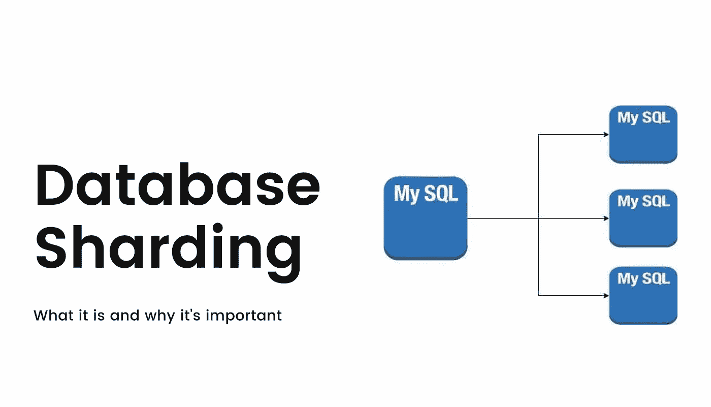
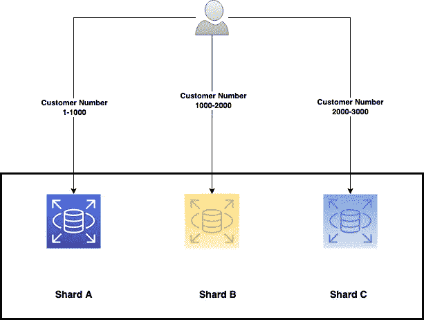
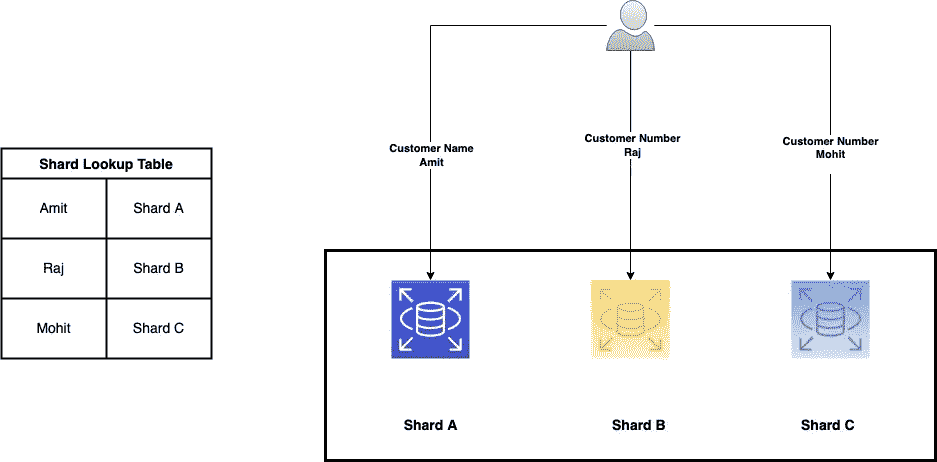
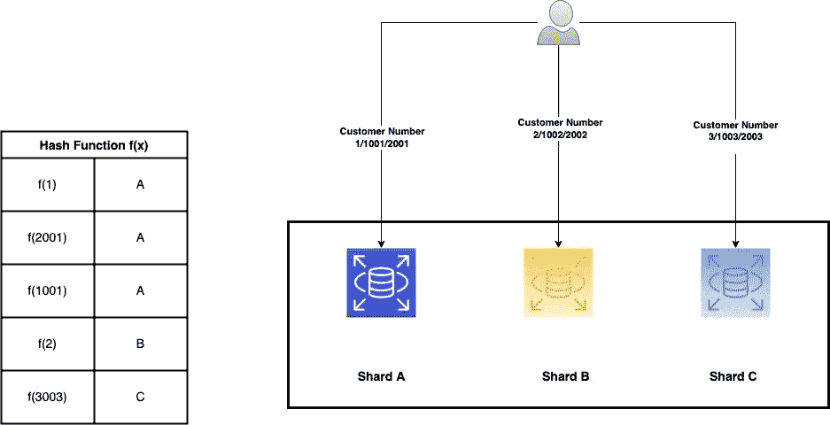

# 数据库分片 101

> 原文：<https://blog.devgenius.io/database-sharding-101-4ef36046c29c?source=collection_archive---------4----------------------->

这篇博客是我们从零开始讨论 101 个概念的系列文章的一部分，读者的入门知识有限。本文属于 ***中级*** 系列，因为它涉及对**数据库分片**的理解，后者主要用于将单个节点中的数据分布到多个分区节点上，以提高业务应用程序的可伸缩性和性能。

101 系列中的一些早期博客如下:

[**缓存策略 101**](/caching-strategy-101-3bc974d2a6cd) [**CORS 101**](/cors-101-72b462396deb)[**断路器 101**](/circuit-breaker-pattern-101-be2d7fdb656) [**优先级队列 101**](/priority-queues-101-40eb4f6f5ee9) [**异步通信 101**](/async-communication-101-b04d5c95333a)[**数据库设计 100**](/database-design-101-7c019d69b97f)

# 什么是分片？

分片是一种设计模式，其中大型数据库被划分为多个节点，每个节点为由*键/id* 逻辑分区的*客户/实体*的子集提供数据。对数据库进行分区的一些原因是**单个服务器上的垂直存储限制、由于高并发性需求而导致的缓慢性能、具有地理上共置的节点以更好地为客户服务的端到端延迟**。

通过将数据分布到多个碎片中，大规模分布式应用可以针对当前和未来不断增长的数据需求建立长期弹性，这些需求受到云托管数据库的 SKU 的限制。

# 分片技术

使用不同的逻辑技术来决定为终端-2-终端客户请求找到正确的碎片。帮助做出这个决定的键被称为 [**分片键**](https://www.mongodb.com/docs/manual/core/sharding-shard-key/) ，并且应该是生产过程中的静态字段。根据需要，分片密钥可以是单一的，也可以是复合的。

在为整个分片策略生成一个合适的策略之前，要考虑许多因素，如数据库查找的**频率、后期添加分片的成本**等。独立于这些技术，有两个关键原则受到警告— **避免碎片之间的数据迁移，以及将单个租户数据分布在多个碎片上。**一些常见的技巧如下

## 范围策略

在范围策略中，属于特定的**范围(1-N)** 的实体由给定的碎片提供服务。这用于将相关实体分组在一起。基于日期范围的 Ex **客户交易**使用相同的 shard 提供服务，因此通过查询单个节点可以简化获取月度汇总报告。

**客户基数范围策略**

它更容易实现，并且范围查询适用于业务用例的**批处理操作**。然而，这种策略并不能保证分片之间的最优流量分配，并且一些节点可能会为客户流量提供较大的乘数。

## 查找策略

**基于查找**或也被称为**目录**的方法使用查找表来识别给定数据库实体的正确碎片。这种策略的一个很好的用例是让基于租户的数据库由一个公共平台提供服务。随着租户被添加到平台或从平台移除，查找表被修改。

这是一种易于实现的方法，但是这种方法有一个额外的开销，即**分片查找步骤**，这可能会影响端到端延迟。如果**共享租户**在同一个分片中，建议保留一个额外的虚拟分片映射，以最小化**分片重新平衡**的影响。

## 哈希策略

该策略使用基于哈希的函数，该函数采用客户属性，如**名称、客户端 IP、地理位置** **等**来评估最佳分片。它的主要目标是**将整个 TPS 均匀分布到 N 个碎片中，以实现资源的有效利用。**

就像查找方法一样，它在哈希计算的额外网络开销以及重新平衡哈希问题上有局限性。然而，使用 [**一致散列**](https://www.toptal.com/big-data/consistent-hashing) 方案可以帮助克服后者的限制。

# 摘要

分片提供了一种优化系统数据库设计方法，可以将分布式设计模式扩展到云产品的垂直限制之外。有效地结合基于邻近的地理碎片分布，它最大限度地减少了中断**爆炸半径和更好的延迟。**大多数云产品如 **AWS、Azure** **等**都使用分片作为核心原则来构建其多区域原生数据库解决方案，如 [**AWS Aurora**](https://aws.amazon.com/rds/aurora/) 、[**Azure Cosmos**](https://azure.microsoft.com/en-in/services/cosmos-db/)**等**解决了工程团队管理多个节点的运营开销。

在本系列未来的高级博客中，我们将深入探讨一种云原生数据库架构。

*如需反馈，请留言至****Amit[dot]894[at]Gmail[dot]com****或联系*[*https://about.me/amit_raj*](https://about.me/amit_raj)*的任何链接。*