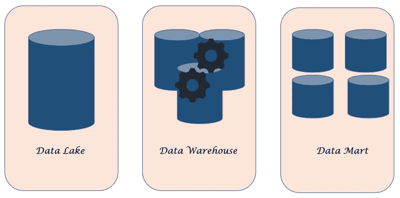
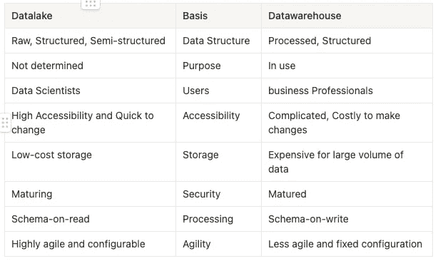
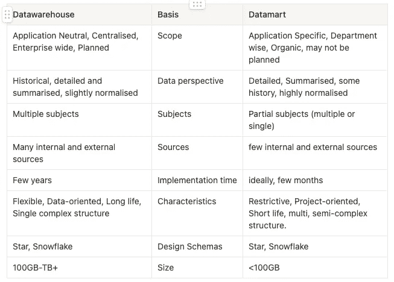

# 数据湖、数据仓库和数据集市

> 原文：<https://blog.devgenius.io/datalake-datawarehouse-and-datamart-7b465200387?source=collection_archive---------8----------------------->

这些是我们在大数据平台上构建的。

在本文中，我们将讨论我们通常在[大数据平台](https://medium.com/p/5c9016638ef8)上构建的东西，以存储、处理和分析数据。它们是数据湖、数据仓库和数据集市。虽然它们看起来很相似，而且经常可以互换使用，但是它们是为不同的目的而构建的，并且它们之间有很多不同之处。让我们从这些分别是什么开始:

# 数据湖:

数据湖是一个集中式存储库，允许您存储任何规模的所有结构化和非结构化数据。您可以按原样存储您的数据，而不必首先结构化数据，并运行不同类型的分析-从仪表板和可视化到大数据处理、实时分析和机器学习，以指导更好的决策。

为什么我们需要数据湖？

1.  组织需要一种廉价的方式来存储大量不同类型的数据。
2.  如果没有处理数据的计划，但是您有强烈的意图在某个时候使用它。

**例子:**

**制造业:**企业可以利用数据湖实施预测性维护，提高运营效率。

**营销:**营销人员从多种渠道收集客户信息，包括展示广告、电子邮件活动、社交媒体平台以及第三方人口统计和市场信息提供商。

**供应链:**数据湖可以从内部订购和仓库管理系统、供应商和发货商以及外部来源(如天气预报)收集信息。

# 数据仓库:

数据仓库是来自许多来源的数据到一个统一数据质量和格式、支持分析报告、结构化和/或特别查询以及决策制定的单一集中存储库的集合。数据仓库的目标是创建一个可以检索和分析的历史数据宝库，以提供对组织运营的有用见解。

这些系统对于受监管的行业来说必须具有足够的可扩展性、可靠性和安全性，并且足够灵活以支持各种数据类型和用例。这些需求远远超出了任何传统数据库的能力。这就是数据仓库发挥作用的地方。

**示例:**

投资和保险公司使用数据仓库主要分析客户和市场趋势以及相关的数据模式。

零售连锁店使用数据仓库进行营销和分销，因此他们可以跟踪商品、检查定价政策和分析顾客的购买趋势。

另一方面，医疗保健公司使用数据仓库概念来生成治疗报告，与保险公司以及研究和医疗单位共享数据。

# 数据集市:

数据集市本质上是一组仪表板，它们分析来自特定业务功能的数据仓库或湖的子集的数据。也就是说，数据集市将为团队或分析领域管理的数据仓库或湖的一部分与分析数据的仪表板和可视化相结合。

有三种类型的数据集市:

1.  一个相关的数据集市，由企业数据仓库分区组成。它是仓库中主要数据的子集。
2.  一个独立的数据集市，它是一个独立的系统，孤立于业务的特定部分。
3.  混合数据集市，由来自仓库和独立来源的数据组成。这种类型通常提供更快的数据访问和用户友好的界面。

示例:

为组织中的特定部门(如营销、销售、人力资源或财务)创建的数据集市。

# 数据湖、数据仓库和数据集市之间的区别:

希望这是在大数据平台上构建数据解决方案的良好开端。接下来，我们将在后续文章中列出构建这些解决方案的指导方针和原则、面临的挑战等。