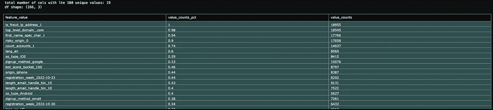
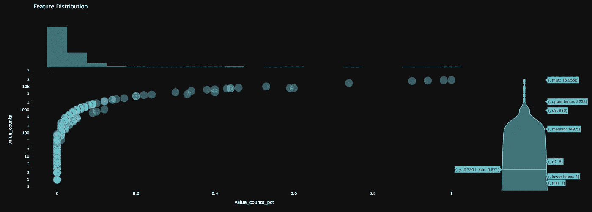
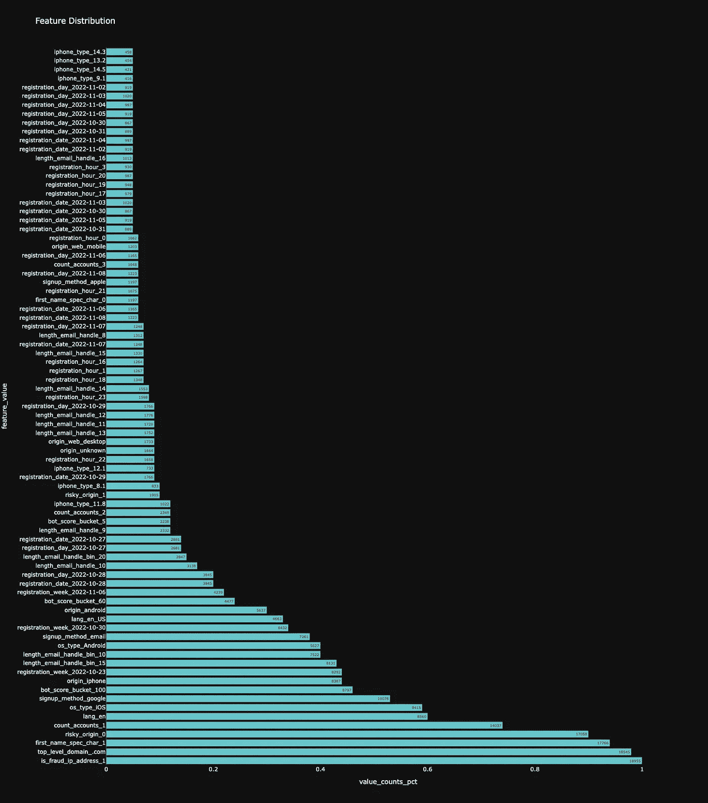

# Python 中带有熊猫值计数和绘图的数据集异常

> 原文：<https://blog.devgenius.io/dataset-anomalies-with-pandas-value-counts-and-plotly-b142cb4d6da3?source=collection_archive---------12----------------------->

# 一个非常非常小的介绍

我不是一个健谈的人。可能是我成为数据科学家的原因。然而，有些东西需要解释所以..这是:

下面的代码将获取一个数据集——任何数据集，不管有多少列(尽管 df 不应该太大——我希望它少于 500 列——即 b/c plotly 在绘制大型 df 时有困难),并绘制每列值的`value_counts()`。

# 你为什么想要这个？

假设您在欺诈、信托和安全部门工作，或者在需要发现用户、订单、商家等的模式或异常的领域工作。这个小数字可以让你即插即用。

# 代码和一点点它是如何工作的:

这相当简单——除了调用它并提供参数之外，您不需要做任何事情。它接受一个 df，并将每一列的值附加到列名中，并绘制出每一列值的值计数，以百分比表示。有点难以理解——**，但可以这么说**——它打印出**所有**df 的唯一值，作为它们各自列的百分比。因此，与其单独调用每一列的`value_counts()`或循环遍历一列列表，然后试图读取类似 MS-DOS 的输出，(提示:如果您遇到了这个特定的代码问题——首先*祝贺*——很少会出现在您的技术/数据级别:)，您可以使用`display`而不是`print`，它会在循环中将您所有的值计数都放入单独的数据图中；问题就在这一点上——你如何把它们都附加上去)→下面是方法:

# 结果:

代码将吐出三个对象——一个**表格**和两个**图表**。

# 结论:

我已经有一段时间没有在这里分享了。这个可能不会有太大的吸引力。但是如果你碰巧发现了这个——它非常有用。在我的整个职业生涯中，我都可以使用这些代码，这会让事情变得容易得多。

快乐