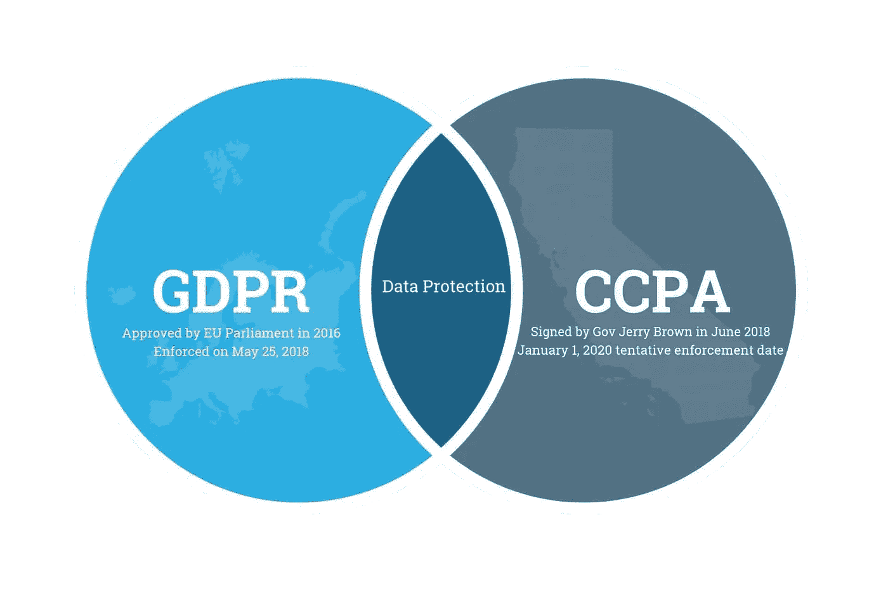

# 数据集评估框架

> 原文：<https://blog.devgenius.io/dataset-assessment-framework-2ab1499d054a?source=collection_archive---------6----------------------->

*在 GDPR 和 CCPA，强制云公司需要遵守数据的合理使用。这是一个简单的入门框架……*

*所有在合规范围内的数据科学开发者和公司都是这个框架的潜在消费者。*

> **风险=资产(个人数据)+漏洞+威胁**

因此，我们需要用组织定义的“控制”进行风险管理、评估和处理。

*正式定义:*

**风险管理**:指导和控制组织风险的协调活动。

**风险评估**:风险识别、风险分析和风险评估的全过程。

**风险处理**:使用已定义的控制措施修改风险的过程。

让我们考虑一下如何获取一个自然人的信息。对此类数据集进行风险管理的实用方法是一个三步流程:

# ***第一步:***

1.**评估风险** —数据不得:

*   不准确、不充分或过时的数据，
*   保存时间过长(休眠账户)，
*   过多或不相关的信息，
*   透露给错误的人，
*   不安全地传输或存储，
*   以不可接受或意想不到的方式使用。

2.**识别风险** —可能性和严重程度必须设置为低、中、高。

**图-2:风险与对策**

**图-3:评估成本和价值**

# ***第二步:***

1.**对数据进行分类** —数据必须有足够的元信息和标签，例如:个人数据、次要数据、性别、高净值人士等特殊类别等。

2.**采取行动控制** —组织可以部署的对其数据集进行有效控制的处理方式有:

*   减少收集的数据，
*   假名信息，
*   保留策略，
*   信息的安全销毁和清除机制，
*   访问控制，
*   培训和意识，
*   与第三方处理器的合同或数据共享协议，
*   SDK 或应用程序中的可接受使用策略，
*   主题访问请求流程，

3.**实施事件，管理响应**:向监管机构报告数据违规。这需要正式结构化。

# ***第三步:***

展示持续的风险和事故监控。数据保护不是命运，而是一个旅程，因此嵌入数据保护应该是最终目标。人员、流程和技术可以实现这一点。

# 方案

假设我们有一个自然人的面部图像数据集，我们希望保护它:

自然人的图像是生物特征信息，在隐私影响评估(PIA)下被认为是**敏感**数据。生物特征验证必须基于同意，因此自然人必须知道它的用途。适应的技术应该使他们的生活更加安全和容易，而不是相反。

通过匿名化，来自自然人的面部图像将与其身份分离，这是一个不可逆的过程。但是这个过程符合标准，并且这样的数据可以被用来使模型更加稳健。毕竟，真实世界的面部图像很难收集。

另一方面，假名化是一个过程，在此过程中，如果不使用额外信息，数据就无法归属于某个自然人，但当这些额外信息(秘密)单独保存在一个高度安全的地方时，将被视为假名化。这种附加信息被称为标记化。这种技术对于存储用户生物特征数据以供将来验证是有用的。

为了进一步降低风险，自然人的面部图像将被转换成嵌入图像(例如:128，152 字节长)并存储，而不是原始图像，这是使用面部 AI 模型来完成的。这样做的好处是，您可以使用假名来保持用户身份的完整性，但是嵌入数据是没有用的，除非创建数据的模型不为未经授权的人所知。

*如果你觉得我们可以改进这个框架，同时保持它的简单，请留下你的评论。*

**你可以在|**[**LinkedIn**](https://www.linkedin.com/in/mdeore/)**|**[**网站**](https://tomdeore.wixsite.com/epoch)**|**[**Github**](https://github.com/milinddeore)**|**