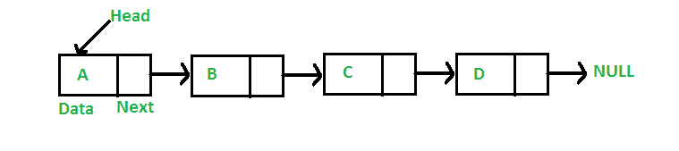

# 数据结构:数组和链表

> 原文：<https://blog.devgenius.io/datastructures-arrays-and-linked-lists-538d26bffebd?source=collection_archive---------5----------------------->

**数组**

**数组**是由元素集合组成的数据结构，每个元素至少由一个索引或关键字标识。在我们作为存储的储物柜的外行语言中，数组可以被看作是一组背靠背的储物柜，其中每个存储的项都可以使用储物柜号来访问(储物柜号是这个位置的索引)。对于 3 个整数的数组，其中每个整数占用 8 个内存插槽，需要 24 个背靠背的内存插槽来以数组格式存储这些整数。

照片由 Moren Hsu 在 unsplash 上拍摄

请注意，内存不是随机分配的，因为系统必须找到 24 个背靠背的内存位置。

也就是说，如果在槽号 23 处有一个元素，并且您想要存储一个 3 个元素的数组，这将需要 24 个存储槽，那么它将不会从头开始，而是跳过槽 23。相反，如果有 24 个背靠背的空闲内存插槽，它将从 24 个插槽开始。

有两种类型的数组:**静态数组和动态数组**。

**静态数组**是一个数组实现，它分配固定的内存来存储数组的值。将值追加到数组涉及复制整个数组，并为其分配新的内存槽，以满足新添加的值所需的额外空间。

在 Java 和 C++中，你声明数组的长度来明确地告诉操作系统为它分配特定数量的内存槽。

**动态数组**是一种数组实现，它分配两倍于存储数组值所需的内存量。追加值是一个恒定的时间操作，直到分配的内存被填满，这时数组被复制，并使再次分配给它的内存加倍。Python 和 Javascript 将数组实现为动态数组。这种实现导致在结束操作时插入摊销的常数时间。

以下是阵列的标准操作及其相应的时间复杂性:

**访问给定索引-0(1)处的值:**读取给定索引处的值需要恒定的时间，并且不会基于数组长度而改变，因为数组已经知道任何给定值在内存槽中的位置。

**更新给定索引值— 0(1)**

**在数组开头插入值— 0(n):** 在数组开头插入值是在线性时间内完成的，因为它需要您将现有数组复制到一个长度为+1 的新数组中。

**遍历数组— 0(n)**

**在中间插入值— 0(n)**

**在末尾插入值:**

**Static — 0(n):** 因为静态数组的长度是固定的，所以需要将数组复制到一个新的+1 值槽中，以便在数组的末尾添加一个值。

**Dynamic — 0(1):** 对于动态数组，在数组末尾添加一个值是一个常数时间，因为数组已经知道它的结束位置，如果在它结束的位置之后有空闲的内存槽，则添加另一个值是常数。

**移除开头的值— 0(n):** 移除数组开头的值是一个线性操作，因为在元素被移除后，你需要移动每个元素。

**删除中间值— 0(n)**

**删除末尾的值— 0(1):** 删除数组的元素是一个常量操作

**复制一个数组— 0(n):** 复制一个数组是一个线性操作，在使用之前你应该停下来思考一下。Javascript 中的 slice()

**链表**

如果我在这个过程中没有失去你，你会记得数组是背对背内存分配的，需要大块内存来实现它们，这是它们的局限性。链表和数组的不同之处在于它们的实现方式。链表将元素存储在内存中的任何位置，并使用指针连接元素。因此，您不必使用背对背内存插槽来保存它们。

每个节点(指向下一个元素的值和指针)都有一个内存槽的地址。第一个元素被称为头部，而链表的最后一个元素被称为尾部。链表的每个节点都有下一个节点所在内存的引用。由于元素可以分布在内存中的任何地方，存储它们变得更容易，成本也更低。

有不同类型的链表:

**单链表:**单链表通常会暴露它的头以便于早期访问。添加或删除节点只是覆盖下一个指针，假设您可以访问正在添加或删除的节点之前的节点

图片:GeeksForGeeks

**双向链表:**类似于单向链表，只是它也有一个指向链表中前一个节点的指针。

图片:GeeksForGeeks

**循环链表:**循环链表没有明确的头和尾，因为它的尾指向头形成一个封闭的圈。循环链表可以是单向循环链表，也可以是双向循环链表。

下面是链表的标准操作及其相应的时间复杂度:

**单链表**

**访问磁头— 0(1)**

**访问尾部— 0(n):** 访问尾部是一个线性操作，因为你必须遍历链表的每个节点才能访问它。

**访问中间节点— 0(n)**

**插入和移除头部— 0(1)**

**插入和移除尾部— 0(n)访问+ 0(1)** :插入和移除尾部是一个线性操作，因为它需要 0(n)遍历并到达尾部，即使只是添加或移除的动作是恒定的。

**插入和移除中间-0(n)以访问+ 0(1)**

**Copy — 0(n):** 制作链表的副本是一个线性操作。

**遍历— 0(n):** 遍历链表是一个线性操作。

**双向链表**

**访问磁头— 0(1)**

**访问尾部— 0(1)**

**访问中间节点— 0(n)**

**插入和移除头部— 0(1)**

**插入和移除尾部— 0(1)**

**插入和删除中间的 0(n)以访问+ 0(1)**

**搜索值— 0(n)**

**复制— 0(n)**

**遍历— 0(n)**