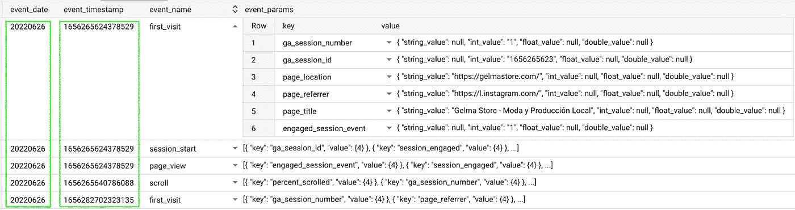
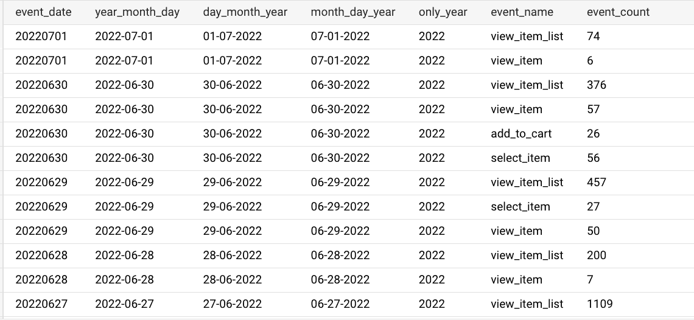
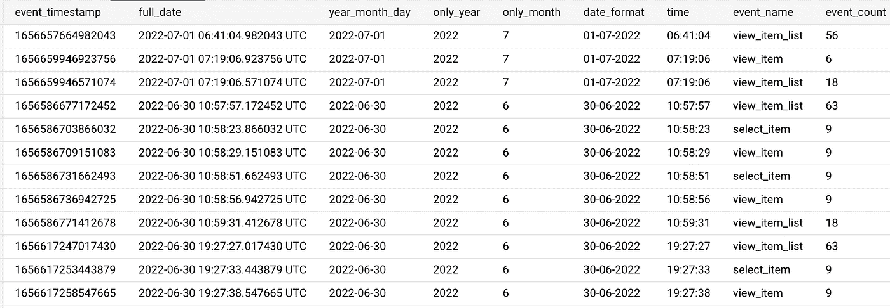
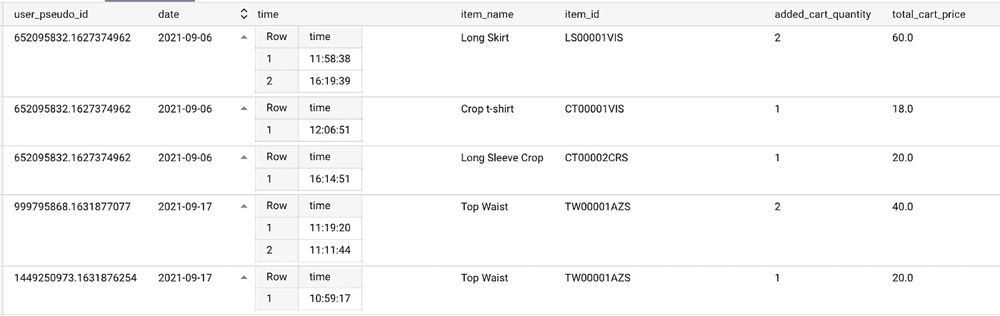
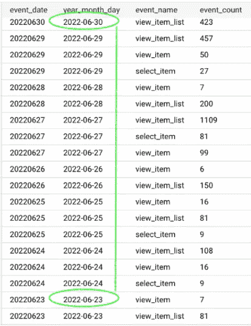

# 日期，如何在 BigQuery 中从 GA4 表中提取日期(初级水平)

> 原文：<https://blog.devgenius.io/dates-how-to-extract-dates-from-a-ga4-table-in-bigquery-beginner-level-347c666cdc27?source=collection_archive---------5----------------------->


目录

> [简介](#40ae)
> [GA4 表和模式](#c6ed)
> [Event _ date](#5644)
> [Event _ timestamp](#afa5)
> [Time 事件示例](#be18)
> [时间段功能](#fd51)
> [最终文字](#b919)

# **简介**

Google Analytics 中报告的每次点击都与自动收集的时间戳值相关联。在 BigQuery 中预览 GA4 表有两个维度与这些值相关: **event_date** 和 **event_timestamp** 。

这是分析师的一个基本特性，因为日期允许我们为报告和仪表板创建过滤器。然而，当在 BigQuery 中使用这些数据时，我们很快就会发现值是原始格式的。所以，我们需要把它们转换成可理解的。

在今天的文章中，我们将看到不同的`sql functions`将原始数据破译为可读数据，以供我们分析。

# **GA4 表和模式**

表中的每一行代表一个事件(事件名称)。每个事件都有 **event_date** 和 **event_timestamp** 值，以及许多嵌套的事件特定参数(event_params)及其相应的值。BigQuery 中的 GA4 表是这样的:



*   顾名思义，**事件日期**表示事件发生的确切日期。默认情况下，它使用 YY/mm/dd 格式，其模式是一个字符串。
*   关于 **event_timestamp** 是指从**1970–01–01 00:00:00 UTC**到事件被创建所经过的**毫秒数**。它的模式是整数。

> 注意:[模式](https://support.google.com/analytics/answer/7029846?hl=en)很重要，因为它们决定了我们可以运行什么功能。有时我们可以使用[转换**和**函数](https://cloud.google.com/bigquery/docs/reference/standard-sql/conversion_rules)来改变模式，比如`CAST (exp)`

乍一看，我们可以看到 **event_date** 由于其简单的 YY/mm/dd 格式，相对容易破译。关于**事件时间戳**，事情变得有点复杂。

例如，今天是 2022 年 7 月 2 日。
我的 GA4 event_timestamp 值显示:1656729312056608
用这个[时间转换器](https://www.epochconverter.com/)检查结果

现在已经清楚了这些值是如何工作的，让我们从`functions!`开始

# 事件日期

使用`PARSE_DATE("%Y%m%d", event_date)`函数，我们将以可理解的格式获取日期。而且，如果我们愿意，我们也可以通过使用`FORMAT_DATE('date-representation', PARSE_DATE('%Y%m%d', event_date))`将给定值转换成其他格式，如 *dd/mm/YY* 或 *mm/dd/YY* 。

使用您最喜欢的格式，或者根据您的[国家日期和时间表示](https://en.wikipedia.org/wiki/Date_format_by_country)选择格式。确保%Y 是大写的，而%m 和%d 是小写的。

**在 SELECT 语句中:**



就是这样。现在我们可以在查询中使用`PARSE_DATE("%Y%m%d", event_date)`函数，并知道每个事件发生的日期。

**在 WHERE 语句中:** 函数`PARSE_DATE("%Y%m%d", event_date)`也可以在过滤器中使用**，以便查询返回那些在我们特别指定的日期之间压缩的值:**

```
WHERE PARSE_DATE(“%Y%m%d”,event_date) = “2022–06–29” (equal)WHERE PARSE_DATE(“%Y%m%d”,event_date)>=“2022–06–29”(equal or bigger)WHERE PARSE_DATE(“%Y%m%d”,event_date)<=“2022–06–29” (equal or minor)WHERE PARSE_DATE(“%Y%m%d”,event_date) > “2022–06–29” (bigger than)WHERE PARSE_DATE(“%Y%m%d”,event_date) < “2022–06–29” (minor than)WHERE PARSE_DATE(“%Y%m%d”,event_date) != “2022–06–29” (is not that date)WHERE PARSE_DATE(“%Y%m%d”,event_date) BETWEEN “2022–06–29” AND “2022–01–29”
```

# **事件 _ 时间戳**

由于 **event_timestamp** 的值显示自 1970–01–01 00:00:00 UTC 以来已经过去的**毫秒，因此可以应用不同的函数及其组合来将该原始值转换为特定的日期。因为这是一篇面向初学者的文章，所以我选择了 4 个我认为最容易应用的函数，它们返回足够全面的值来执行分析。**

## **在 SELECT 语句中:**



从左到右，该表将 event_timestamp 显示为一个原始数字，并且每个函数的结果: **full_date、year_month_day、only_year、only_month、date_format 和 time。**注意，它们也可以用在`WHERE`语句中，与上一条相同。

# **时间示例**

我在查询中最喜欢使用的函数之一是这个:`FOMAT_TIME('%T', TIME(TIMESTAMP_MICROS(event_timestamp)))`。使用此功能，您可以**根据事件发生的日期和确切时间进行分析。**



您甚至可以计算自用户第一次访问以完成特定事件(如 add_to_cart 或 purchase)以来所经过的时间。

> 注意:按照这个时间微分逻辑，我想到了另一个计算日期差异的函数。`SELECT DATE_DIFF ("2021-06-28", "2021-06-18", DAY)`。如果我们运行这个查询，结果将是 10。

# **最后一天、一周或一个月**

一旦我们对如何使用基本函数从 event_date 和 event_timestamp 中破译日期有了一个大致的概念，就到了进一步改进的时候了。

*   例如，创建一个返回最近一天、7 天或 30 天的值的查询。为此，我们将结合`FORMAT_DATE`、`DATE_SUB`和`INTERVAL`使用`_TABLE_SUFFIX`函数。一下子:)

**按昨天过滤**

`_TABLE_SUFFIX = FORMAT_DATE("%Y%m%d", DATE_SUB(CURRENT_DATE(), INTERVAL 1 DAY))`

**过去 7 天过滤**

`_TABLE_SUFFIX BETWEEN FORMAT_DATE("%Y%m%d", DATE_SUB(CURRENT_DATE(), INTERVAL 8 DAY)) AND FORMAT_DATE("%Y%m%d", DATE_SUB(CURRENT_DATE(), INTERVAL 1 DAY))`

**按过去 30 天过滤**

`_TABLE_SUFFIX BETWEEN FORMAT_DATE("%Y%m%d", DATE_SUB(CURRENT_DATE(), INTERVAL 31 DAY)) AND FORMAT_DATE("%Y%m%d", DATE_SUB(CURRENT_DATE(), INTERVAL 1 DAY))`

让我们来看看:



该表仅返回 7 天内压缩的值**。** Tese 函数适用于 event_date 和 event_timestamp，并且对报告非常有用。

一个好的实践(尽管这是更高级的 sql 级别)是自动执行查询，返回给定时间内完成的事件，而无需重写查询。例如，每 30 天购买事件的数量。

# **最后的话**

日期和时间戳被自动收集在 GA4 表中，并与一个唯一的事件相关联。因此，分析师可以创建报告，并在我们的报告中按特定日期进行筛选。

使用 BigQuery 时，event_date 和 event_timestamp 显示为原始数字。我们需要使用函数来破译它们，并将它们转换成人眼可以理解和阅读的值。在本文中，我们已经看到了像`PARSE_DATE`、`FORMAT_DATE`、`EXTRACT`这样的基本函数，以及像`_TABLE_SUFFIX`、`DATE_SUB`和`INTERVAL`这样更复杂的函数。

当然，这些函数还有许多其他用途，我想更好的用途是返回一个类似的值(…)，尽管我试图让它对使用和熟悉 GA4 的入门级 SQL 分析师来说简单实用。