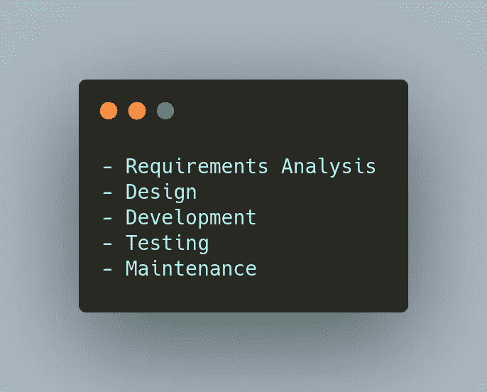
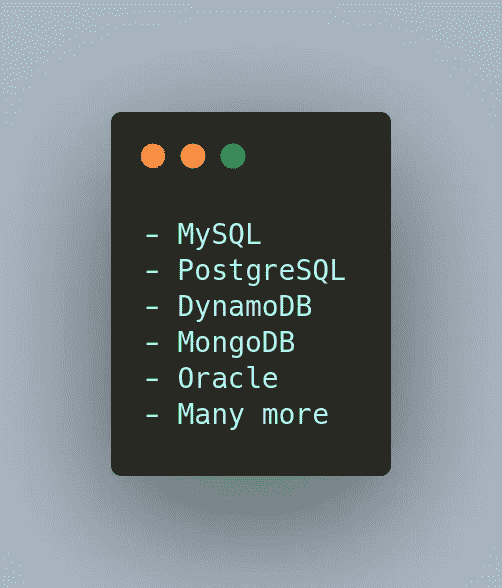

# 第一天:软件开发讲座

> 原文：<https://blog.devgenius.io/day-1-lightening-talks-on-software-development-9301f6cc23a7?source=collection_archive---------12----------------------->

是的，今天是第一天作为技术倡导者的读者，ops 忘记提到第 0 天博客了。如果你没有读过，你可以在这里读出[。](https://www.csaju.com/day-0-welcoming-to-software-engineer-trainee/)因此，我们学习了一些关于整体软件开发及其生命周期的知识。

嗯，它是编写源代码的过程，包括从所需软件的概念到软件的最终表现形式之间所涉及的一切。软件开发可能包括研究、重新设计，或者可能改变软件产品的整个堆栈。人们对软件开发的误解是，软件开发就是把代码放在电脑上，然后喝一杯咖啡。

有许多软件项目管理的方法被称为软件开发生命周期。其中一个著名而古老的模型是瀑布模型，你可能也听说过。对于初学者来说，可能会对瀑布模型有误解，它不是坐在瀑布后面的模型女孩。这是软件工程师遵循的神话，并将他们的代码发布到产品中。在软件工程师的日常工作中，有几个步骤可以实现瀑布模型。

这些是软件工程师遵循的基本步骤，但可能还有更多步骤，但这是基本步骤。也有许多过程，并不像软件开发生命周期只有一个瀑布模型。

那么为什么还有其他人存在呢？因为这个瀑布模型需要改进，还有其他原因。瀑布模型的一些缺点列举如下。

有一点是，瀑布模型中的所有东西都是相互依赖的。对此有什么解决办法？

敏捷的词源学含义是快速、轻松地移动。敏捷是一个过程，通过这个过程，一个团队可以将一个项目分成几个阶段来管理，并涉及到与利益相关者的持续协作以及每个阶段的持续改进和迭代。

敏捷包括以下步骤。

## 敏捷的好处不多

现在，让我们深入开发和编码的东西。

编码是软件工程师为项目编写代码的过程的一部分。编码可以分为许多类型。通常在 web 开发中，有四种类型。

前端是用户与之交互的部分。你在电脑或手机上浏览时看到的一切都是前端开发的一部分。它扮演着更重要的角色。前端开发中使用的主要技术有:

它是软件的一部分，决定了应用程序的整体功能如何工作。您主要关注业务逻辑，通过您的代码解决他们的问题。你必须使用数据库来执行 CRUD(创建、读取、更新和删除)操作，并使用 API(应用程序编程接口)来执行你想要的渲染和其他任务。有大量的语言可以用作后端语言。下面列出了其中的一些。

数据在当今世界无处不在，甚至在你的行动中也是如此。那么数据和数据库是什么关系呢？你想要的数据库管理数据。数据库是用于存储、管理和检索信息的数据集合。你使用社交媒体，和你的朋友聊天，信息从你的手机传到服务器，再从服务器传到你的朋友。在这里，消息就是您的数据，为了管理这些数据，数据库采取了行动。外面有许多数据库。有些是 SQL 和非 SQL 数据库。

我们学到了很多，很值得。现在，也有一些新的东西。

它是一组操作原则和实践的集合，使应用程序开发团队能够更频繁、更可靠地交付代码变更。是开发和运营任务的交互。DevOps 的优势如下。

我认为全栈开发没有确切的定义。有些人被认为是万事通，但也精通某些特定的东西。全栈开发人员是能够处理数据库、服务器、系统工程和客户端的所有工作的工程师。这并不意味着他们将 24/7 小时都在编码。他们将在一个项目中工作，在这个项目中，他们将身兼数职，而且他们也有能力在几个时间跨度内运用新技术。这些只是我们学到的基本知识，但对于每个小主题，我无法在一个博客中分享它的广阔范围。

在课程结束时，我们了解了软件工程师如何在公司工作。请注意，这可能因公司而异。这些是软件工程师日常锻炼中包含的基本内容。

我对第一天也很兴奋。我们正在平行地学习每一件事。我已经学了一些东西，所以我也很容易理解这些概念。我希望你会觉得我的文章值得一读。谢谢你。