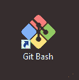
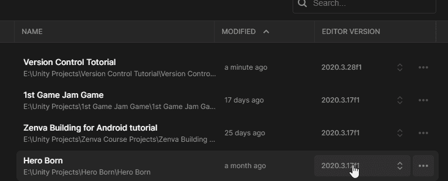
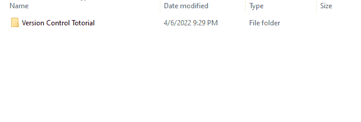
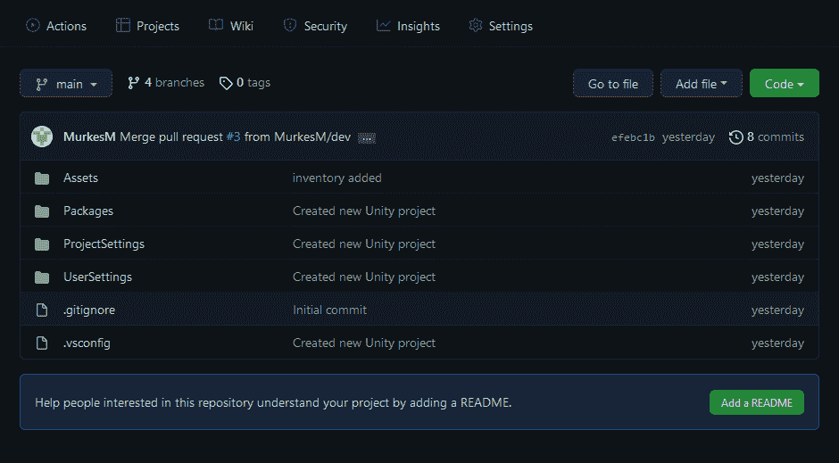
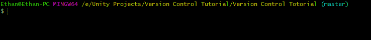
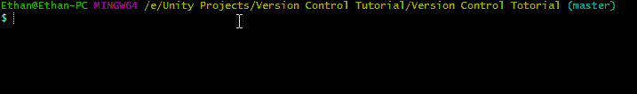

# 游戏开发的第一天:用 Unity 项目设置 Git！

> 原文：<https://blog.devgenius.io/day-1-setting-up-git-with-a-unity-project-28a9f5538ae?source=collection_archive---------6----------------------->

目标:在一个 **Unity** 项目中设置版本控制( **Git** 在这里是命令行版本),并熟悉一些基本命令。

对于许多新开发人员(包括我自己)来说，版本控制一开始看起来非常令人畏惧，甚至有些毫无意义。我写这篇文章的目的是向您快速展示设置 **Git** (最流行的版本控制系统之一)的基础知识，消除一些对源代码控制的恐惧，同时展示使用它比您想象的要容易。以及为什么你应该使用它。

基本上，版本控制的目标是允许您管理项目的变更。这在一个大规模的开发团队中更容易想象，在这个团队中，许多人同时从事一个项目。使用版本控制，您可以通过向每个人和/或团队提供项目的单独版本来最小化错误。当一个团队添加了导致问题的东西时，它不会影响到其他所有人，因为错误是常见的，你可以想象它节省了多少麻烦。使用版本控制的其他好处包括:恢复变更、测试变更、管理变更等等。

**重要！** —为了让下面的步骤有意义，您需要理解这一点，您将使用 [**GitHub**](https://github.com/) 在线设置项目的“主”版本。然后，您将使用 [**Git Bash**](https://git-scm.com/) 在您的计算机上设置项目的“本地”版本。在本地版本上做了更改后，您可以将更改推送到在线版本，并从在线版本中提取内容来更改本地版本。现在不要太担心所有的细节，只要确保你理解通过 GitHub 在线的主版本和在你电脑上的“本地”版本的概念。

**现在开始使用 Git 的基础知识！**

首先确保你已经安装了[**Git Bash**](https://git-scm.com/)(**Gits**命令行版本)。在 [**GitHub**](https://github.com/) 上在线设置你的存储库(对存储位置的幻想)。接下来要做的是确保你有一个想要使用版本控制的 Unity 项目。

完成上述步骤(包括设置“主”或在线存储库)后，您需要在您的计算机上设置“本地”存储库。

我发现的最简单的方法是首先，在文件浏览器中找到你的 Unity 项目，右击包含你的项目的文件夹，然后点击 **Git Bash Here。**

现在 **Git** 已经在您的屏幕上打开，并且当前位于您的项目文件中，键入命令: **git init**

这将初始化本地系统上的存储库。如果您已经这样做了，它将重新初始化存储库。

现在，您需要将您的本地存储库与您的在线存储库连接起来，这样它们就可以进行通信，这样您就可以完成版本控制的所有神奇功能。

要连接它们，你首先需要通过 **GitHub** 复制在线资源库的 URL。

然后在 **Git Bash** 中输入命令:**Git remote add origin(your URL)**并点击 enter。

这应该把网络版和本地版连接起来了。要进行验证，请键入命令: **git remote -v**

这将表明您有能力“获取”和“推送”到那个服务器(存储库)，现在您所需要知道的就是它们是连接的！

太棒了，你现在知道版本控制是用来做什么的，以及如何用 **Git** 初始设置一个 **Unity** 项目！这看起来似乎是多劳少得，但是一旦你真的开始使用 **Git** 并且不用担心初始设置，相信我，这已经成为你的第二天性了。

继续努力，继续学习，记住保持简单！祝你今天开心！玩的开心！