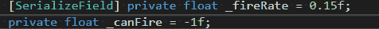
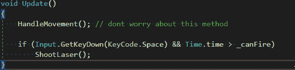
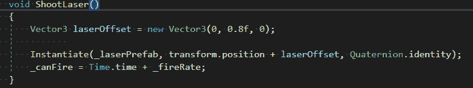
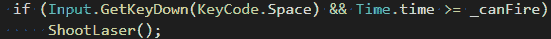

# 游戏开发的第 10 天:如何在 Unity 中创建冷却功能！

> 原文：<https://blog.devgenius.io/day-10-of-game-dev-how-to-create-a-cooldown-feature-in-unity-4420b0ae9038?source=collection_archive---------5----------------------->

**目标:**在我的《2D 银河射击游戏》中创建一个发射激光的**冷却**功能，这样玩家就不能发射激光了。

谈到这个特性所需的代码，它非常简单，只需要几行代码。就我个人而言，我很难理解代码到底在做什么来让我的**冷却**功能工作。请耐心听我解释这段代码在做什么，因为它会促使你更像软件工程师一样思考。如果到最后你只是感到困惑，那就接受困惑，如果需要的话，以后再回来。我也花了一点时间，但现在我可以向别人解释了！

让我们从思考我们想要做什么开始。在我的例子中，我想创建一个类似于**的计时器**，让玩家只能在距离上次发射激光一定时间后才能发射激光。这将使它到达玩家不能发射激光的地方。

现在进入代码。我将解释发生了什么，并在我们进行的过程中带您浏览代码。

我们需要两个浮点变量。我把我的命名为 **_fireRate** 和 **_canFire** 。

**_fireRate** 变量表示玩家被允许开火前需要经过的时间。需要变量 **_canFire** ，这样我们就有东西可以与 **_fireRate** 进行比较。如果我们说 **_fireRate** 例如是 0.15，那么计算机喜欢 0.15 什么？一会儿你会明白我的意思，不要担心它是否令人困惑。有人教过我，一开始我也很困惑。不要放弃！

我们还需要使用 [**Time.time**](https://docs.unity3d.com/ScriptReference/Time-time.html) 变量，这是一个浮点数。该变量内置于 Unity 中，基本上是应用程序运行以来的当前时间。

在此代码的最终实现中，它将如下所示:

首先我们有之前的**变量**。其次，我们有我们的 **if 语句**，它不仅检查玩家是否按下了**空格键**，还检查是否已经过了允许他们开火的正确时间量。

在 **ShootLaser()方法**中，我们也在更新 **_canFire** 的当前值。 **_canFire** 正在被“=”设置为**time . time**+**_ fire rate**。这意味着 **_canfire** 变量是" = "从应用程序开始到现在的时间"+"火灾率(0.15)。

这意味着，在 **if** 语句中，我们正在检查自应用程序启动以来的当前时间是否是“>”而不是自应用程序启动以来的当前时间“+”触发率。然后当我们开火时， **_canFire** 变量被更新为一个新值，即“=”当前时间+开火速率。意思是每次你开火的时候， **_canFire** 变量是“=”到未来的另一个 0.15 秒。因此，当你检查**时间.时间**是否为>时，那么**就可以发射**了。

如果你愿意的话，你也可以把等式变成“> =”，这样会更精确。因此，它不仅会检查是否超过 0.15 秒，还会让你在正好超过 0.15 秒时开火。

目前就是这样，我知道对一些人来说这可能有意义，但仍然会让你质疑软件工程师应该如何思考，因为这可能会把你推到正常人类思维过程的界限之外。这需要练习，写这篇文章的时候我的头有点痛，但是越来越好了:)

**坚持学习，不要放弃！有什么问题尽管问！**