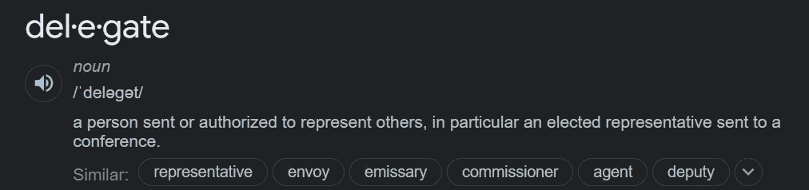
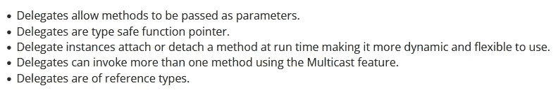
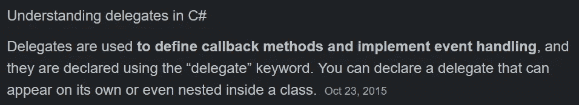
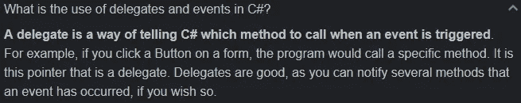

# 游戏开发的第 100 天:什么是委托——c#/Unity？

> 原文：<https://blog.devgenius.io/day-100-of-game-dev-what-are-delegates-c-unity-5c0ba355ed7b?source=collection_archive---------9----------------------->

**目标:**回顾一下 **C#** 中的**委托**是什么，并回顾一些用例。

这篇文章的目标是尽可能简单地教你关于**委托**的知识。我们的目标是在没有互联网所能给你的“额外”帮助的情况下接触到初级开发人员。请记住**代表**是一个更中间的话题，所以如果你花了一点时间才得到他们，不要觉得不好。我肯定不是代表方面的专家，但我相信我可以从更好的工程师那里收集信息，并以更简单的方式向缺乏经验的开发人员解释这些信息。

[图片来源:CFI 团队](https://corporatefinanceinstitute.com/resources/careers/soft-skills/delegating/)

**代表的定义:**

对于那些刚接触编程的人来说，我认为这个定义是你在开始使用代理时首先需要知道的。随着您的学习，您对代表的定义将变得更加微妙。

在普通英语中什么是代表？

C#中的委托是什么？

委托是保存一个或多个方法的变量。就像普通变量一样，它代表一个值。而不是保存一个 bool，int，float 等。，它可以保存一个或多个方法。

就像名为 _isActive 的 bool 保存 true 或 false 值一样，名为 myDelegate 的委托保存 TestMethod()。

**代表的用例:**

您可能会问，为什么不创建一个名为 PerformTasks()的方法，并在该方法中调用 Task1()方法和 Task2()方法呢？为什么不在普通方法中嵌套一两个方法呢？使用委托有什么意义？是什么让代表与众不同？

[演职员表:阿布舍克·库马尔](https://www.c-sharpcorner.com/UploadFile/de41d6/delegate-uses-in-C-Sharp/)

你不需要理解上面列出的所有用法，但基本上它说委托的工作方式与普通方法不同。

我们什么时候使用委托？

委托往往被用来创建**事件驱动系统**。这是他们变得非常值得学习的地方。请记住，委托是用来创建一个更大的系统，而不是单独使用。它们是整体设计模式的一部分，这就是为什么我说这可能是一个比你预期的更中间的主题。

回调就像你调用委托，委托调用分配给它的方法。委托“回调”其他方法。

[学分](https://en.wikibooks.org/wiki/C_Sharp_Programming/Delegates_and_Events)

为什么你可能想要一个**事件驱动系统**？

它们可以是非常灵活和独立的功能(更多内容将在后面的文章中讨论)。

请记住，当你看到真正从中受益的情况时，你会理解得更多。现在，你可能会在某种程度上断章取义地学习这些概念。不过没关系！你必须从某个地方开始:)

我希望这能让你对什么是**委托**以及如何使用它们有一个全面的了解。

***如有任何问题、想法或指正，欢迎评论。让我们制作一些令人敬畏的游戏！***