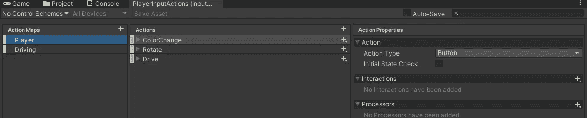
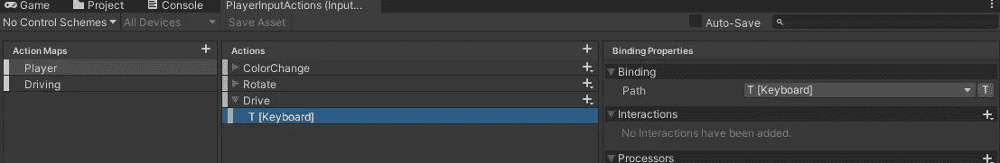
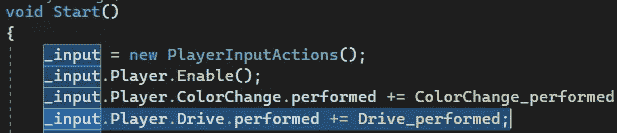
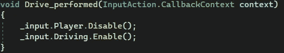
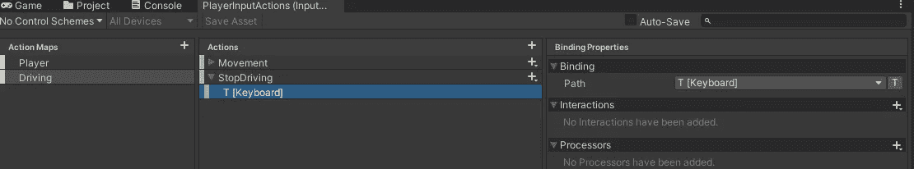
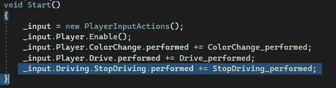
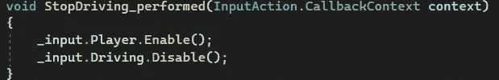

# 游戏开发的第 101 天:Unity 新输入系统——切换动作地图 w/ C#！

> 原文：<https://blog.devgenius.io/day-101-of-game-dev-unity-new-input-system-switching-action-maps-w-c-2a1ac91a896?source=collection_archive---------9----------------------->

**目的:**通过脚本切换我在游戏中的动作地图。

我有 2 个不同的行动地图设置。

两个行动图都是为了举例

**玩家动作地图**使用 A 和 d 向左或向右旋转，并且每当按下空格键时改变随机颜色。

**驾驶动作地图**允许玩家使用 WASD 或箭头键沿着 x 和 y 轴移动。

我将设置一个按钮(T 键),用于在它们之间切换。

在我需要的代码中，我需要访问执行的事件，在分配给该事件的方法中，我将禁用**玩家动作映射**并启用**驾驶动作映射**。

现在在游戏中，我可以切换到我的驾驶动作地图，但不能返回。

最初，我厌倦了做一个 if else 检查，这样我就不必做另一个方法/绑定来切换回来。基本上，如果检查是检查玩家地图是否启用，禁用它，并启用驾驶地图。否则，如果玩家地图被禁用，启用它并禁用驾驶地图。不幸的是，这不起作用，因为我禁用了绑定了“T”的玩家地图。所以你必须在每个动作图上创建相同的绑定和相同的方法来切换回来，这并不是最糟糕的事情。

我的最终结果有效！

***如有任何问题、更正或想法，欢迎评论。让我们制作一些令人敬畏的游戏！***