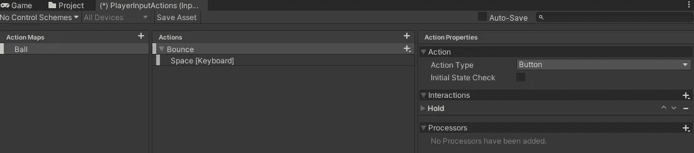
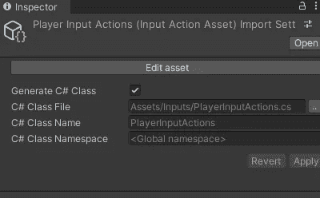
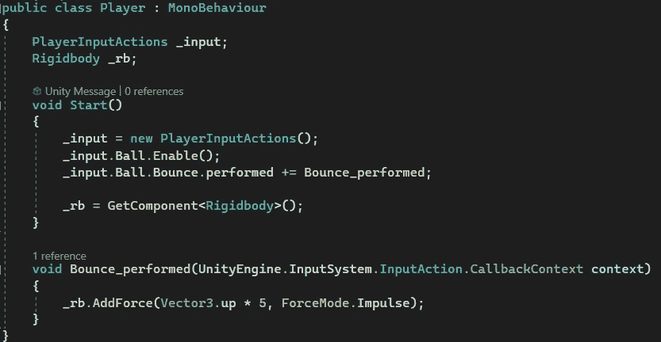
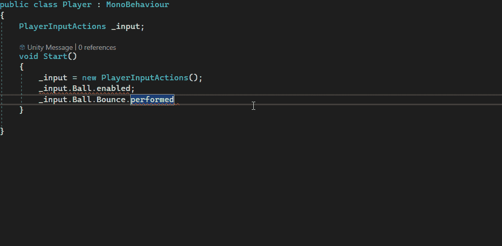
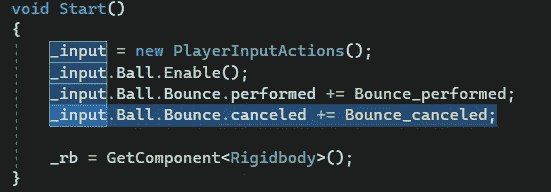
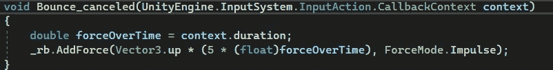
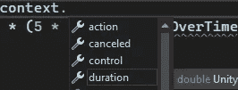
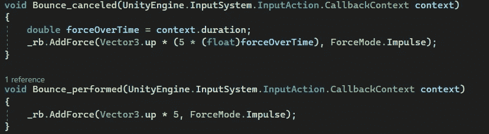
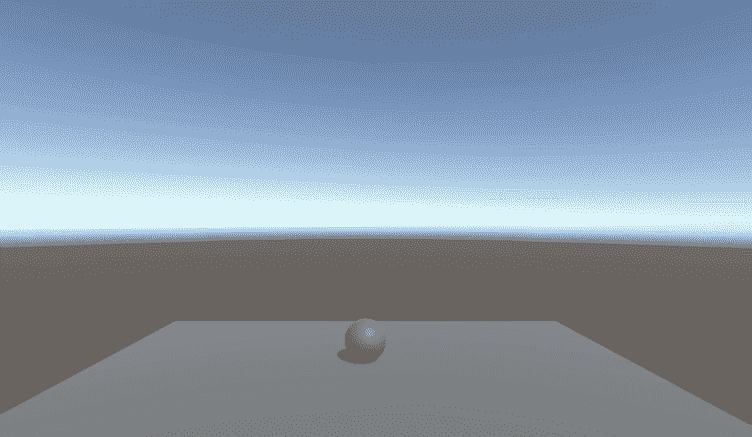

# 游戏开发的第 102 天:Unity 新输入系统——点击或按住以获得更高的跳跃！

> 原文：<https://blog.devgenius.io/day-102-of-game-dev-unity-new-input-system-tap-or-hold-for-higher-jumps-584b33daedae?source=collection_archive---------8----------------------->

**目标:**展示使用新的输入系统可以获得的一些数据，以创建特定的效果。

这里的最终结果不会是一个抛光跳跃机制或超时加速机制。相反，这里的主要目标是向您展示如何获取一些有用的数据来为您的项目创建这些特性。

首先，我将创建一个新的动作图，创建一个名为 bounce 的动作，并在交互中添加 hold。并确保绑定设置为空格键。

记住，一定要保存资产。

同样在检查器中，确保生成一个 C#类。

现在我将创建一个新的脚本并附加到我的球体上。我给剧本作者打电话。

为了完成一些设置，我将确保有一个对我的 PlayerInputActions(输入动作资产)的引用。启用我的操作图，并创建分配给已执行事件的方法。

请记住，您可以在+=后单击 tab，这样它会为您创建基本方法。

在 Bounce_performed 方法中，我将对球体上的 rb 施加向上的力。(也请确保将这个脚本附加到您的游戏对象上)

到目前为止，如果我们按住空格键，我们将继续增加我们的领域的力量。请记住，我们不是像您通常会做的那样检查跳转或重置跳转。这只是一个例子。

如果我们想要一个更小的跳跃，如果我们按住空格键更少的时间呢？

利用取消的事件，我们可以很容易地得到这些信息，而不需要我们自己做任何疯狂的计算。取消的事件检查我们是否停止压制空间。

在这个脚本中，我们执行了事件设置。这是检查是否正在执行按住空格键。它开始时的值是 0，然后逐渐上升，直到被认为保持为 1。如果我们每次按住空格都得到中间值，那么我们可以将它乘以我们的力，这将根据我们按住它的时间给我们一个或大或小的跳跃。

我将创建一个方法，并将其分配给取消的事件。

在该方法中，您会注意到有一个参数被传入。默认情况下，它被命名为 obj，但是我将 mine 重命名为 context 作为 preference。你做你的。无论哪种方式，该数据都包含被调用操作的当前值。您可能会注意到，在上下文数据中有与按钮被按住的持续时间相关的信息。

我们可以把它保存到一个变量中，在 canceled 事件方法中，我们可以增加力，但是力要乘以它被保持的时间。基本上就是说，如果它保持的时间比最大值短，也就是说，这个方法处理的时间比最大值短，那么这个力的倍数就会比最大值小。意思是少跳一跳。

上下文持续时间数据是双精度的，因此在这个实现中，您必须将它转换为一个浮点型，这不会造成任何伤害。

这是两种方法(执行和取消)。我希望这能帮助你想象我们在这里做了什么。请记住，这种精确的实现可能不适合您，但我希望这有助于学习如何获得一些“中间”数据，以创建一些您将使用新输入系统的功能。

***如果您有任何问题、更正或想法，请随时评论。让我们制作一些令人敬畏的游戏！***