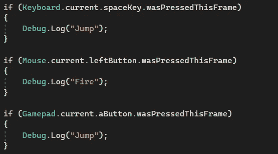

# 游戏开发的第 103 天:Unity 新输入系统——如何更容易地制作原型！

> 原文：<https://blog.devgenius.io/day-103-of-game-dev-unity-new-input-system-how-to-prototype-easier-5dcb2d037969?source=collection_archive---------19----------------------->

**目标:**回顾我们如何使用新的输入系统构建原型(让事情变得更快)。

当我们从旧的输入系统转移到新的输入系统时，我们中的许多人可能会注意到一件事，在你可以让输入工作之前，有更多的设置要做。至少在你读到这里之前，你可能是这么想的。

我发现这里有两个选择。

**选项 1:**

使用旧系统，我们只需键入如下内容:

好消息是，有一个新的输入系统，你甚至不需要设置你的动作地图或任何其他与新系统相关的东西。

确保拥有 **UnityEngine。输入系统**名称空间。

嘣，不同的语法，但我可以告诉你完全相同的功能。

还有一个被释放的相框

你的鼠标和控制器也是一样！

**选项 2:**

转到项目设置>播放器>配置，并将活动输入处理设置为两者。现在您可以使用两种输入系统:)

***如有任何问题或想法，欢迎评论。让我们制作一些令人敬畏的游戏！***