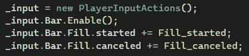

# 游戏开发第 104 天:Unity 新输入系统——进度条 UI！

> 原文：<https://blog.devgenius.io/day-103-of-game-dev-unity-new-input-system-progress-bar-ui-428db3f3be6a?source=collection_archive---------14----------------------->

目标:使用新的输入系统创建一个进度条 UI。

这应该是最终结果:

每当我按住空格时，横条就会填满，而当我不按住空格时，就会失去进度。

Unity 已经有一个内置的滑动条，我们可以通过代码来操作。

在滑块上有一个值变量，它表示条有多满。

和滑块一起，这个脚本让我填充或降低它的进度。

我们来分析一下。

首先，我获得了对输入动作资产的引用，启用了我想要使用的动作映射，并为开始和取消的事件创建了一个方法。

动作图由 1 个动作组成，空格键设置为绑定。

我还需要访问滑块，这样我就可以操作它的值变量。

然后，我将创建一个协程，基于 bool 增加 sliders 值。如果布尔值为假，那么滑块值将减少，直到达到 0。

或者，我可以设置滑块值根据布尔值减少。这样您就不必等到该值达到 0 后再开始增加。

我用时间来加或减这个值，deltaTime 意味着它会根据实际时间增加或减少。

回到 started 和 canceled 方法，我正在检查被按下的空格键是否已经启动。如果已经将 _isFilling bool 设置为 true，则启动协程。如果空格键停止被按下(被取消)，那么将 _isFilling bool 设置为 false。

我对此很感兴趣，但肯定需要其他人的一些投入才能做好。如果你需要帮助，不要难过。你的工作不是成为无所不知的人，而是解决问题的人。有时候解决问题最快最好的方法就是寻求帮助。这没什么不对。

***如有任何问题或想法欢迎评论。让我们制作一些令人敬畏的游戏！***