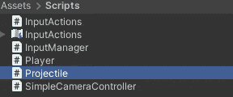
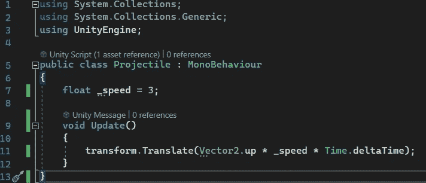
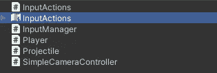
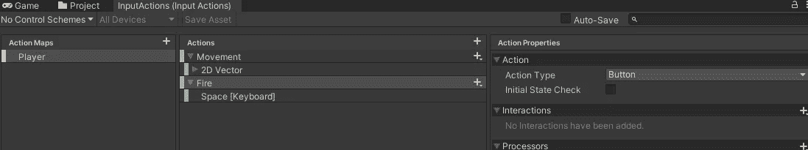
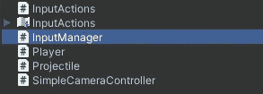
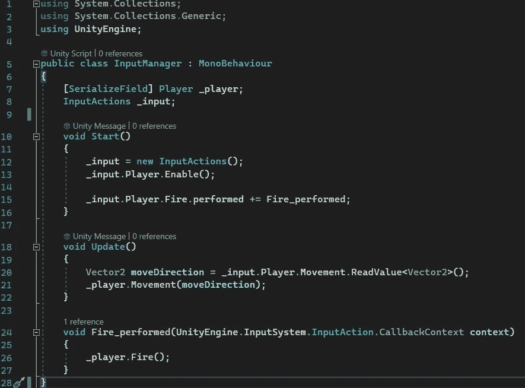
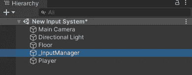
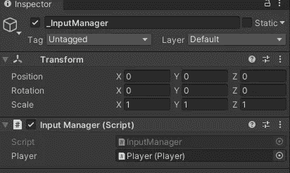
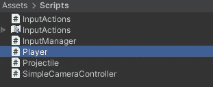
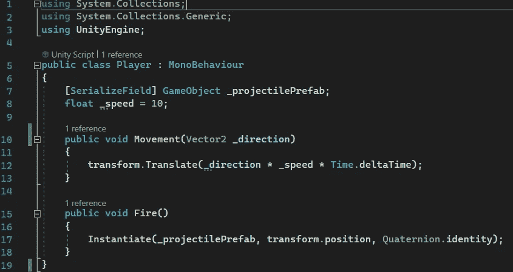

# 游戏开发的第 105 天:Unity 新输入系统——保持你的代码模块化！

> 原文：<https://blog.devgenius.io/day-105-of-game-dev-unity-new-input-system-keeping-your-code-modular-87e8263fe630?source=collection_archive---------17----------------------->

**目标:**用新的输入系统将玩家输入与玩家类分开。

说到新的输入系统，还有更多的编码需要完成。最好不要把所有这些复杂的代码都放在你的播放器类中，因为它很容易把代码弄乱。我将向您展示一种简单的方法来确保您的代码保持整洁，同时也不会增加太多的复杂性。

在解释代码之前，我将设置我的场景。场景将会有 2d 角色移动和玩家可以射击的投射物。

我有我的:

玩家(球体)

射弹预制件(胶囊)

投射脚本(向上移动)

输入动作资产

InputManager 脚本(管理所有输入)

一个空的游戏对象(保存 InputManager 脚本)

播放器脚本(在播放器上)

我们真正需要关注的 2 个脚本是输入管理器和播放器脚本。

我们先来看看玩家剧本(上图)。

正如你所看到的，有两个方法你通常可以从玩家类本身调用(移动和开火方法),但实际上在这个脚本中根本没有被调用。逻辑是构建出来的，但实际上从来没有被调用过。

相反，在这个实现中，为了保持所有代码整洁，它们都是公共方法，这样就可以从 InputManager 脚本中调用它们。因此，Player 类处理所有与播放器相关的行为，而 InputManager 类自己处理输入。

回到 InputManager 类:

我们有一个对 Player 类的引用，如你所见，每当使用输入时，我们都从 Player 类调用公共的 Movement 和 Fire 方法。这是一种非常简洁的设置代码的方式，但是请记住，它确实增加了一层复杂性，尽管它非常值得学习。尤其是因为让你的代码保持模块化非常重要，所以在任何事情上都学习它是很好的实践。

***如果您有任何想法或问题，请随时评论。让我们制作一些令人敬畏的游戏！***