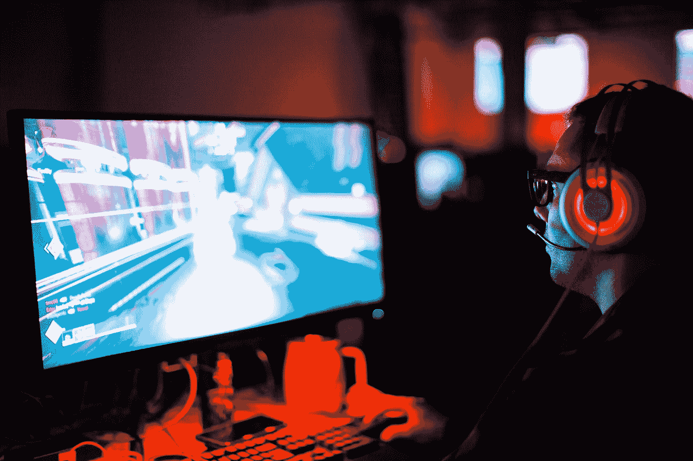

# 游戏开发的第 106 天:Unity 新输入系统——从传统输入升级玩家动作！

> 原文：<https://blog.devgenius.io/day-106-of-game-dev-unity-new-input-system-upgrading-player-movement-from-legacy-input-107ca4a933a1?source=collection_archive---------12----------------------->

照片由[肖恩·多](https://unsplash.com/@everywheresean?utm_source=medium&utm_medium=referral)在 [Unsplash](https://unsplash.com?utm_source=medium&utm_medium=referral) 上拍摄

**目标:**从**玩家**开始，用旧的输入系统做一个项目，换成新的输入系统。

在**播放器类**中，有一个在 **Update()** 中被调用的方法叫做 **CalculateMovement()** ，其中有与播放器相关的大部分输入。

播放器已经设置了旋转和移动功能。我在这里的工作不是改变这一切。只是输入来自哪里。

我想对我的输入做的是保持它们的模块化。这意味着我希望我的输入脚本与播放器脚本分开，以保持一切整洁，而不是将我的所有输入放入与播放器相同的脚本中。我这样做是因为新的输入系统需要更多的代码。

我将首先在与玩家脚本**相同的文件夹中创建一个新的**输入动作资产**。**

我会设置一个**玩家动作图**。基于 **CalculateMovement()** 方法，我只需要替换 **h** 和 **v** 变量的取值位置。我们一会儿会更深入地探讨这个问题，但这意味着在我的动作图中，我只需要一个侧面到侧面和前后移动的绑定，我可以通过 Vector 3 类型来实现。

确保保存资源并从中生成脚本。

然后，我将在同一个文件夹中创建一个新脚本，并将其命名为 **GameInputManager** ，因为它将不仅管理玩家的输入。这是保存输入值的脚本，播放器脚本在调用其 **CalculateMovement()** 方法时可以使用这些输入值。

回到**玩家**脚本，我已经做了必要的修改，这是非常少的。

你可能也注意到了我增加了旋转的速度。对我来说感觉很慢，但这并不是理解这篇文章的主要重点所需要的。

在整个方法中， **h** 和 **v** 变量用于计算该运动。所以我只想取代他们的输入来源。我现在就把它们注释掉，我会把变量变成参数，并从 **GameInputManager** 脚本中获取它们的值。

请记住，必须从某个地方调用 **CalculateMovement()** 方法，如果我们从另一个脚本获取输入，就必须从那里调用它。这也是我们将 **h** 和 **v** 变量设为参数的原因。所以我停止了从**播放器**脚本中的 **Update()** 方法调用 **CalculateMovement()** ，而是在**游戏输入管理器**脚本中调用它。

在 **GameInputManager** 脚本中，我引用了我的**输入动作**资产和我的**播放器**。在 **Start()** 中，我将启用行动地图。在 **Update()** 中，我从我之前在动作映射中设置的动作中获取值，并将它们作为参数传入 **CalculateMovement()** 脚本中。

我们开始了，输入被替换为播放器，并准备就绪。

***如有任何想法或问题，欢迎评论。让我们制作一些令人敬畏的游戏！***