# 游戏开发的第 108 天:在你的类中使用构造函数！

> 原文：<https://blog.devgenius.io/day-108-of-game-dev-using-constructors-with-your-classes-5d22a7529198?source=collection_archive---------15----------------------->

**目标:**回顾一下什么是构造函数以及它们的一些好处。

对于任何理解这个话题有问题的人来说，不要担心一开始会不会有点困惑。当你读到这篇文章的结尾时，它会变得更有意义。重读一遍也没什么坏处，我建议先读一遍，做个大概的了解，然后再从头到尾读一遍，尽量多注意细节。你能做到的！

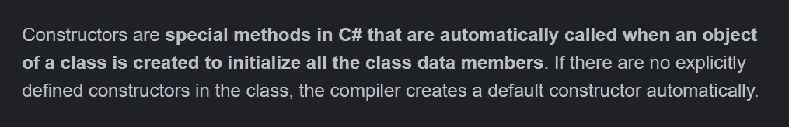

[演职员表](https://www.knowledgehut.com/tutorials/csharp/csharp-constructors)

构造函数有什么好处？

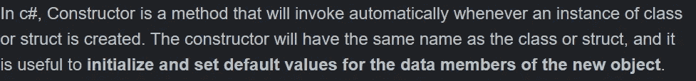

让我们来看一个构造函数的实际应用。

在我的例子中，我有一个玩家脚本和一个武器脚本。

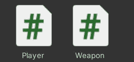

我将在武器脚本中设置一些所有武器的标准变量。

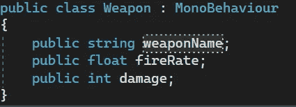

注意:请记住这不是一个完美的例子，但是请试着继续学习，看看构造函数可以用来做什么。

然后从玩家脚本中，我将创建一个武器类的实例(也称为对象)。

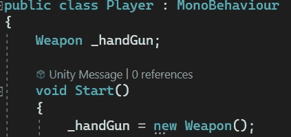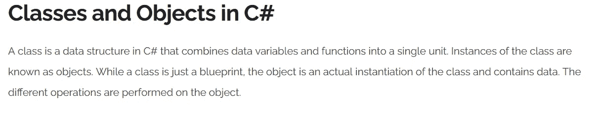

[演职员表](https://www.knowledgehut.com/tutorials/csharp/csharp-classes-objects)

这个实例将是一把手枪，我将为它的每个变量赋予一个特定的值。

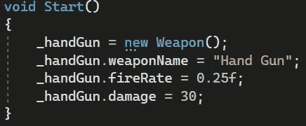

那我再举一个例子，叫它狙击手。然后我也会给变量赋值。

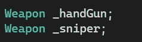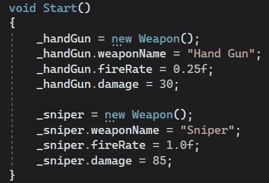

有几个问题是，在我的游戏中，我想要更多的武器。它需要多行代码，并且不能保证我会记住为每个实例分配变量。

使用构造函数，我们可以将这些值作为参数传入，从而节省了多行代码(同时也减少了输入的工作量),并且只需要输入或不输入某些数据。例如，当您调用 Instantiate()或 Destroy()或 transform。Translate()和给定的调用它们的多个选项，这是因为设置了多个构造函数，允许不同的选项，包括一些 100%必须输入的值和一些被赋予默认值的可选值。我会告诉你我的意思。

这里，我将在武器类中创建一个构造函数。

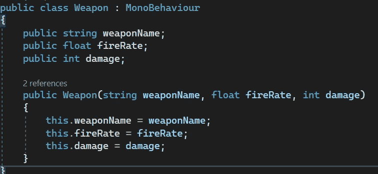

构造函数名将与类名相同。除此之外，我在这里做的是创建一个公共方法，我们可以在其中传递变量。要传递的变量可以随意命名。我将把 weaponName 参数更改为不同的值，以便向您展示。

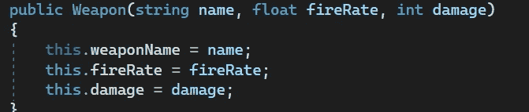

但是类变量前的“this”关键字是什么呢？

我是说这个武器名，就像你创建的类的实例一样，将等于你传入的任何参数。

回到玩家类，我将使用这个构造函数创建一个我的手枪和狙击手的实例，而不是像我之前展示的那样。

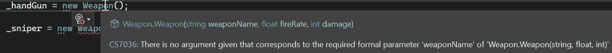

这里有一个错误，告诉我现在需要向这些参数传递值。

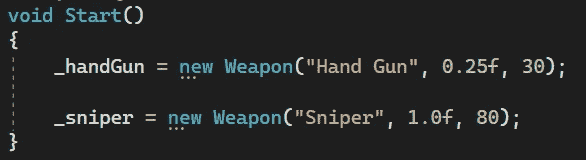

更干净，打字更快。也更容易阅读。

我也可以创建多个构造函数。

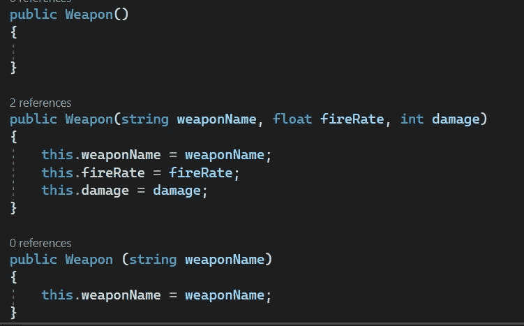

这里我添加了一个没有参数的构造函数和一个只有武器名称字符串的构造函数。

回到我的玩家脚本，每当我创建一个武器类的新实例时，我现在有多个选项。

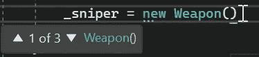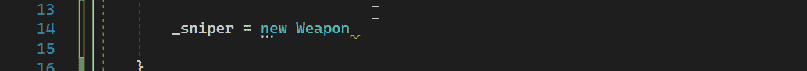

所有这些现在都是我可以实例化一个新的武器对象的方法。

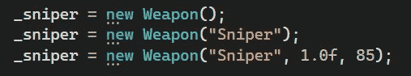

我希望这有助于你理解构造函数以及它们的一些好处。如果你有任何想法或问题，请随意评论。让我们制作一些令人敬畏的游戏！