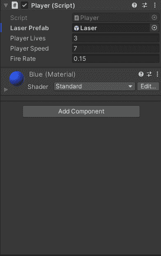
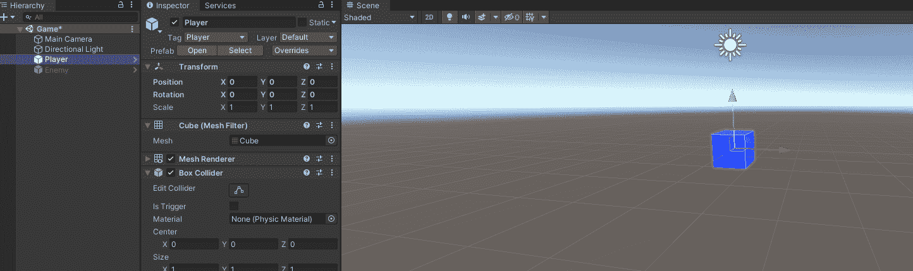
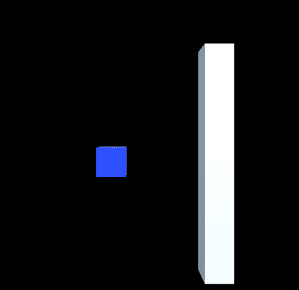
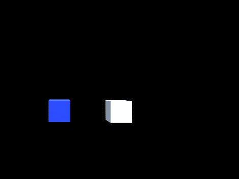
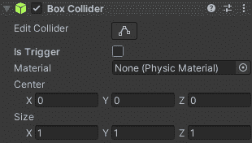
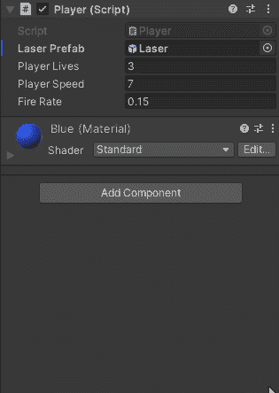

# 游戏开发的第 11 天:Unity 中的碰撞和物理学介绍！

> 原文：<https://blog.devgenius.io/day-11-of-game-dev-intro-to-collisions-and-physics-in-unity-33342cc6698a?source=collection_archive---------4----------------------->

**目的:**在 **Unity** 中学习**碰撞**和**物理**的基础知识。

在 **Unity** 中有被称为**碰撞器**的组件。这些用于很多事情，主要的一个是你需要它们来检测两个或更多游戏对象之间何时发生碰撞。

有许多不同类型的**碰撞器**，例如:盒子碰撞器、胶囊碰撞器、多边形碰撞器等等。这些**对撞机**中的每一台都有它们的 2D 版本，用于 Ex: Box 对撞机 2D。

您可以通过在检查器中找到游戏对象并单击新建组件来为游戏对象添加一个**碰撞器**。键入“**对撞机”**，你会看到你所有的选项。

你还可以在场景视图中编辑**碰撞器**的大小，以确保它们符合你想要的游戏对象。

需要记住的一点是，例如多边形碰撞器会比箱式碰撞器更耗费你的项目，因为它有更多的点。对于小项目，不要过分强调它，只要记住它就行了。

也就是说，碰撞器可以检测到两种不同的**碰撞。有**硬面碰撞**和**触发碰撞**。例如，**硬表面碰撞**就像你的角色站在地上。你的角色对地面的反应就像它是一个固体一样。或者你的玩家撞到了一面墙，再次像一个固体一样对它做出反应。**

**触发碰撞**也检测**碰撞**但不会使两个碰撞的物体反应得好像它们是固体一样。相反，**触发碰撞**用于检测**碰撞**以触发代码，同时仍然允许对象相互通过。例如，你想让你的玩家抓住一个能量球，但不要击中它，并停留一秒钟，直到你“捡起它”。你只是想让他们走过/通过它，简单地运行“拿起电源”代码。为了知道你何时走过它，触发碰撞**必须检测它何时发生。**

您可以通过勾选或取消勾选检查器组件上的**是触发框**来设置**碰撞器**是否是**触发器**。

我肯定会习惯使用**对撞机**,因为它们非常复杂和有用，但最棒的是，我们不必制造它们！在 **Unity** 的漂亮的人们已经做了。我们只需要学会如何使用它们。如果你感兴趣的话，这里有一个关于 Unity 对撞机的**[**官方 API 的链接。浏览一下就能很好地理解了。随着时间的推移，通过使用它们成为专家。**](https://docs.unity3d.com/ScriptReference/Collider.html)**

接下来，为了让两个物体使用**碰撞器**进行交互(比如一个玩家和地面)，至少有一个物体需要有一个 [**刚体**](https://docs.unity3d.com/ScriptReference/Rigidbody.html) 。在**碰撞器的官方 Unity API** 中**你会注意到当碰撞器用于不同的目的时需要一些不同的规则。就像我刚才举的球员和地面的例子一样，为了让这两者像在坚硬的表面上一样互动，我不仅需要检测它们之间的**碰撞**，还需要**物理系统**实际上处于活动状态。**刚体**组件是“激活”游戏对象上的**物理** **系统**的组件。**

请记住，**刚体**应该是应用程序性能需要注意的地方，因为太多刚体会导致性能下降。同样，不要为小项目担心，只要记住就行了。

以玩家和地面为例，让**刚体**开启，让他们可以使用**物理系统**互动，这样可能会更好？记住，至少有一个游戏对象需要有**刚体**组件才能“激活”游戏对象上的**物理系统**。要么每一片地面、每一面墙和每一个你想拥有坚硬表面的物体都需要**刚体**或者只是玩家。这里很容易选择，如果我们给玩家**刚体**来模拟物理，并且地面的**碰撞器**没有被设置为**触发器**(使其成为坚硬的表面)，那么玩家可以在地面上行走！

不用从零开始建立一个**物理系统**是多么美好的事情啊！感谢 **Unity** 让我们专注于游戏制作。我希望这有助于理解**碰撞**和**物理**在**统一**中的工作方式。

**记得坚持学习，需要的时候休息一下(人生不全是学习)，做一些牛逼的游戏！有问题随时提问，谢谢。**