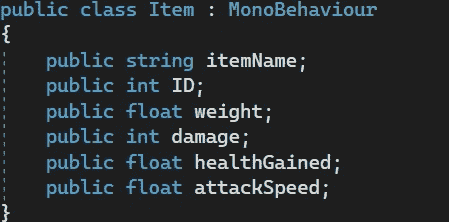
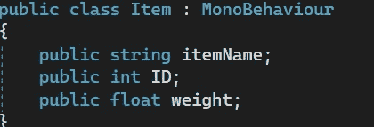
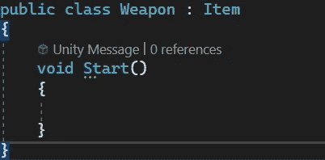
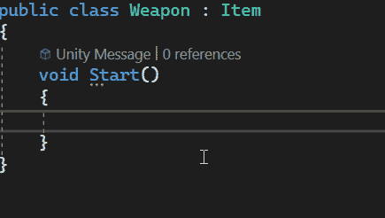
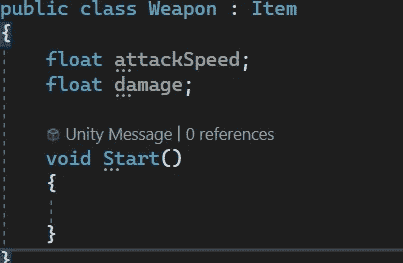
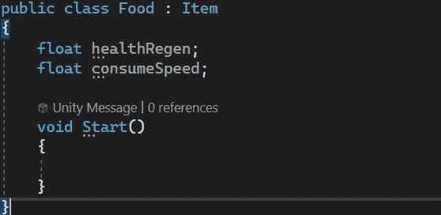
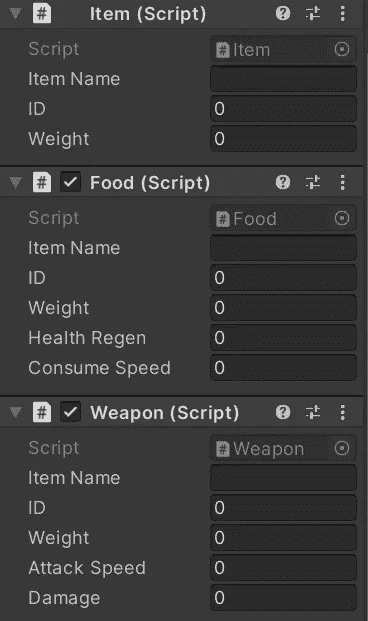
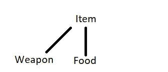
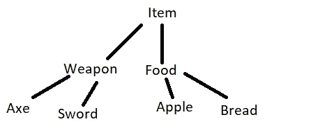

# 游戏开发的第 110 天:在 C#中使用类的继承！

> 原文：<https://blog.devgenius.io/day-110-of-game-dev-using-inheritance-with-your-classes-in-c-46161590178b?source=collection_archive---------14----------------------->

**目标:**回顾 OOP 的核心要素之一以及为什么它如此有益。

**OOP** 代表**面向对象编程**。C#是一种面向对象的语言。OOP 是一种众所周知和流行的编程方式，它有几个核心租户，包括我将在本文中重点介绍的继承。

在这个上下文中，继承意味着让你的类继承其他类的行为。

一般来说，在 Unity 的脚本中，它们默认继承自 MonoBehavior。这使得它们可以做多种事情，主要是能够作为组件附加到游戏对象上。

让我们看一个项目中继承的例子。

假设我们正在创建一个项目系统。

我将创建一个项目脚本，并在其中开始添加与项目相关的变量。

这里有 6 个不同的变量，有些项目会使用其中一些变量，而其他项目不会。那么，让所有项目访问所有相同的变量有意义吗？不完全是。

食物不需要伤害或攻击速度变量，武器不需要生命值变量。相反，我们可以创建一个通用的项目类，使用所有项目共有的变量。

然后，我们可以创建一个单独的武器脚本，并让它从项目类继承。

现在，我们可以访问一个项目的所有通用变量。您可以看到，我们可以访问 itemName、ID 和 weight，它们都在 Item 类中。

但是我也可以在武器类中添加特定于武器的变量。

我将创建一个食物脚本并做同样的事情。(确保它也继承自 Item)

我将对变量进行序列化，在检查器中，您可以看到每一项都是一些通用变量以及特定于该项的变量。而且并不是所有的都在同一个剧本里。

这是目前的等级制度

这样脚本会更清晰。更容易阅读，因为信息只与武器或食物种类有关。调试和找出问题所在要容易得多。你也可以继续传承下去。

它不仅仅是继承变量，还继承方法，以及大多数与父类相关的东西，这取决于你设置它的方式。

一开始，继承可能会让人感到畏惧，但是如果你想要大型的、干净的项目，继承是必须的。

***如有任何问题或想法，欢迎评论。让我们制作一些令人敬畏的游戏！***