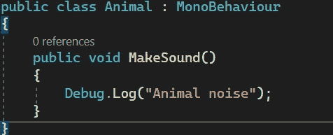
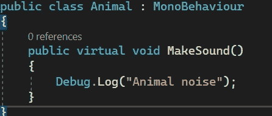
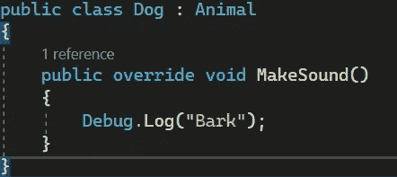
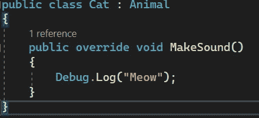
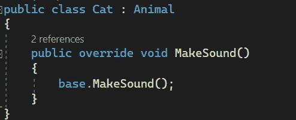
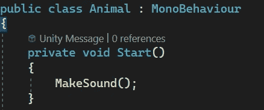
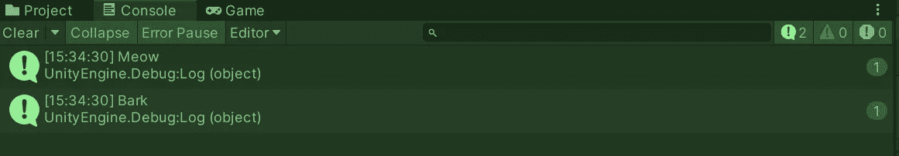

# 游戏开发的第 111 天:在 C#中重写继承类的方法！

> 原文：<https://blog.devgenius.io/day-111-of-game-dev-overriding-methods-from-inheriting-classes-in-c-d54a429c1e30?source=collection_archive---------9----------------------->

**目标:**回顾为什么以及如何定制从父类继承的方法。

假设我们有一个通用的动物类。

它包含 MakeSound()方法。

假设我们有多种不同类型的动物继承了这个类。我们将带一只狗和一只猫去。

我们现在面临的问题是，狗和猫发出的声音是不同的。那么我们如何定制方法来为每个类做不同的事情呢？

如果我们将 virtual 关键字添加到父类中的 MakeSound()方法中，它将为我们提供在继承类中自定义方法的选项。

在 Dog 和 Cat 中，我将自定义方法，为此我需要添加 override 关键字。

快速提示:如果我有另一个继承自 animal 的类，比如 Duck 类，并且我只想调用 MakeSound()方法的通用/原始版本，那么我可以调用 base。MakeSound()，它调用 MakeSound()方法的基类版本。

为了测试/形象化这一点，在 Animal 类中，我将调用 Start()中的 MakeSound()方法，因为 Dog 和 Cat 类继承了 Animal 类，所以它们也将调用 Start()中的方法。我将把狗和猫脚本添加到一个空的游戏对象中，单击 play 并检查控制台。

因为每个脚本都重写方法，所以它将调用方法的重写版本。这使得用我们的类设置继承更加有利。

***如有任何问题或想法，欢迎评论。让我们制作一些令人敬畏的游戏！***