# 游戏开发的第 112 天:C#中的结构+值类型和引用类型！

> 原文：<https://blog.devgenius.io/day-112-of-game-dev-structs-value-types-and-reference-types-in-c-108374a4c488?source=collection_archive---------10----------------------->

**目的:**以类和结构为主要示例，考察值类型和引用类型之间的差异。这一切都将在我的统一项目中完成。

理解值和引用类型在幕后是如何工作的很重要。

我的目标是帮助你不要害怕他们，同时不要和他们一起掉进一个长兔子洞。我会尽我最大的努力保持它的清晰和简单，如果你只记得一个他们的差异的概述，那么你将取得坚实的进展:)

对一些人来说，这个设置可能有点复杂，我鼓励你不要担心。到最后，您将理解值和引用类型之间的区别，即使我设置的测试有点难以理解。我知道这是我第一次学这个，但是再次强调，试着关注文章的主题。

让我们从结构和类之间的区别开始。

结构与类非常相似，它们也可以提供性能优势，尽管这是如此小的性能提升，以至于在大多数情况下，您不应该基于性能提升来决定是使用结构还是类。

一般来说，如果您有 4 个或更少的变量，并且不需要继承，最好选择一个结构而不是一个类，因为结构不能像类一样被继承。

结构应该是不可变的，因为它们不需要更新。他们作为数据持有人更好。随着我们的继续，你会明白我更多的意思。

这个主题很重要，因为根据你处理的类型，数据是如何在内存中传递的。

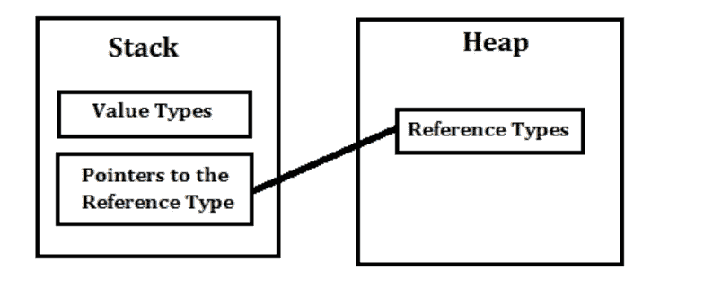

当我们继续前进时，需要记住的是值类型被分配给所谓的堆栈，而引用类型被分配给所谓的内存堆。(对于您想做的事情，您可能不需要成为这方面的专家，但记住这一点很有帮助)。

像 int、bools、floats、bytes、chars、doubles、longs 和 structure 这样的东西都是值类型。

字符串、数组、委托和类都是引用类型。

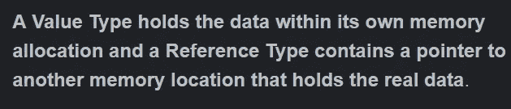

[信用](http://net-informations.com/faq/general/valuetype-referencetype.htm)

值类型保存自己的数据，而引用类型保存数据的地址。

为什么这很重要？

从程序员的角度来看，这很难理解，尤其是在 C#中，因为内存管理内置于该语言中，而不像 C++那样，需要手动分配/取消分配内存。

让我们看一个代码中引用类型与值类型的例子，以及它们对被操纵的反应。这将有助于我们理解数据是如何传递的以及为什么它很重要。

我将创建一个示例结构和一个示例类。

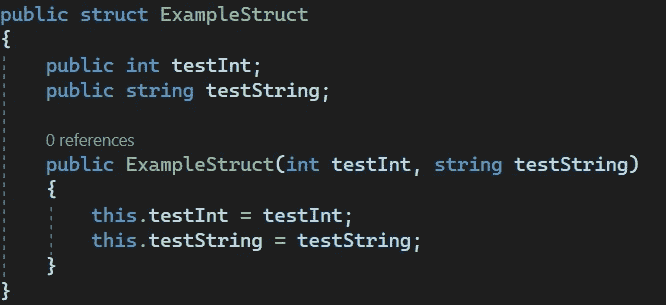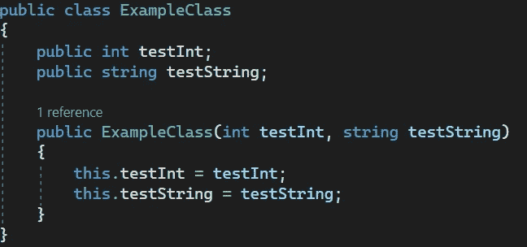

如你所见，结构和类的设置几乎完全相同。虽然结构不能被继承并且是值类型，但与类不同，类可以被继承并且是引用类型。

附注:结构和类都是用构造函数设置的。如果你不确定什么是构造函数，不要强调它，因为你不需要理解它们来学习这篇文章的主题。尽你最大的努力跟上，并坚持手头的主题。

我还将创建一个测试类来测试如何操作数据。(先不要纠结于所有的代码，我们会把它们分解开来)。

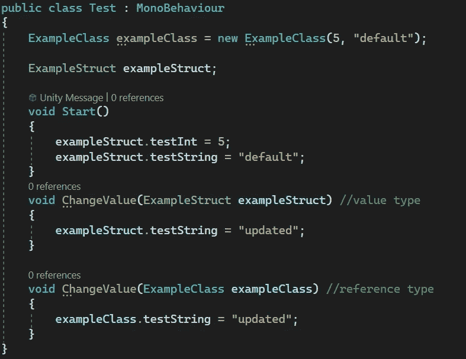

需要注意的事项:

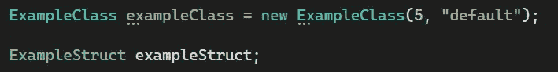

一个类是一个蓝图，一个类的实例是一个用这个蓝图制作的实际对象。所以这里我们创建了 ExampleClass 的一个实例。但是对于结构，因为它是值类型，所以它不是蓝图，而是实际的数据本身。所以我们不必创建它的新实例。

在这里，ExampleStruct 和 ExampleClass 变量都被赋值。testInt 设置为 5，testString 设置为默认值。

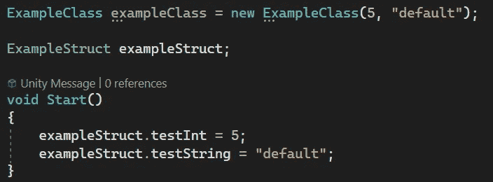

现在我们已经设置好了，我想操作这些数据。

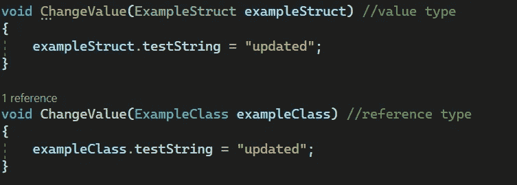

在我的测试类中，我有两个方法，一个用于操作结构的字符串，另一个用于操作类的字符串。无论哪种方式，字符串都将从“默认”变为“更新”。

先从班级说起吧。在操作变量之前和之后，我都会将字符串的值写入控制台。

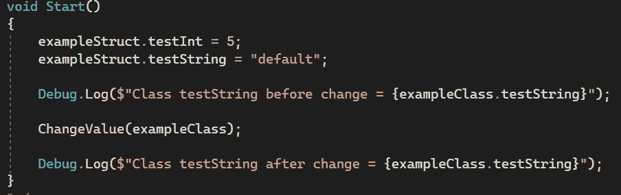

当我在 Unity 编辑器中点击 play 时，这就是打印到控制台的内容。

这几乎是我们所期望的。

现在让我们对这个结构做同样的事情。

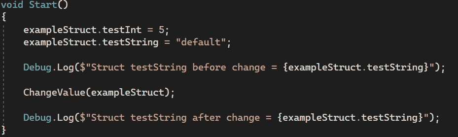

在我点击 Unity 编辑器中的 play 后，这就是打印到控制台的内容。

它似乎没有改变，但是为什么呢？

这是因为你只能修改引用类型的原始版本。您不能修改值类型的原始版本。因此，当我们更改 ExampleClass testString 的值时，我们成功地更改了确切的变量值。

但是当我们修改 ExampleStruct testString 时，(因为它是值类型)，它创建了变量(testString)的副本，并使该副本的值被“更新”，而不是操作原始变量本身。

回到 ChangeValue()方法，我将把“新的”或复制的变量打印到控制台。

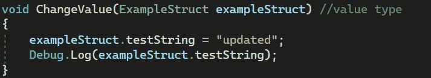

现在，当我在 Unity 编辑器中单击播放时，这就是打印到控制台的内容。

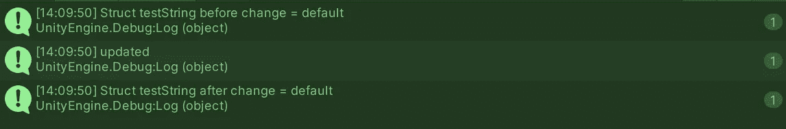

对于引用类型(类),我们总是处理完全相同的变量并操纵它，而对于值类型(结构),我们不允许改变原始变量，而是操纵它的副本。

我希望这有助于理解结构和类之间的区别，以及值类型和引用类型之间的区别。

***如有任何想法或问题，欢迎评论。让我们制作一些令人敬畏的游戏！***