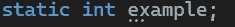
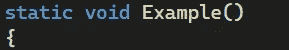
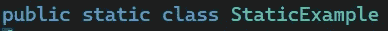
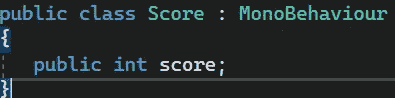
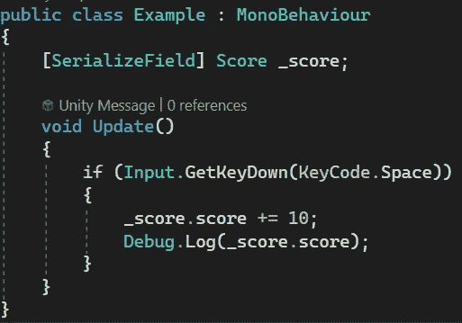
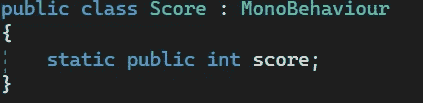
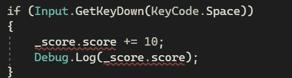
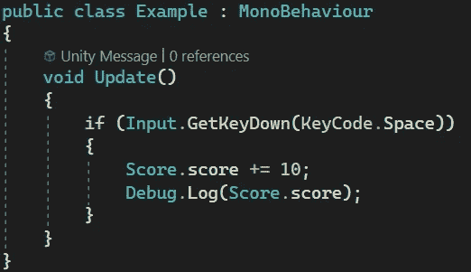
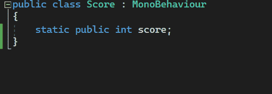

# 游戏开发第 113 天:什么是静态类型 C#/Unity？

> 原文：<https://blog.devgenius.io/day-113-of-game-dev-what-are-static-types-c-unity-13e3dbbd66a6?source=collection_archive---------11----------------------->

**目标:**介绍静态类型以及如何使用它们。

您可以将变量、方法和类设为静态类型。

但是什么是静态类型呢？

静态信息可以被认为是在程序的生命周期中“停留”在内存中。我们越了解它们是如何工作的，这就越有意义，我们将在下面的文章中继续讨论。

让我们看一个例子。假设我有一个保存玩家分数数据的类。

我还将有一个示例类，它将寻找输入，当按下空格键时，我们将在分数上加 10。我必须首先获得对 Score 类的引用，这可以通过[SerializedField]或 GetComponent()来完成。

现在我想了想，我真的不需要破坏 score 变量。它将伴随游戏的整个生命周期。看起来，让它保持静态是值得的。

让我们把分数变量设为静态。

当我们这样做时，我们在引用这个变量的脚本中得到一个错误。

这是因为如果我们想访问 Score 类中的一个静态变量，我们不需要获取对该类实例的引用。相反，我们可以在类层次上与它交互，而不是在对象层次上。这意味着我们不必通过[SerializedField]或 GetComponent()来获取类的实例。我们可以访问变量本身。当一个成员成为静态时，它只存在一个实例。与非静态成员不同，在非静态成员中可以创建它的多个实例。

我还加入了一个调试。点击此处查看分数更新。这是因为您不能序列化静态成员。这是需要记住的事情。

另一件你需要记住的事情是，在有很多静态成员的大型程序中，你可能需要重构它，因为很多静态成员会“阻塞”内存，因为静态成员在程序的整个生命周期中都存在。

另一件要记住的事。静态类，不能继承其他类。

我希望这对于介绍静态类型有所帮助。下面的文章将对这一主题进行扩展。

***如有任何想法或问题，欢迎评论。让我们制作一些令人敬畏的游戏！***