# 游戏开发第 115 天:如何使用属性 C#！

> 原文：<https://blog.devgenius.io/day-115-of-game-dev-how-to-use-properties-c-7409cac5fa11?source=collection_archive---------10----------------------->

**目标:**回顾什么是属性，以及我们如何在 C#中使用它们。

有时，您的项目中会有一些您不希望任何其他脚本更改的变量，但是您希望它们仍然可以访问这些变量。如果您将变量设置为 public，那么其他脚本可以更改该变量的值。如果你把它设置为 private，那么其他脚本根本不能访问这个变量。我们如何让它变得可访问但不可改变？

我们可以使用有时也称为 getters 和 setters 的属性。

如果你已经使用 Unity 一段时间了，你可能已经通过代码改变了游戏对象的位置，并且很可能使用 Time.deltaTime 来平滑你的项目中的某些事情，比如运动。

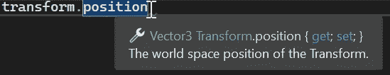

当鼠标悬停在 visual studio 中的 position 变量上时，它显示您能够获取和设置该变量。这意味着您既可以访问该数据，也可以更改它。

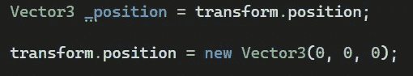

在这里，我获取 transform.position 变量，并将其值赋给我自己的自定义变量(_position)。我正在访问(获取)它的数据。

就在它下面，我将 transform.position 值设置为新的值(设置)。在这里是世界的中心。

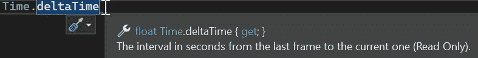

当我们将鼠标悬停在 Time.deltaTime 上时，它显示我们只能获取该值，而不能设置它。

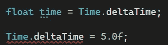

在这里，我获取 Time.deltaTime 的值，并将其赋给我的自定义变量“Time”。

但是当我试图改变(设置)Time.deltaTime 时，我得到一个错误，因为不允许我改变 Time.deltaTime 的值，只允许我访问它。

有很多原因你可能不希望另一个 dev(或者将来的你)改变一个 variablez 的值，即使是偶然的。主要是当你需要一个非常具体的变量时。这也是 OOP 的基本概念之一。我们需要学习如何遵循它来创建强大的程序。假设我们不小心改变了 Time.deltaTime 的值，我们的项目会很快变得不可思议。

既然我们已经很好地理解了属性的工作原理和它们的用途，那么让我们自己来创建一些属性。

我将创建一个游戏管理器脚本和一个测试脚本。GameManager 脚本将保存 _isGameOver Bool，我希望该变量只能被访问，不能被其他脚本更改。

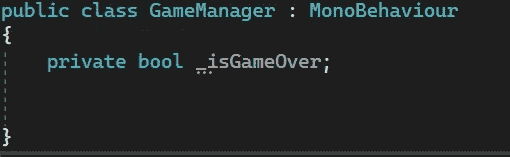

到目前为止，在这个脚本之外还不能访问 _isGameOver bool。让我们改变这一点。

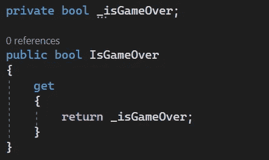

通常的做法是，将保存 getter 和 setter 的变量命名为试图设置这些属性的变量，但是使用 pascal 大小写而不是 camel 大小写。

pascal 大小写=所有单词大写。

camel case =第一个单词的第一个字母小写，其余单词大写

我们也公开变量。添加 setter 是可选的。现在我将只添加一个 getter。现在有了一个 getter 属性，让我们试着从测试脚本中访问它。

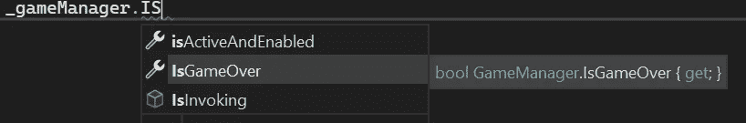

如您所见，IsGameOver 变量只有一个 get 属性。

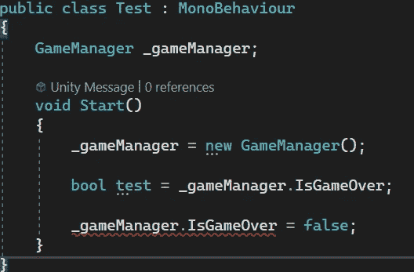

在测试脚本中，我引用了游戏管理器。然后，我获取 IsGameOver bool 的值，并将其赋给我的自定义变量。但是当我试图设置(更改)IsGameOver bool 的值时，我得到一个错误，因为我不被允许。这正是我想要的。

例如，假设我也希望能够从类外部设置 _isGameOver。

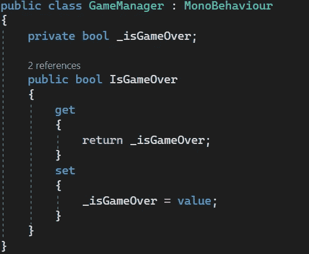

**value** 关键字基本上是一种隐式的方式(在幕后),表示您将 _isGameOver 变量更新为传入的任何值。

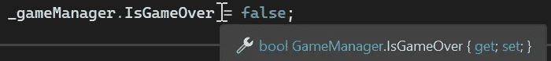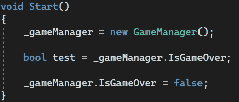

现在在我的测试脚本中，我也可以设置变量。没有错误。

另一个要注意的有趣的事情是，如果你愿意，你可以通过你的属性运行代码，因为它们在某种程度上很像方法。

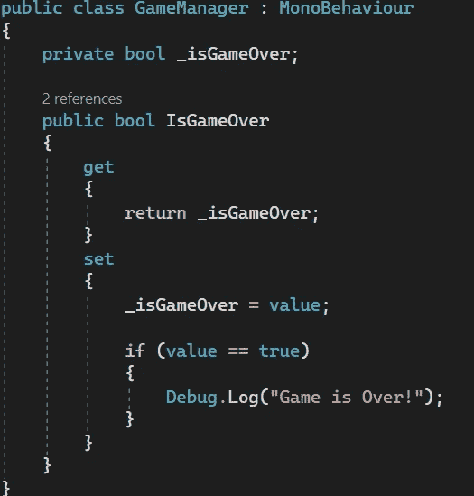

这是另一种方式来申报你的财产，它有自己的利弊。

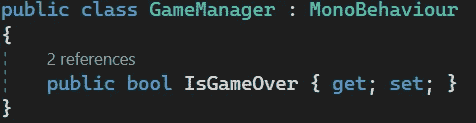

我删除了所有以前的代码，并把这一行。这个变量可以被访问和修改。

当然我也可以把集合拿出来，这样变量只能被访问。

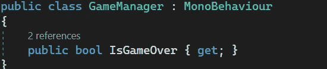

这样做的一个好处是它更容易编写，代码行更少。

不利的一面是，如果你想传入任何代码，你都不能传入。

以便调试。来自早期的日志(或我想要的任何其他代码)不能被传递到属性中。

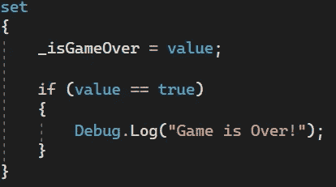

你可以做的另一件事是，如果你想从保存它的脚本(在这个例子中是 GameManager 脚本)中获取和设置 IsGameOver，但是只允许获取对其他脚本的访问，那该怎么办？

你可以放一套私人的。

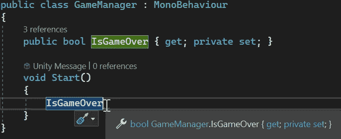

现在你只能从基类设置，而不能从其他类设置。

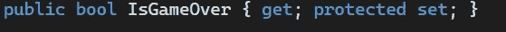

你也可以将它从 private 改为 protected，这将允许任何继承 GameManager 类的类也可以设置它，但是仍然不允许非继承类设置它。

还有一点要提的是，如果你要[SerializedField]一个属性，那么它仍然不会显示在检查器中。通过一些工作，您可以创建一个自定义编辑器功能，允许它显示出来，但一般来说，从检查器中查看变量的唯一方法是通过调试模式，该模式应该显示所有变量，尽管您不一定能从检查器中编辑它们。

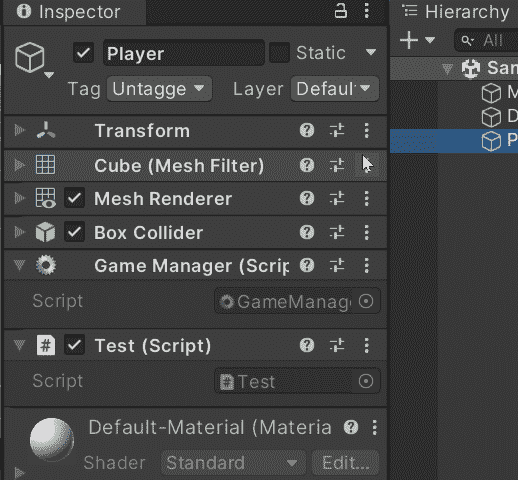

有了属性，你就有办法遵循核心的 OOP 原则，这里主要是不要在不需要访问的地方给出访问。

***如有任何问题或想法，欢迎评论。让我们制作一些令人敬畏的游戏！***