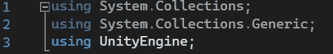
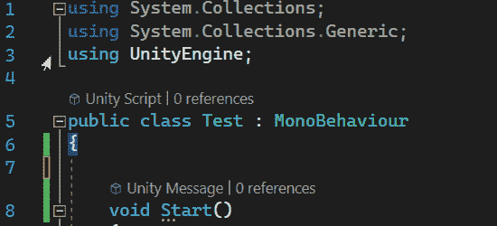
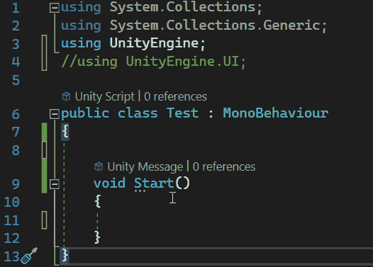
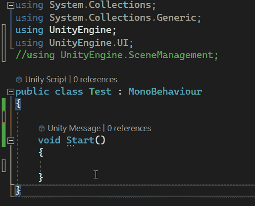
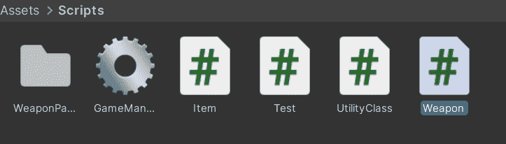
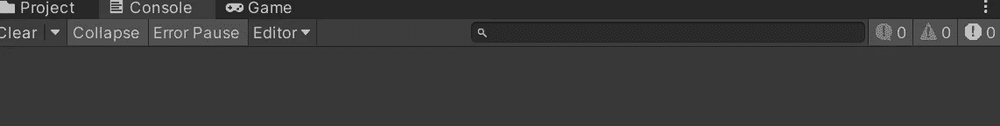
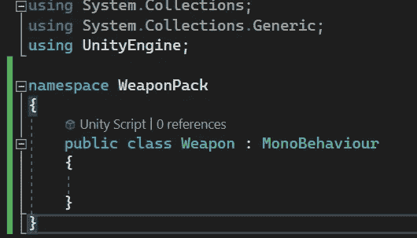
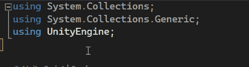
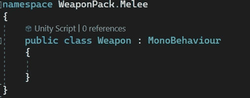
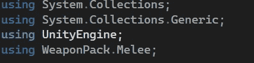

# 游戏开发的第 116 天:什么是名称空间——Unity/c#？

> 原文：<https://blog.devgenius.io/day-116-of-game-dev-what-are-namespaces-unity-c-79a603bddd46?source=collection_archive---------2----------------------->

**目标:**回顾什么是名称空间以及如何使用名称空间。

简单地说，名称空间是一个代码库。

每当你在 Unity 中创建一个新的 C#脚本时，默认情况下，该脚本会在顶部有 3 个不同的名称空间。

每当你“使用”一个名称空间时，你就在说，我想访问这些名称空间提供的代码。

例如，如果移除 UnityEngine 命名空间，您将无法访问 MonoBehaviour 类。

此外，假设您想通过代码使用 UI 图像。你需要联合引擎。UI 名称空间来访问图像数据和更多的 UI 数据。

如果你想通过代码加载不同的场景也是一样。你必须进入联合引擎。SceneManagement 命名空间。

名称空间非常有用还有其他一些原因。例如，你可能想知道为什么我们必须指定我们想要使用一个名称空间。为什么不直接接触所有人呢？

想象一下你在 visual studio 中的智能，你知道帮助自动完成变量和方法的东西。如果你尽可能地使用每一个名称空间，那么这个东西绝对会被塞满。

此外，更重要的是，你已经知道你不能有两个同名的脚本。也就是说，你不能有两个同名的类，否则你的代码不会知道你想用哪个类，并给你一个错误。

名称空间有助于分隔这些类，以便只有其他需要看到它们的类才能看到它们。

例如，假设您从 Unity 资产商店下载了一个武器包，其中包含一个名为“武器”的脚本。假设您的项目已经有了一个名为“武器”的脚本。

没有名称空间，您要么不能使用这个武器包，要么必须在所有代码中重命名其中的一个。

相反，我可以将其中一个武器类命名为名称空间。它可能是我导入的那个，因为它不是这个项目的原生版本，但是大多数资源包可能已经为你设置了这个。

一旦我使它成为一个名称空间，错误就消失了，因为 import Weapon 类不再被每个类看到，除非这个类添加了它的名称空间。

为了使它成为一个名称空间，我只需输入名称空间和一个自定义名称。然后把这个类放在花括号里。

现在，在我的其他脚本中，如果我愿意，我可以实现这个名称空间。

如果我想要不同类型的武器，比如近战武器和远程武器，我甚至可以进一步指定名称空间。

最终，命名空间是一个类，只有当你指定你想要访问它的时候，它才能被访问。如果你愿意，你可以自己做！

***希望这对你有帮助。如果您有任何问题或想法，请随时发表评论。让我们制作一些令人敬畏的游戏！***