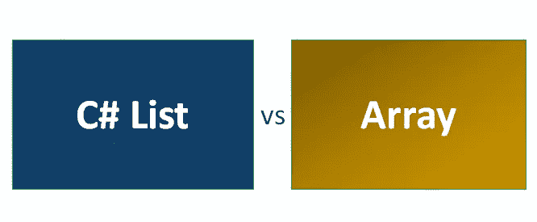
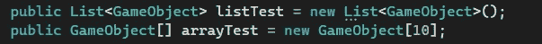
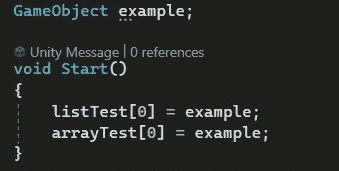
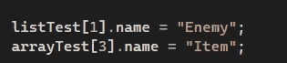
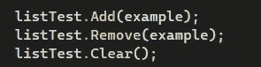
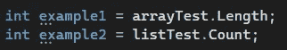
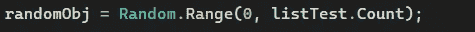

# 游戏开发的第 117 天:在 C#中使用列表！

> 原文：<https://blog.devgenius.io/day-117-of-game-dev-working-with-lists-in-c-40cb1e3ef568?source=collection_archive---------6----------------------->

**目标:**回顾列表的基本原理以及它们与数组的比较。

[图片来源](https://www.educba.com/c-sharp-list-vs-array/)

列表类似于数组，但也有一些不同。像数组一样，列表可以接受多种不同类型的对象，并创建一个容器来保存它们。当我说多种类型时，我的意思是你可以选择一个整型或浮点型的列表/数组，等等。但不能两者同时进行。

列表不同的地方之一是它们可以实时更新(在游戏中),而数组不能，并且是一个设定值。如果你想“更新”一个数组，你必须创建一个新的数组，并使该数组等于旧数组的值，同时加上或减去你想要的值。可能会很不方便。

你可以把数组看作静态存储，而列表是动态存储。

列表和数组的声明在语法上略有不同。

当声明一个数组时，我们必须指定它有多少个槽。

在这里，我创建了一个示例游戏对象变量进行测试。我们可以在数组和列表中以同样的方式分配一个特定的对象。两者都从索引 0 开始。和访问数组或列表中的特定对象是一样的，如下面的代码所示。

列表也有一些额外的小方法，允许你添加一个对象，删除一个对象或者清除列表。

我还注意到，如果你想知道一个数组有多长，你通常会使用(yourarray).Length，列表有很多相同的东西，但是这个属性不是叫做 Length，而是叫做 Count。

所以如果我想创建一个变量来随机选择列表中的一个对象，我可以这样做。

***我希望这有助于你对列表的整体理解。如果你有任何想法或问题，请随时评论。让我们制作一些令人敬畏的游戏！***