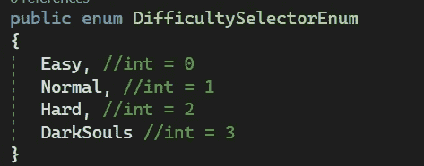
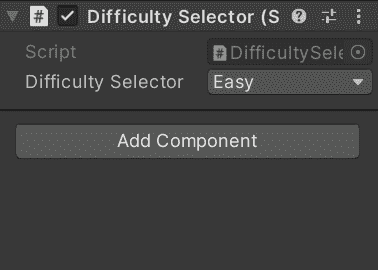

# 游戏开发的第 118 天:enum-c#！

> 原文：<https://blog.devgenius.io/day-118-of-game-dev-enums-c-fd68c5375644?source=collection_archive---------12----------------------->

**目标:**回顾什么是枚举，以及我们如何在 C#/Unity 中使用它们。

[演职员表](https://www.section.io/engineering-education/c-sharp-enums/)

基本上，上面的定义是说，枚举可以用来创建一个自定义命名变量的列表，这些变量以一种易于阅读的方式被赋予一个整数值。

让我们看一个代码示例。让我们假设我们想为我们的游戏做一个难度选择器。

我将从创建一个困难的选择器脚本开始。并声明一个枚举。

首先我声明 enum 并命名它。然后在里面(用简单的英语)我可以添加变量，后面跟着逗号。最后一个变量不会产生彗差，所以不要在最后一个变量上加逗号。

默认情况下，每个变量都被赋予从 0 开始的 int 值。

如果你愿意，你也可以手动给它们赋值。

现在我们可以使用这些数据。到目前为止，它就像一个类，只是保存数据，但从未使用过。就像一个类一样，我们需要实例化这个枚举类型的对象。

一旦我这样做了，我将能够从检查器中看到这个枚举，它带有一个非常漂亮的下拉菜单，包含枚举变量。

这就是设置枚举的全部内容。这里有一个例子，我使用 switch 语句来检查选择了哪个枚举变量，并基于此调用某些代码。

另一条有价值的信息是使用基于 int 值的枚举。

在上面的 switch 语句中，我们检查我们选择了哪个枚举，除了它专门查找枚举的字符串或名称，而不是缺省情况下的 int 值。

但是，如果我们想将一个枚举的 int 值传递给一个方法，该方法根据我们所在的枚举或类似的东西加载一个场景，该怎么办呢？我们可以很容易地将枚举值转换为 int。

这是一个示例方法，它将基于我们所在的枚举加载一个场景。

我得到一个错误，因为 LoadScene 方法需要一个 int 值。我可以将 enum(默认情况下作为字符串读取)转换为 int 值。就像我之前说的，默认情况下从 0 开始，或者你可以手动赋值。

错误已解决，当我从 Start()调用该方法时，它将根据使用 enum int 值选择的难度来加载场景。

我希望这有助于理解什么是枚举以及如何使用它们。如果您有任何问题或想法，请随时发表评论。让我们制作一些令人敬畏的游戏！