# 游戏开发的第 119 天:什么是字典——c#？

> 原文：<https://blog.devgenius.io/day-119-of-game-dev-what-are-dictionaries-c-f4138401221e?source=collection_archive---------11----------------------->

**目的:**复习什么是字典，如何在 C#/Unity 中使用字典。

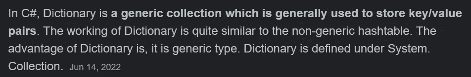

[演职员表](https://www.geeksforgeeks.org/c-sharp-dictionary-with-examples/)

为了理解字典的好处，我将在**举一个例子**。我将创建一个包含项目定义的项目类。然后我将创建一个 ItemDB (db for database)类来保存这些不同的项目。接下来，我将确保创建一个项目列表，并通过序列化项目类使该列表可从检查器中编辑。

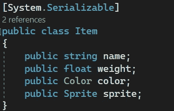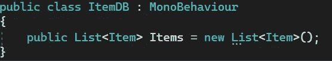

在检查器中，您可以看到我们有 50 个项目，每个项目都有自己的值。

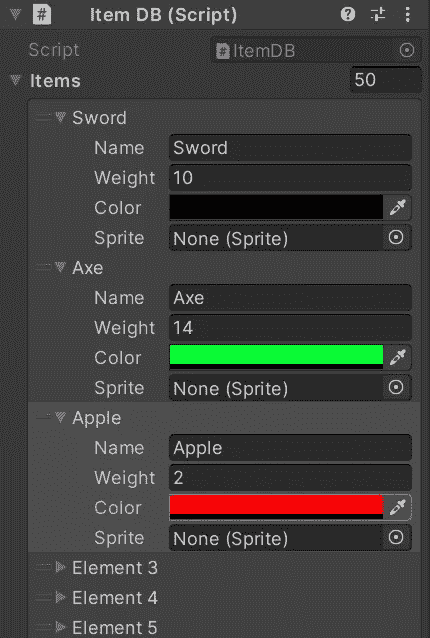

通过代码，如果我们想找到某个项目或从项目列表中检索信息，我们可能会使用 foreach 循环来遍历每个项目，项目越多，花费的时间就越长。

使用字典，我们可以通过使用键/值对来加快这个过程。基本上我们所做的就是创建一个新类型的列表(一个字典),在这里我们可以为一个条目分配一个 int。也就是说，当我们想要获取某个条目的信息时，我们只需要在字典中搜索，也就是说，我们只需要在一个 int 列表中搜索，当我们找到这个 int 时，我们就可以看到这个 int 被分配给了哪个条目。

最终结果将是一个包含相关条目的 int 列表(字典),而不是一个包含更多信息的条目列表，以确定我们想要的条目。

让我们看看如何通过代码进行设置。

正如您在这里看到的，声明一个字典非常类似于声明一个列表。

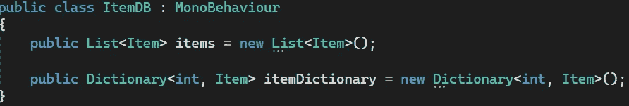

除了字典接受一个键和类型。我希望键是一个 int，类型是一个 Item。这意味着我给每一项赋值一个 int。如果我想的话，我可以给每一项赋值一个字符串或者其他的东西，但是 int 是非常可读和高性能的，我将在这个例子中使用它。

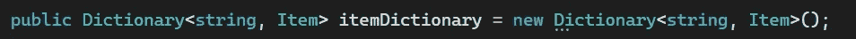

例子

您可能会注意到字典的一个特点是它们不会出现在检查器中。我们如何通过代码来填充它们呢？

让我们比较一下向列表和字典添加项目。

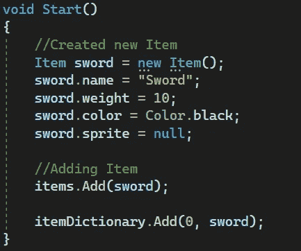

在这里，我创建了一个新条目，并将其添加到列表和词典中。列表只需要我们想要添加的条目，而字典也需要一个键和一个条目来分配它。然后，它添加键和项。

如果我想把我在检查器中创建的条目分配给字典，我可以这样做。

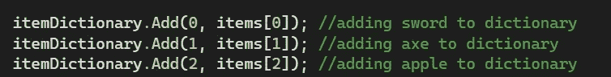

尽可能保持列表中对象和字典中对象的相同索引位置是一个好习惯。列表中的项目 0 在字典中被分配 0 位置(索引)，项目 1 也是如此，依此类推。

(注意):记住下一部分，字典中目前有 3 个条目。

你也可以用几种不同的方式来遍历字典。

你可以先尝试这样一种方法:

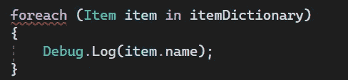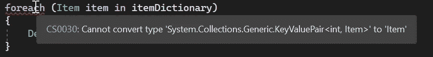

您将很快注意到一个错误，这是因为要访问字典，您必须通过键\值对来完成。我们有几个选择。

您可以只遍历字典中的键。

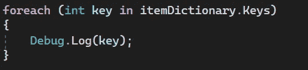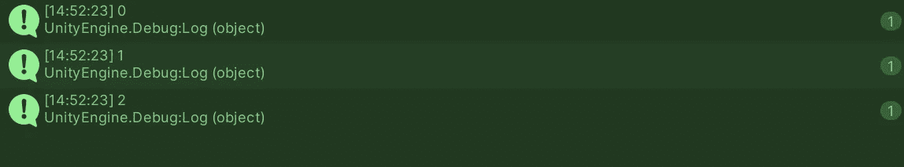

或者仅仅通过价值观。

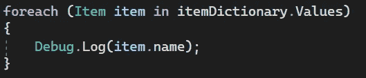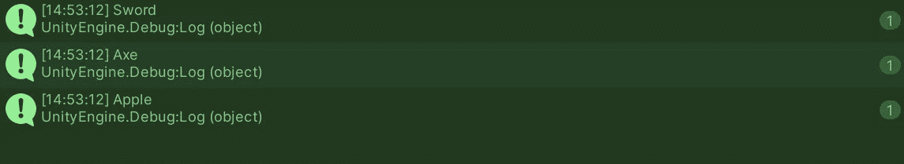

或者两者都有。

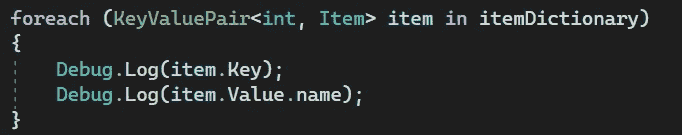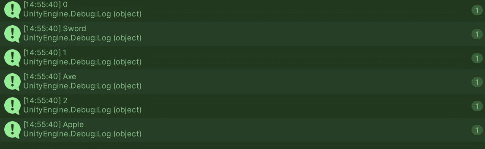

我希望这有助于你理解字典以及如何使用它们。如果你有任何问题或想法，请随意评论。让我们制作一些令人敬畏的游戏！